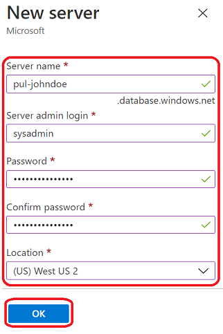
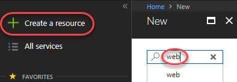
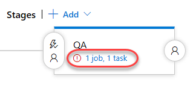
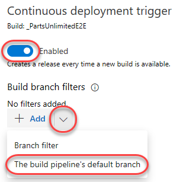
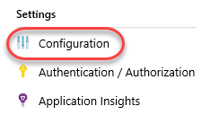
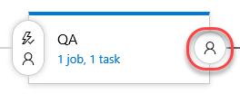
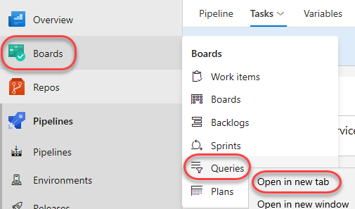
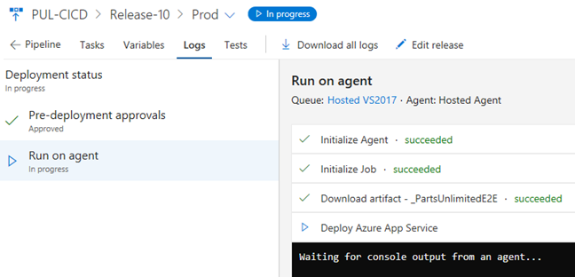
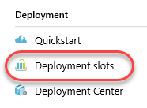

Lab version: 15.8.2

Last updated: 9/5/2018

<a name="Overview"></a>
## Overview ##

In this lab, you will learn about the release management features available in Azure Pipelines that automate the deployment of applications. These features help development and operations teams integrate with Team Foundation Server to configure and automate complex deployments of their automated builds to target stages more easily. Development teams can also model their release processes and track approvals, sign-offs, and visualize their release status.

<a name="Prerequisites"></a>
### Prerequisites ###

- An Azure account (free from [https://azure.com/free](https://azure.com/free)).

- Complete task 1 from the <a href="../prereq/">prerequisite</a>  instructions.

<a name="Exercise1"></a>
## Exercise 1: Embracing Continuous Delivery with Azure DevOps ##

<a name="Ex1Task1"></a>
### Task 1: Setting up Azure resources ###

1. Start off by creating the Azure resources needed for this lab. This includes a database and two app services: one for QA and one for production. Log into your account at [https://portal.azure.com](https://portal.azure.com/).

1. Click **Create a resource** and search for **"sql"**.

    

1. Select **SQL Database** and click **Create**.

    

1. Enter **"partsunlimited"** as the **Database name**. Select a subscription (it doesn't matter which one, but use the same one for all steps in this lab). Select **Create new** for **Resource group** and enter **"partsunlimited"** as the name. Make sure **Select source** is set to **Blank database** and click **Configure required settings**. If you don't already have a server you want to use, click **Create a new server**.

    

1. Enter a unique name for **Server name**, such as by including your name. Enter an admin username and password you can remember. Note that **"P2ssw0rd"** meets the password requirements. Click **Select** to select these options.

    

1. Click **Create**. It'll take some time to complete, but you can move on to the next step while it works in the background.

    

1. Click **Create a resource** and search for **"web"**.

    

1. Select the **Web App** template and click **Create**.

    

1. For **App name**, enter a unique name, such as by using your name as part. Since this will be for our QA deployment, append the name with **"-qa"**. Select the same **Subscription** and **Resource group** as before. If required to create an **App Service plan**, accept the defaults. Click **Create** to create.

    

1. Repeat the process above to create a second app service for the production stage. This time, append it with **"-prod"** instead.

    

1. It may take a few minutes for all of your new Azure resources to become available, so continue on to the next task. Leave this browser tab open for later.

<a name="Ex1Task2"></a>
### Task 2: Creating a continuous release to the QA stage ###

1. Navigate to your team project on Azure DevOps in a new browser tab. It should be at [https://dev.azure.com/YOURACCOUNT/Parts%20Unlimited](https://dev.azure.com/YOURACCOUNT/Parts Unlimited).

1. Navigate to **Pipelines \| Releases**.

    

1. **Delete** the existing **PartsUnlimitedE2E** release pipeline. We'll start fresh here.

    

1. From the **New** dropdown, select **Create a release pipeline** to create a new release pipeline.

    

1. There are many starting templates to choose from, or you can even begin with an empty process template. In this case, select the **Azure App Service Deployment** and click **Apply**.

    

1. Rename the default stage to **"QA"**. This template will deploy to QA, and then to a production stage. We'll set up this one first.

    

1. Rename the release pipeline to **"PUL-CICD"**.

    

1. The first thing to define is exactly what should be deployed. Click **Add** in the **Artifacts** section to specify the artifact to deploy.

    

1. There are many types of artifacts, but this one will be pretty simple: a project built from the **PartsUnlimitedE2E** build pipeline that already exists in this team project. Click **Add**.

    

1. Now that the artifact has been defined, it's time to configure the deployment to QA. Click **1 job, 1 task** in the **QA** stage.

    

1. Select the **Azure subscription** you used earlier to create the resources and click **Authorize**. If you need to create a connection to an Azure account associated with a different Microsoft account, click **New** and follow that workflow before continuing.

    

1. Follow the workflow to authorize access to your Azure account.

1. Enter the **App service name** used earlier when creating the QA app service.

    

1. Return to the **Pipeline** tab.

    

1. Click the **Triggers** button to define what triggers will invoke this deployment.

    

1. **Enable** the **Continuous deployment trigger**. Add a **Build branch filter** that points at the **The build pipeline's default branch**. This will kick off the deployment when the build completes.

    

1. **Save** the release pipeline.

    

<a name="Ex1Task3"></a>
### Task 3: Configuring the Azure app services ###

1. Return to the browser tab open to the Azure portal.

1. Click the **Resource groups** tab from the left menu. Locate and click the **partsunlimited** group created earlier.

    

1. Click your SQL database (**pul-johndoe/partsunlimited**). Make sure you click the database you created and not the server. Note that it may take a few minutes for the database and server to become available, so click the **Refresh** button every once in a while to check in.

    

1. In the new blade, click **Show database connection strings**.

    

1. This will provide you with a list of connection strings based on platform. Copy the **ADO.NET** string to your clipboard so you can configure your new web site to use it. Close this blade.

    

1. Open a new instance of **Notepad** and paste the connection string into it. This will make it easier to edit and retrieve later on in case anything happens to the clipboard copy.

1. Use the breadcrumb navigation to return to the **partsunlimited** resource group.

    

1. Click the **QA** app service created earlier.

    

1. Select the **Application settings** tab from the **Settings** section.

    

1. On this blade you can configure settings for your app, such as connection strings. Locate the **Connection strings** section and add a new entry with the key **"DefaultConnectionString"** and the value pasted from the clipboard. You'll need to locate the "{your_username}" and "{your_password}" sections and replace them (including braces) with the actual SQL credentials entered earlier. Press **Enter** to complete.

    ```
    Server=tcp:pul-johndoe.database.windows.net,1433;Initial Catalog=partsunlimited;Persist Security Info=False;User ID={your_username};Password={your_password};MultipleActiveResultSets=False;Encrypt=True;TrustServerCertificate=False;Connection Timeout=30;
    ```
    

1. Click **Save** from the toolbar to commit.

    

1. Repeat the process above to add the same connection string to the production app service.

<a name="Ex1Task4"></a>
### Task 4: Invoking a continuous delivery release to QA ###

1. Return to the browser tab open to your Azure DevOps project.

1. Now that the release pipeline is in place, it's time to commit a change in order to invoke a build and release. You'll need to make a few changes like this over the course of this lab, so it's recommended that you use a separate tab for **Code \| Files** to keep that part of the process separate.

    

1. Navigate to **PartsUnlimited-aspnet45/src/PartsUnlimitedWebsite/Views/Shared/_Layout.cshtml**. This is a file that defines the general layout of the site and is a good place to make a change that will be easily visible after deployment.

    

1. Click **Edit** to edit the file inline.

    

1. Locate the **Parts Unlimited Logo** and add the text **"v2.0"** after it. This will be an easy thing to check for after deployment.

    

1. **Commit** the changes back to the repo. This will kick off a build based on the preconfigured build pipeline.

    

1. Navigate to the **Builds** hub via **Build and Release \| Builds**.

    

1. Open the most recent build for **PartsUnlimitedE2E**. It may be queued, in progress, or already completed.

    

1. Follow the build until completion.

    

1. Click the **Releases** tab to see the new release get going.

    

1. Click the release. As with the build, it may be queued, in progress, or already completed when you get here.

    

1. Follow the release until it succeeds.

    

1. You can now close this tab if you prefer.

    

1. In a new browser tab, navigate to the QA site. It will be the name of your app service plus **".azurewebsites.net"**. It should show the **v2.0** added earlier.

    

<a name="Ex1Task5"></a>
### Task 5: Creating a gated release to the production stage ###

1. Return to the Azure DevOps browser tab.

1. As release pipelines get more sophisticated, it becomes important to define gates to ensure quality throughout the release pipeline. Since the next stage we're deploying to is production, we'll need to be sure to include both automated quality gates as well as a manual approver gate. Return to the release pipeline browser tab and click **Clone** in the **QA** stage. Since the production stage is virtually the same, we can reuse almost all of the existing configuration.

    

1. The new stage is added after the current one, which is what we want. However, before we can consider the QA deployment successful, we'll need to define a post-deployment condition. Click the **Post-deployment conditions** button on the **QA** stage.

    

1. **Enable** the **Gates** option.

    

1. There are several kinds of gates available that can automatically test virtually anything you need to make sure a deployment is in good shape. These could be the return values of Azure functions or REST APIs, queries to Azure for alerts, or work item queries in Azure DevOps. You can also configure how long the platform should delay before evaluating the gates for the first time. In this case, change that to **0** so it will test them immediately after deployment. Then click **Add** \| **Query Work Items**.

    

1. Select the **Query** for **Shared Queries \| Critical Bugs**. We will make it our policy that the QA deployment cannot be considered a success until all critical bugs have been resolved.

    

1. Expand **Evaluation options** and update the **Time between re-evaluation of gates** to **5**. If this gate fails, we want it to reevaluate the query every 5 minutes until it clears because engineers will need some time to confirm those critical bugs are fixed in the current version. However, if those bugs aren't cleared and the release isn't manually failed, this configuration will automatically fail the gate after 1 day.

    

1. We can now turn our focus to the production stage. Select the **Copy of QA** stage.

    

1. Rename it to **"Prod"**.

    

1. Click its **Pre-deployment conditions** button.

    

1. **Enable** the **Pre-deployment approvals** and add yourself as an **Approver**. The idea here is that you won't be asked to approve the production deployment until after the QA deployment has succeeded. At that point, someone on this list will need to approve the deployment to production. Also clear the box for **User requesting a release of deployment should not approve** if it's checked. For the purposes of this lab, you can approve releases you have requested.

    

1. Click the **Prod** stage's **1 job, 1 task**.

    

1. Update the **App service name** to reflect the "**-prod**" (instead of **"-qa"**).

    

1. **Save** the release pipeline.

    

1. Repeat the process for changing the codebase at **"PartsUnlimited-aspnet45/src/PartsUnlimitedWebsite/Views/Shared/_Layout.cshtml"** followed earlier in a new tab. This time, update the version number from **"2.0"** to **"3.0"**. This will invoke the release pipeline.

1. As before, follow the release until it is deploying to QA. Click to follow the release itself once available.

1. When you get to the release view, click **Release (pipeline view)**. This will provide a visualization of where the release is in the pipeline.

    

1. Eventually there will be an issue with the QA deployment. While it deployed out successfully, one of the quality gates failed. This will need to be resolved for that stage to be approved. Click the **View post-deployment gates** button.

    

1. It looks like the **Query Work Items** gate is failing. This means that there is a critical bug that must be cleared.

    

1. Open a new tab to **Boards \| Queries** to locate the bug.

    

1. Use the query list on the **All** tab to open the **Shared Queries \| Critical Bugs** query.

    

1. Open the one bug by clicking it.

    

1. Ordinarily you'd check the site to confirm the bug was fixed, but we'll skip ahead here and mark it **Done**. Click **Save** and close the tab.

    

1. Return to the release pipeline tab. Depending on timing, it may take up to five minutes for Azure DevOps to check the query again. Once it does, the bugs will be cleared and the release will be approved. You can then click **Approve** to approve deployment to production.

    

1. Confirm the deployment.

    

1. Click the **In progress** link to follow the release workflow.

    

1. It may take a moment for the release to kick off and complete.

    

1. Once the release has completed, open a new tab to the production app service URL. It should be the same as your QA URL, but with **"-prod"** instead of **"-qa"**. Note the **v3.0**.

    

<a name="Ex1Task6"></a>
### Task 6: Working with deployment slots ###

1. Return to the browser window open to the Azure portal.

1. Azure App Services offer **deployment slots**, which are parallel targets for application deployment. The most common scenario for using a deployment slot is to have a staging stage for your application to run against productions services, but without replacing the current production application. If the staging deployment passes review, it can immediately be "swapped" in as the production slot with the click of a button. As an additional benefit, the swap can be quickly reversed in the event an issue is uncovered with the new build. Locate the resource group created earlier and click the **prod** app service.

    

1. Select the **Deployment slots** tab. If you see a message indicating that your current pricing tier does not support slots, follow the workflow to upgrade this service to a **Production** tier or higher and then return here. You may need to refresh the browser for the **Add Slot** option to become enabled.

    

1. Click **Add Slot**. Note that the **production** slot is considered a "default" slot and is not shown as a separate slot in the user experience.

    

1. Enter a **Name** of **"staging"** and select the **Configuration Source** that matched your existing deployment (there should be only one). Click **OK** to create the slot.

    

1. Return to the Azure DevOps tab with the **Prod** stage pipeline editor.

1. Select the **Deploy Azure App Service** task.

    

1. Check **Deploy to slot** and set the **Resource group** and **Slot** to those created earlier.

    

1. **Save** the release pipeline.

    

1. Follow the workflow from earlier to commit a change to the codebase at **"PartsUnlimited-aspnet45/src/PartsUnlimitedWebsite/Views/Shared/_Layout.cshtml"** by updating the layout template from **"3.0"** to **"4.0"**.

1. Follow the release pipeline through deployment and approve the release to production when requested.

1. When the production deployment has completed, refresh that browser tab. Note that there shouldn't be any change since the deployment was pushed to a different slot.

    

1. Open a new tab to the **staging** slot. This will be the same as your production URL, but with **"-staging"** appended to the app service name within the domain. This should reflect the new **v4.0**.

    

1. Return to the browser window open to the **Azure portal**. Click **Swap** in the slots blade.

    

1. The default options here are exactly what we want: to swap the production and staging slots. Click **OK**. Note that if your apps rely on **slot-level configuration settings** (such as connection strings or app settings marked "slot"), then the worker processes will be restarted. If you're working under those circumstances and would like to warm up the app before the swap completes, you can select the **Swap with preview** swap type.

    

1. Return to the **prod** browser window (not the staging slot) and refresh. It will now be the 4.0 version.

    

