In this exercise, you are going to clone a Github repo into VSTS, if you have not already done so. This repo contains a class library (MyShuttleCalc) that is used by the MyShuttle2 application. You will configure a Jenkins build to get the source code from the VSTS repo, build and then publish the MyShuttleCalc package to a VSTS Maven Package feed so that it can be consumed by MyShuttle2 and any other applications that require the calculation code.

This exercise assumes you have completed the exercises to create a Team Project and have set up the Docker private VSTS agent. This exercise uses a team project named **jdev**, though your team project name may differ.

> **Note**: It is not necessary to clone Github repos into VSTS. VSTS will work just fine with Github (or other Git hoster)  repos. However, some linkages from source code to other aspects of the DevOps pipeline (such as work items, builds or releases) work best if the code is in VSTS.

> **Note**: This exercise shows how to do a Maven build using Jenkins. To see how to perform a Maven build using just VSTS Team Build that integrates into the VSTS Package Feed, please refer to [Maven Package Management with VSTS and Jenkins](./Maven Package Management with VSTS and Jenkins,md).

> **Note**: Jenkins is running in a Docker container on the Azure VM you created for these labs. Port 8080 is open, meaning anyone can browse to your VM and interact with Jenkins. This is not a recommended production setup - typically authentication is required to interact with a Jenkins server that is publicly avaliable.

Clone the Repo and Configure Package Management
-----------------------------------------------

Before getting to the build, you will need to clone the code from Github into VSTS, create the Maven Package Feed and then update the Maven settings file in the project to specify where to publish the package to. All these instructions are in the [Maven Package Management with VSTS and Jenkins](./Maven Package Management with VSTS and Jenkins,md). Please complete the following exercises from that lab:

- Importing the MyShuttleCalc code from Github into VSTS
- Create a Maven Package Feed
- Clone the MyShuttleCalc repo
- Create a Maven Settings File with the Feed Credentials

### Create an SSH Key for Git authentication

In this task you will create an SSH key to authenticate to the VSTS repo. You need to create an SSH key if you do not already have one, then upload the public key to VSTS. The Jenkins job will use the key to authenticate to the repo.

1. On your VM, open a terminal by clicking on the Terminal Emulator icon in the toolbar.

    

1. Enter the following command:

```sh
ssh-keygen -C "jdev.com"
```

and press Enter 3 times to use the default id_rsa location as well as an empty pass phrase.

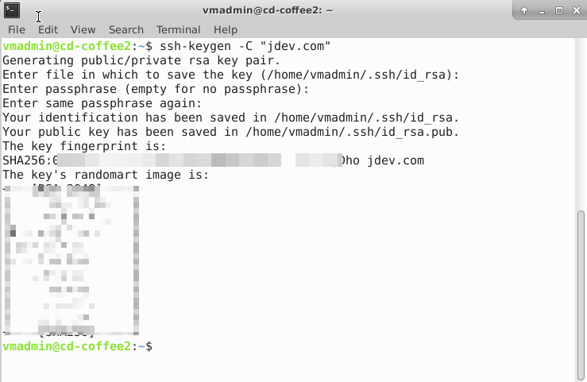

> **Note**: the domain is not important - use any value you want. You can also enter a pass phrase if you want to, though this will cause a prompt each time you use the key.

1. Enter the following command to print out the public key in the terminal:

```sh
cat /home/vmadmin/.ssh/id_rsa.pub
```

1. Select all of the text (from `ssh-rsa` to `jdev.com`), right-click and select "Copy".

1. Go back to Chrome and browse to your VSTS Team Project.
1. Click on your profile image in the upper right. In the menu, click Security.

    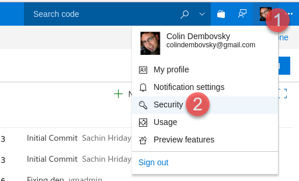

1. Click on "SSH public keys" and click the "Add" button.
1. Enter "jdev" for the Description and then paste into the Key Data the contents of the public key (which should be in your clipboard).

    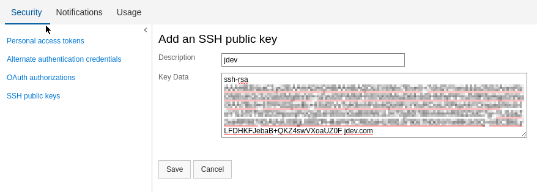

> **Note**: Once you have your SSH credentials set up, you can use the SSH URL when cloning repositories.

Configure the Jenkins Maven installation
----------------------------------------

In this task you will configure the Maven installation settings for Jenkins.

1. On your VM, open Chrome and browse to `http://localhost:8080` to open Jenkins.
1. One the list of links in the left, click "Manage Jenkins". On the mangement page, click "Global Tool Configuration".
1. Scroll down to Maven. Click "Add Maven" to add a new Maven installation.
1. Enter `default` as the name. Uncheck the "Install Automticall" checkbox and enter `/usr/share/maven` for the MAVEN_HOME property.

    

1. Click Save.

Create a Maven Job
------------------

In this task you will create a Maven job in Jenkins to build MyShuttleCalc and to deploy the package to the VSTS Package feed.

1. Open your VSTS Team Project in Chrome and click on Code to open the Code Hub. Select "MyShuttleCalc" from the list of repos.

    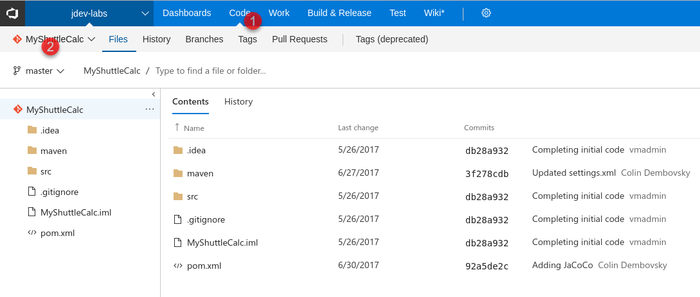

1. In the upper right, click the "Clone" button. Switch to the SSH tab and copy the SSH url into the clipboard.

    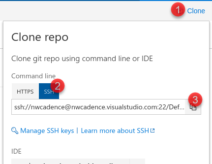

1. Go back to Jenkins in your browser.
1. In the list of items in the left navigation pane in Jenkins, click "New Item".
1. Enter `MyShuttleCalc` for the item name and click on "Maven Project". Click OK.
1. In the Source Code Management section, select Git. Paste in the SSH url to the MyShuttleCalc repo.
1. Click the "Add" button in the Credentials section and select "Jenkins".
1. In the dialog, change the "Kind" to "SSH Username with private key".
1. Select the "Enter directly" option under "Private Key".
1. Open a terminal and cat the `~/.ssh/id_rsa` file (or open it in any editor) and paste the contents into the Key textbox. Enter a passphrase (if you used one - otherwise leave it empty). Enter `vmadmin` as the ID. Click Add.

    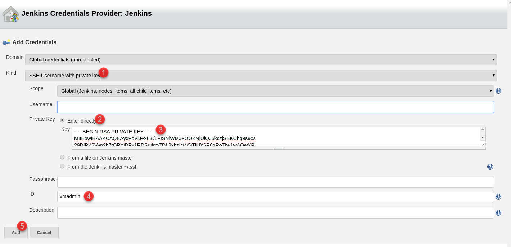

1. Your Source Code Management should now look like this:

    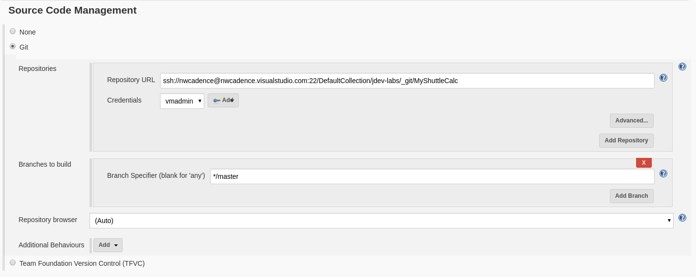

1. In the Build section, ensure that "Root POM" is `pom.xml`. Set the "Goals and options" to `deploy -Dbuildversion=1.0.${BUILD_NUMBER}`. Click the Advanced button to expand the advanved settings. Change the "Settings file" to "Settings file in filesystem" and set the "File path" to `maven/settings.xml`. These settings instruct Maven to build, test and package the code and then publish the package to the repository defined in the settings.xml file, which you previously modified to include the authentication token.

    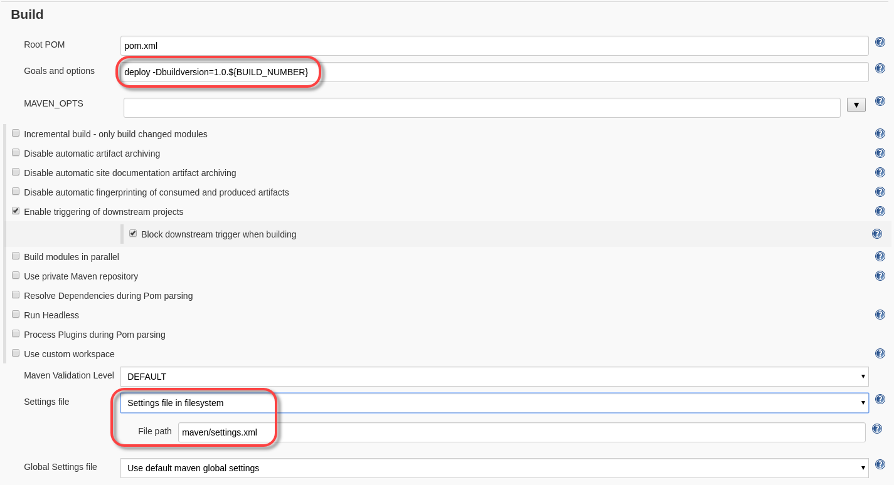

1. Scroll down to Post-build Actions. Click "Add post-build action" and select "Record JaCoCo coverage report". You can leave all the settings as defaulted. This publishes the JaCoCo results for this job.

    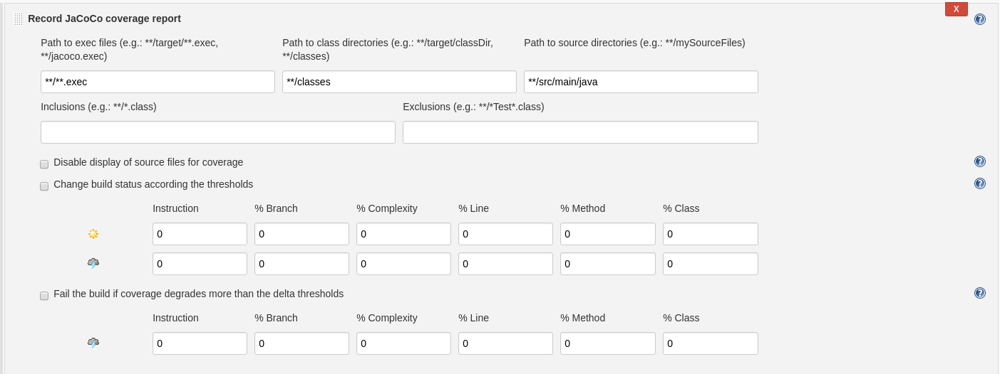

1. Add a new post-build action - this time select "Archive the artifacts". Set "Files to archive" to `**/MyShuttleCalc*.jar`. This saves the MyShuttleCalc jar file as an artifact from this job.
1. Add a new post-build action - this time select "Collect results for TFS/Team Services". This step allows Jenkins to collect test results and coverage results so that they are available to VSTS. Click the Add button twice to add 2 collectors:
    - **Type**: JUnit, **Files to include**: `**/TEST-*.xml`
    - **Type**: JaCoCo, **Files to include**: `**/jacoco/**`

    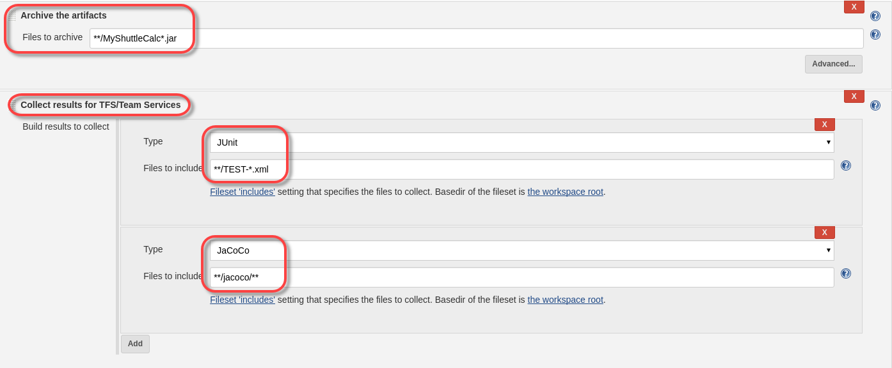

1. Click the Save button.

Schedule a Build
----------------

In this task you will run the build to ensure that it runs successfully.

1. Click "Build Now" in the links on the left to start a build. Alternatively you can schedule the build from the dashboard by clicking the Schedule build button:

    

1. Click on the build number to open the build. Click on "Console Output" to watch the logs.
1. When the build completes, you can click on "Back to project" to go to the build summary. You should see test and coverage results as well as a link to the jar artifact.

    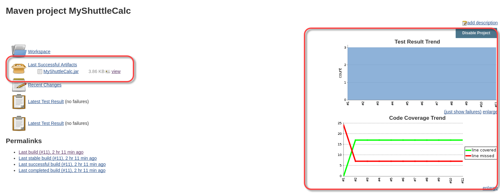

1. Navigate to the Maven Package feed in VSTS. You should see the latest package with the version number matching 1.0._jenkins-build-number_.

    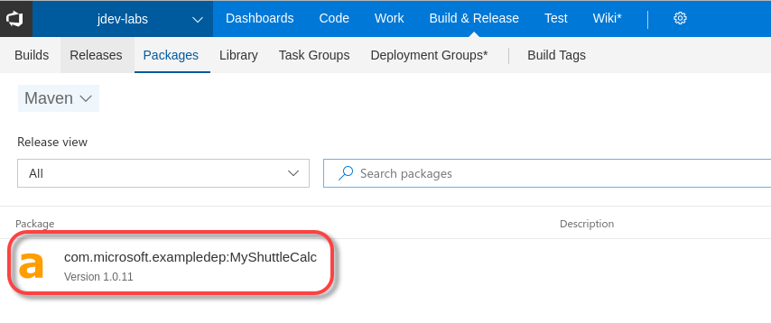

Integrate VSTS Team Build and Jenkins
-------------------------------------

In this task you will configure a VSTS Team Build in VSTS that will trigger the Jenkins job and collect the results. This technique offers the integration from source control, work item tracking, test and release that you get in VSTS but allows the build itself to be in Jenkins.

1. In Jenkins, click on the Jenkins logo to navigate to the dashboard.
1. Click "Manage Jenkins" and then click "Configure Global Security".
1. In the Access Control section, select "Jenkin's own user database" and check "Allow users to sign up". Ensure "Anyone can do anything" is selected unser Authorization.

    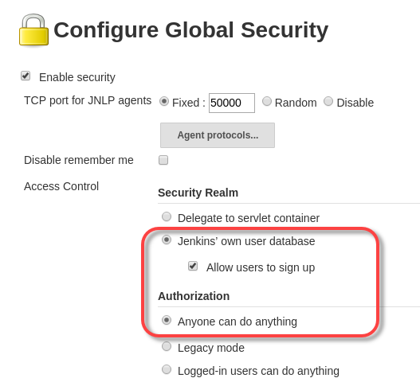

1. On the upper-right of the black toolbar, click "sign up". Create a new user account, making a note of the username and password because you'll need them later on.
1. Navigate to your VSTS Team Project and click on the gear icon and then Services.
1. Click "+ New Service Endpoint" and select Jenkins from the list.
1. Enter the following:
    Name | Value | Notes
    --- | --- | ---
    Connection Name | `Azure VM Jenkins` | The name of this connection
    Server URL | `http://<machineName>.<location>.cloudapp.azure.com:8080` | The FQDN to your Azure VM on port 8080 (the Jenkins port)
    Username | The username you created in Jenkins |
    Password | The password you created in Jenkins |

1. Click on "Verify connection" to ensure that the connection is valid.

    

1. In VSTS, click on Build & Release->Builds to open the builds hub.
1. Click the "+ New" button to create a new definition.
1. Enter "jenkins" into the search box and press enter. Click on the Jenkins template and click Apply. Configure the following settings and tasks.
1. **Tasks->Process**
    Parameter | Value | Notes
    --- | --- | ---
    Default agent queue | `default` | Run this build on your VSTS agent container
    Job Name | `MyShuttleCalc` | The name of the Jenkins job
    Jenkins service endpoint | `Azure VM Jenkins` | The endpoint you just created to Jenkins
1. **Tasks->Get Sources**
    Connect to the MyShuttleCalc repo on the master branch.
1. Configure the "Queue Jenkins Job: MyShuttleCalc" task as follows:

    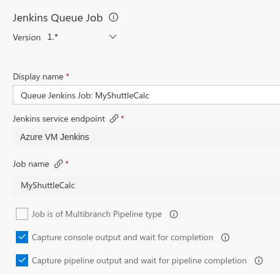

1. Configure the "Download artifacts produced by MyShuttleCalc" task as follows:

    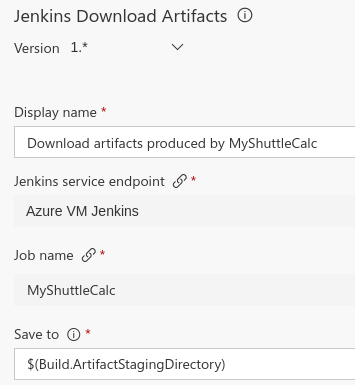

1. Insert a "Publish Test Results" task and configure it as follows:
    Parameter | Value | Notes
    --- | --- | ---
    Test result format | `JUnit` | Publish JUnit results
    Test results files | `**/TEST-*.xml` | File containing test results
    Search Folder | `$(Build.ArtifactStagingDirectory)` | Root folder for search operation

    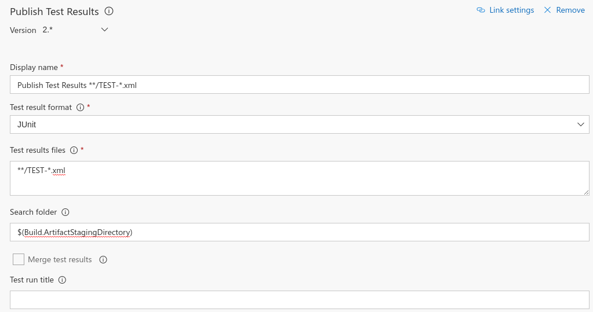

1. Insert a "Publish Code Coverage Results" task and configure it as follows:
    Parameter | Value | Notes
    --- | --- | ---
    Code Coverage Tool | `JaCoCo` | Publish JaCoCo results
    Summary File | `$(Build.ArtifactStagingDirectory)/jenkinsResults/MyShuttleCalc/team-results/jacoco/target/site/jacoco/jacoco.xml` | File containing JaCoCo results
    Report Directory | `$(Build.ArtifactStagingDirectory)/jenkinsResults/MyShuttleCalc/team-results/jacoco/target/site/jacoco` | Folder containing detailed coverage reports

    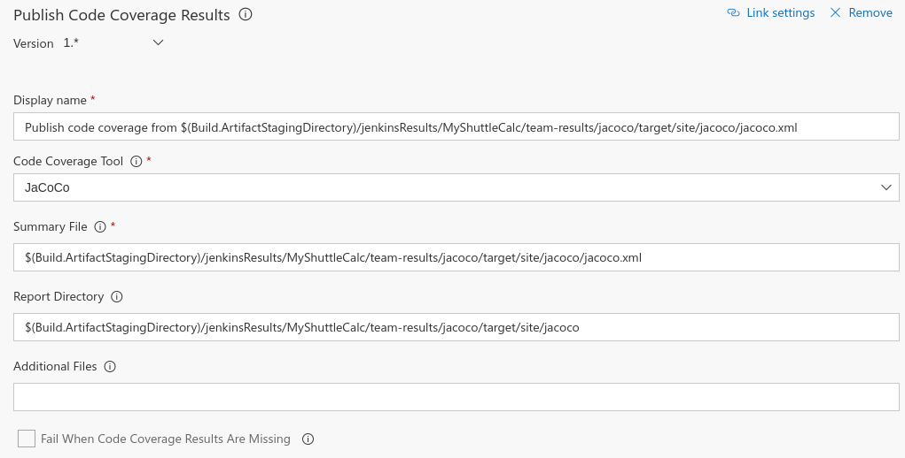

1. The final list of tasks should look as follows:

    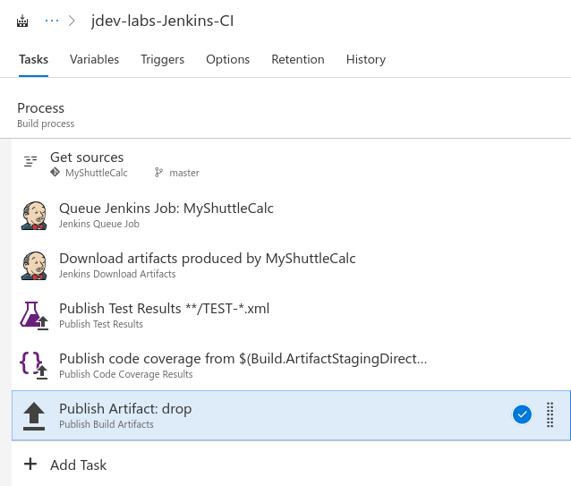

1. Save and Queue the build.
1. When the build completes, click on the build number to see the results.

    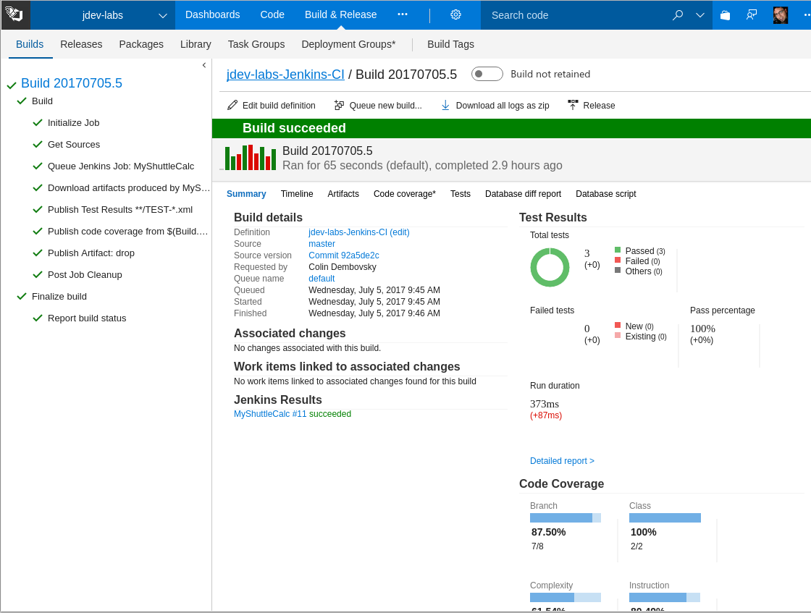


