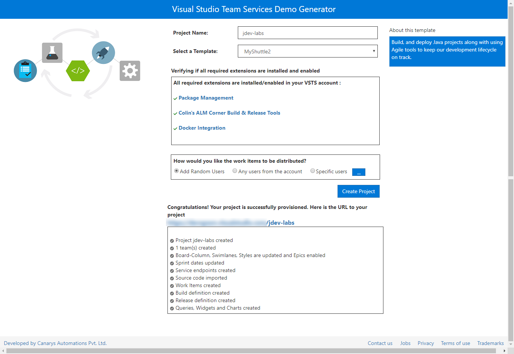

## Overview

This exercise will walk you through the steps to creating your Visual Studio Team Services (VSTS) account and create a new project.

1. Login to the virtual machine.

1. Start the Firefox or Chrome browser.

1. Login to your Team Services account - `https://{your account name}.visualstudio.com`. If you do not have a VSTS account, you can sign up one for free from [here](https://www.visualstudio.com/team-services/)

## Generating a VSTS Personal Access Token (PAT)

Personal access tokens essentially are alternate passwords. You need them to integrate VSTS with non-Microsoft tools such as Git, XCode, etc.

In this task you will generate a PAT for yourself. You will use this PAT to connect the agent to your VSTS account.

    

1. Connect to the virtual machine with the user credentials which you specified when creating the VM in Azure.

1. Open Chrome and browse to `http://<youraccount>.visualstudio.com` (where `youraccount` is the account you created in VSTS).

1. In the upper right, click on your profile image and Click Security.

    

1. On the Personal access tokens page, click the **Add** button. Enter "java" (or whatever you want) for the *Description*. Scroll to the bottom of the page and click **Create token**.

1. When the token is created you will have to copy it - this is your only chance to see the token. Copy it from the browser into the clipboard.

1. Click on the Visual Studio Code icon in the toolbar to open Visual Studio Code.

    

1. Press Ctrl-N (or use File->New File) to create a new file. Paste in your PAT. Save this file (File->Save or Ctrl-S) to `/home/vmadmin/pat.txt`.

## Creating your project

### Provisioning a project using the VSTS Demo Generator

1. You can use the [VSTS Demo Generator](https://vstsdemogenerator.azurewebsites.net) to provision the team project on your VSTS account.  VSTS Demo Generator helps you create team projects on your VSTS account with sample content that include source code, work items,iterations, service endpoints, build and release definitions based on the template you choose during the configuration

    If you prefer to create the project manually, skip this go to the next section.

   

1. Use **MyShuttle2** for the template. Provide a Project Name (jdev-labs in this lab) and select Create Project. After the project is provisioned, click the URL to navigate to the project.

   

### Creating a project manually

If you have not provisioned the project using the VSTS demo generator in the previous exercise,you can follow the steps in this exercise to manually create a project and import code from a GitHub repository

1. C

1. Click on the `jdev` team project to navigate to it. Click on Code in the blue toolbar at the top to open the Code Hub.

1. Click on the repo drop-down in the upper left (in the grey toolbar) and select **Import repository**

    

1. Enter the following url: `https://github.com/nwcadence/MyShuttle2.git` and click Import.

    

1. After a few moments, the code will be imported.

1. There is one more repository you need to import - "**MyShuttleCalc**". Repeat the same steps.  Click on the repo drop-down in the upper left (in the grey toolbar) and select **New repository**

    

1. Enter the following url: `https://github.com/nwcadence/MyShuttleCalc.git` and click Import.

    

1. Wait for the import to complete.

  

