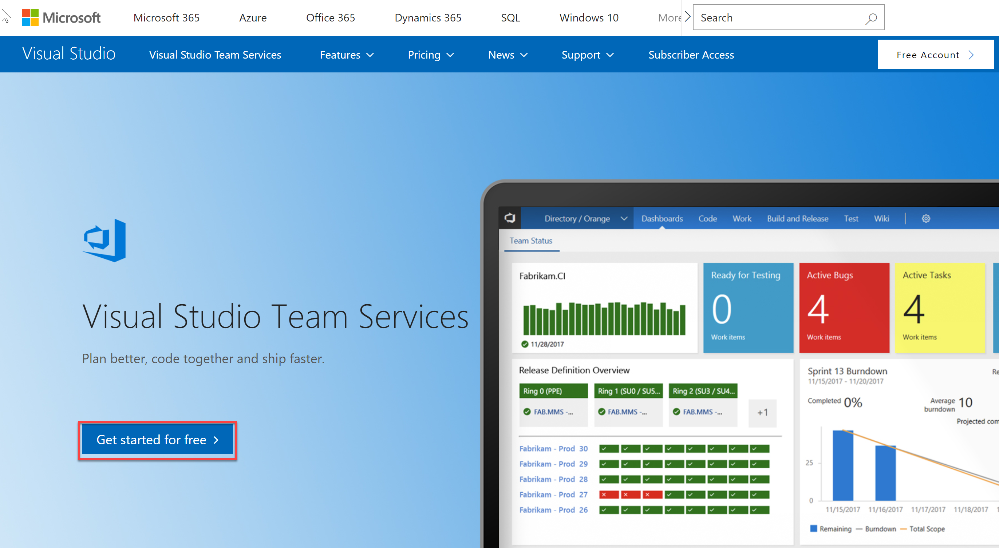
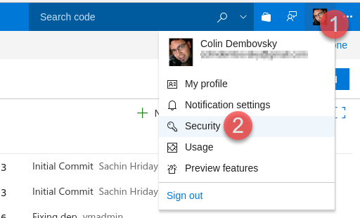
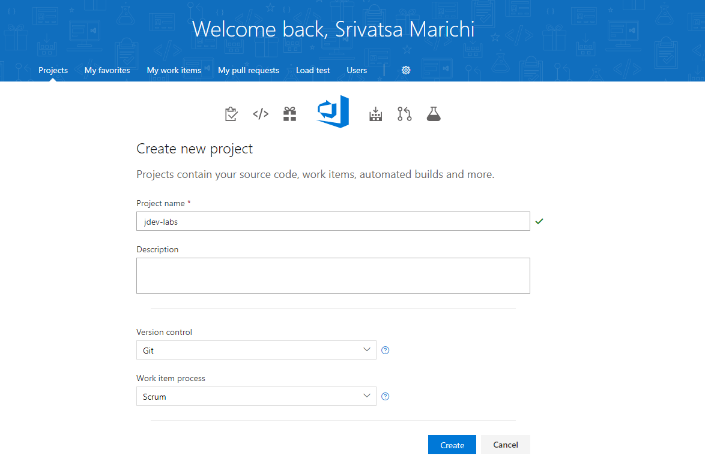
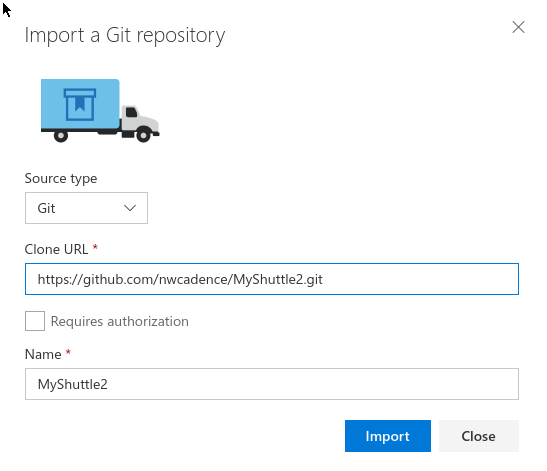

## Overview

This exercise will walk you through the steps to creating your Visual Studio Team Services (VSTS) project.

1. Login to the virtual machine.

1. Start the Firefox or Chrome browser.

1. Login to your Team Services account - `https://{your account name}.visualstudio.com`. If you do not have a VSTS account, you can sign up one for free from [here](https://www.visualstudio.com/team-services/){:target="blank"}

   

   Creating a new account is usually quick and can take as little as a few seconds to complete.

## Generating a VSTS Personal Access Token (PAT)

In this task you will generate a Personal access token for yourself. PATs essentially are alternate passwords. You need them to integrate VSTS with non-Microsoft tools such as Git, XCode, etc. You will need PAT to provision your project using the demo generator or to connect a private agent to your VSTS account.



1. On your VSTS page, in the upper right, click on your profile image and click **Security**.

    

1. On the Personal access tokens page, click **Add**. Enter "java" (or whatever you want) for the *Description*. Scroll to the bottom of the page and click **Create token**.

1. When the token is created, make a note of it as it cannot be viewed again. Copy it from the browser into the clipboard.

1. Click on the Visual Studio Code icon in the toolbar to open Visual Studio Code.

    

1. Press Ctrl-N (or use File -> New File) to create a new file. Paste in your PAT. Save this file (File -> Save or Ctrl-S) to `/home/vmadmin/pat.txt`.

## Creating your project

Next, you need to create a team project. You can create the team project manually or by using **VSTS Demo Generator**, a tool that helps you create team projects on your VSTS account with sample content that include source code, work items, iterations, service endpoints, build and release definitions based on the template you choose during the configuration.

### Provisioning a project using the VSTS Demo Generator

1. Open [VSTS Demo Generator](https://vstsdemogenerator.azurewebsites.net){:target="blank"}

1. Enter your account name and the PAT you saved earlier. Click **Verify and Continue**

   

1. Use **MyShuttle2** for the template. Provide a Project Name (**jdev-labs** in this lab) and select **Create Project**.

1. After the project is provisioned, click the URL to navigate to the project.

   

### Creating a project manually

If you have not provisioned the team project using the VSTS demo generator in the previous exercise, you can follow the steps in this exercise to manually create a team project and import code from a GitHub repository.

1. From the start page. Select **New Project**.

1. Provide a Project Name (**jdev-labs** in this lab). Select **Scrum** for the **Work item process** and click **Create**.

    

1. Click on the `jdev-labs` team project to navigate to it. Click Code to navigate to the Code Hub.

1. Click on the repo drop-down in the upper left (in the grey toolbar) and select **Import repository**.

    

1. Enter the following url: `https://github.com/nwcadence/MyShuttle2.git` and click Import.

    

1. The code will be imported in few minutes.

1. You will need to import one more repository - **MyShuttleCalc** using the above steps. Click on the repo drop-down in the upper left (in the grey toolbar) and select **New repository**.

    

1. Enter the following url: `https://github.com/nwcadence/MyShuttleCalc.git` and click Import.

    

1. Wait for the import to complete.

   

You have now created the project and ready to move to the next exercise [**Setting up a CI/CD private agent**](../dockerbuildagent/)
