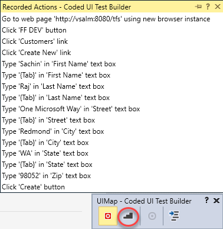
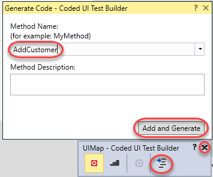
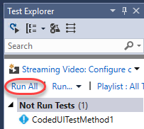

Lab version:15.4

Last updated:11/2/2017

# Overview

Coded UI tests provide a way to create fully automated tests to validate the functionality and behavior of your application's user interface. In this lab, you will gain a basic understanding of coded UI tests by creating a new test and adding validation logic to it.

# Prerequisites

In order to complete this lab you will need the Visual Studio 2017 virtual machine provided by Microsoft. For more information on acquiring and using this virtual machine, please see [this blog post](http://aka.ms/almvm).

# About the Fabrikam Fiber Scenario

This set of hands-on-labs uses a fictional company, Fabrikam Fiber, as a backdrop to the scenarios you are learning about. Fabrikam Fiber provides cable television and related services to the United States. They are growing rapidly and have embraced Windows Azure to scale their customer-facing web site directly to end-users to allow them to self-service tickets and track technicians. They also use an on-premises ASP.NET MVC application for their customer service representatives to administer customer orders.

In this set of hands-on labs, you will take part in a number of scenarios that involve the development and testing team at Fabrikam Fiber. The team, which consists of 8-10 people has decided to use Visual Studio application lifecycle management tools to manage their source code, run their builds, test their web sites, and plan and track the project.

## Exercise 1: Code Generation using Coded UI Test Builder

In this exercise, you will learn how to use the Coded UI Test Builder to generate test code for the Fabrikam Fiber web application.

### Task 1: Working with the Coded UI Test Builder

1. Log in as **Sachin Raj (VSALM\Sachin)**. All user passwords are **P2ssw0rd**.

1. Launch **Visual Studio** from the taskbar.

1. Select **File | New | Project** to create a new testing project.

1. In the **New Project** window, select the **Coded UI Test Project** template from **Visual C# | Test**, then click **OK** to create the test project.

    

1. Select **Record actions, edit UI map or add assertions** and click **OK** to record a new test.

    

1. Click the **Start recording** button to start a new recording session. Once clicked, all actions will be recorded to play back later.

    

1. Launch **Internet Explorer**. This will be the first action the test performs when run.

1. Navigate to the Fabrikam Fiber Dev site by clicking the **FF DEV** shortcut.

    

1. This test will involve creating a new customer, so select the **Customers** tab.

    

1. Click **Create New** to create a new customer.

    

1. Enter the following data in the form and click **Create**. Use the **Tab** key to move from field to field.

    **First Name:** Sachin

    **Last Name:** Raj

    **Street:** One Microsoft Way

    **City:** Redmond

    **State:** WA

    **Zip:** 98052

    

1. Click the **Pause** button from the **Coded UI Test Builder** to pause the recording.

    

1. Click the **Steps** button to review the steps recorded so far. Expand the list so you can see all of the steps. Note that some of the steps may be unnecessary, such as errant clicks or hovers over parts of the browser. You my delete these steps if you like.

    

1. Click the **Generate Code** button in the **Coded UI Test Builder**. This will present a dialog for you to specify a name for the test, which you should call "AddCustomer". Click **Add and Generate** to create the test and then close the **Coded UI Test Builder**.

    

1. Close **Internet Explorer**.

1. In the code editor, right-click the **AddCustomer** method within the generated code and select **Go To Definition**.

    

1. This will open the **UIMap.Designer.cs** file that contains the steps required to run the test. Scroll through the code to see how each of the steps was translated to code.

    

1. Select **Build | Build Solution**.

1. Expand the **Test Explorer**. If it's not visible, you can open it from **Test | Windows | Test Explorer**. Click **Run All** to run the test.

    

1. Wait for the test to complete. Don't use the mouse or keyboard while the test is running.

1. Verify that the test passed by viewing the **Test Explorer** window. In this case, however, we are not performing any validation after any of the steps.

    
