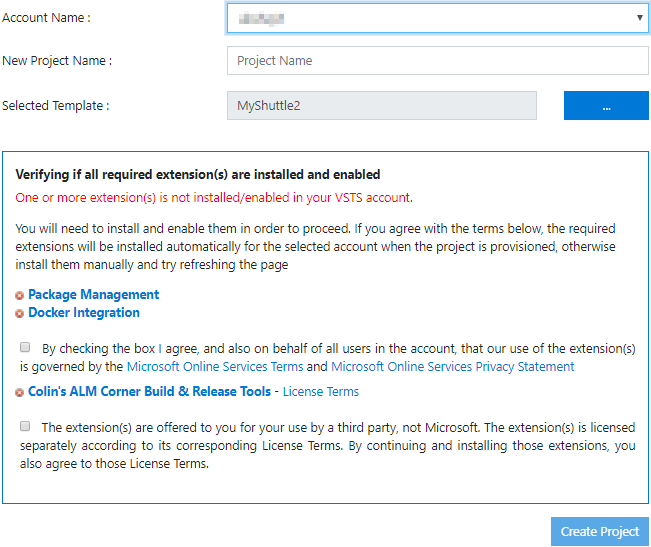
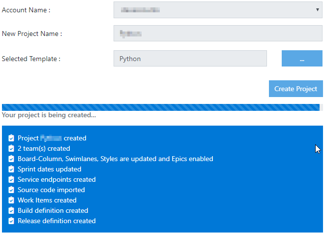
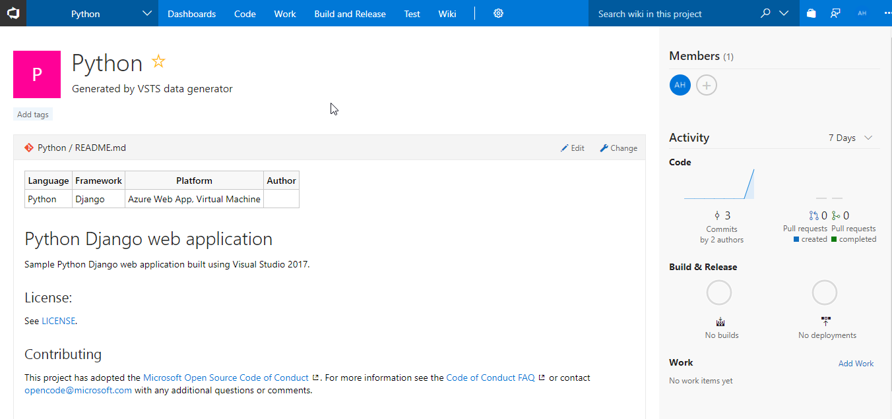

Last updated : {{ "now" | date: "%b %d,%Y" }}.

## Overview

Visual Studio Team Services Demo Generator helps you create projects on your Visual Studio Team Services account with preset sample content which includes source code, work items, service endpoints, build and release definitions based on a template you choose.

The purpose of this system is to help follow hands-on-labs, demos and other education material provided by the Microsoft Visual Studio marketing team.

Before you start:

- You will need a Visual Studio Team Services account - if you do not have one, you can  [create](https://www.visualstudio.com/team-services/) one now
- You will need a Personal Access Token for the account. An overview of PAT with instructions to create is available [here](https://docs.microsoft.com/en-us/vsts/accounts/use-personal-access-tokens-to-authenticate)

## How to use?

1. Browse to [VSTS Demo Generator](https://vstsdemogenerator.azurewebsites.net/)

   

1. Enter your ***VSTS account name*** and ***personal access token*** and then Click on **Verify & Continue**.

   

1. Provide a name for your project and select the template you want to provision from the drop-down list

   

1. Some templates may require additional extensions to be installed to your VSTS account. The system will check if these extensions are already installed. A green tick before the extension means that the extension is already installed. If the extensions needs to be installed, you can select the extension which will take you to the page on Visual Studio Team Services Marketplace, from where you can  install the extension.

   

1. Click on **Install**  to install the extension to your account.

   

1. After the extension is installed, return back to the VSTS Demo Generator tab and refresh the page.  Select **Create Project**. You will see the status while project is being created.

   

1. Upon successful creation of a project, you will see a link with the URL to the team project you created.

   

1. Select the link to navigate to the project and confirm the project was successfully generated.

   

>**Note:** You will need to provide your own information such as URLs, user name, password, etc for the endpoints created. You will need to provide them before you attempt to use them, say in build, release definitions, for example.