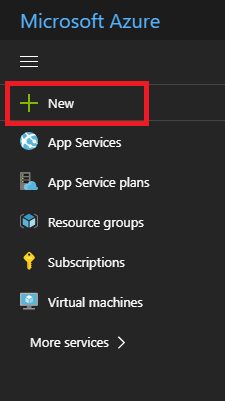
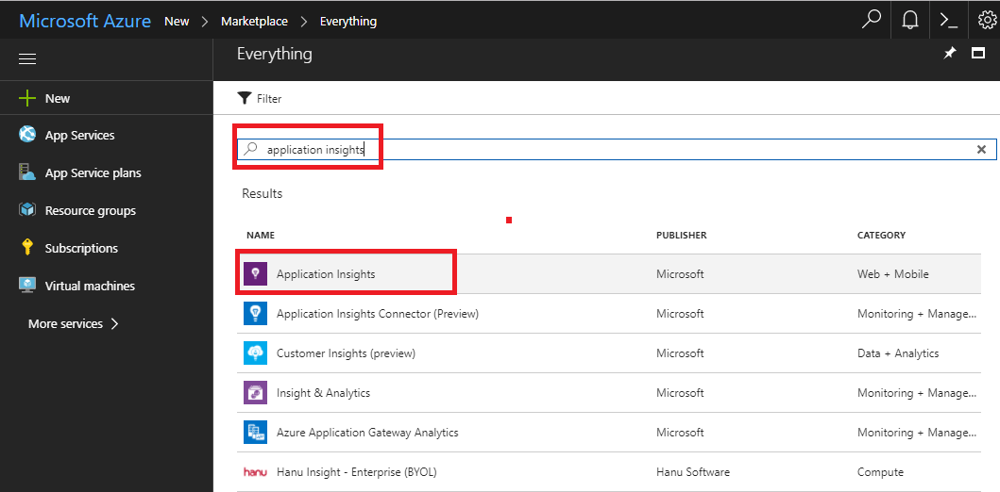
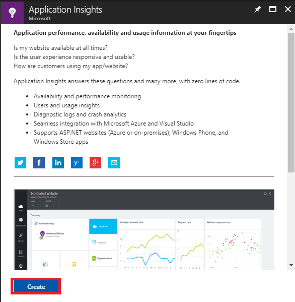
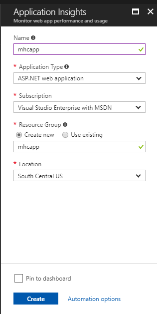
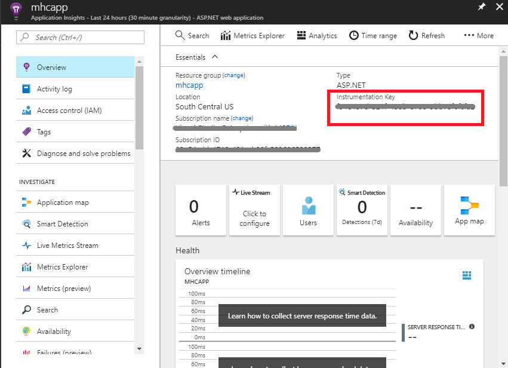

Last updated : {{ "now" | date: "%b %d, %Y" }}.

## Overview

[Application Insights](https://docs.microsoft.com/en-us/azure/application-insights/){:target="_blank"} comes as part of Visual Studio. You get automatic instrumentation for ASP.NET developers and vital application telemetry data right out of the box; including usage, exceptions, requests, performance, and logs.

Monitor web apps—whether written in Java, Ruby, Python, PHP, Node.JS, or other languages—using open source SDKs. Install the Status Monitor on your existing Azure App Services and virtual machines through the Azure portal to get performance monitoring without needing to update and redeploy your application.

Visual Studio Application Insights is an extensible analytics service that monitors your live web application. With it you can detect and diagnose performance issues, and understand what users actually do with your app. It's designed for developers, to help you continuously improve performance and usability. It works for apps on a wide variety of platforms including .NET, Node.js and J2EE, hosted on-premises or in the cloud.

It provides benefits as:

- Exceptions and performance diagnostics.
- Interactive data analysis.
- Azure diagnostics.
- Proactive detection.

## Pre-requisites

In order to complete this lab you will need Visual Studio 2017. Click the button below to deploy a VS 2017 Community VM from the Azure marketplace.

<a href="https://portal.azure.com/#create/Microsoft.VisualStudioCommunity2017onWindowsServer2016x64" class="launch-hol" role="button" target="_blank"><span class="lab-details">Launch the virtual machine</span></a>



- **Visual Studio Team Services account**. If you don't have one, you can create from [here](https://www.visualstudio.com/team-services){:target="_blank"}

- You can use the **[VSTS Demo Data generator](http://vstsdemogenerator.azurewebsites.net/Environment/Create){:target="_blank"}** to provison a project with pre-defined data on to your Visual Studio Team Services account. Please use the ***My Health Clinic*** template to follow the hands-on-labs.

- If you are not using the VSTS Demo Data Generator, you can clone the code from here

## Exercise 1: Creating Instrumentation Key

1. Go to **Azure Portal** from [here](https://portal.azure.com){:target="_blank"}

1. Click on **+ New** icon to create a new **Application Insights**.

   

1. Search for **Application Insights** in the search box.

   

1. Click on **Create**.

   

1. Fill in the following details:-

   - **Name**: Provide the name as **mhcapp**
   - **Application Type**: Select **ASP.NET web application** as the type
   - **Subscription**: Select your subscription
   - **Resource Group**: Create a new resource group with the name **mhcapp**
   - **Location**: Select desired location

   

1. Browse to the resource group **mhcapp** which was created and click on the app insights resource.

   

1. Copy the the **Instrumentation Key** from the top as shown below.

   

## Exercise 2: Configure Application Insights

In this lab we have the existing **01_Demos_ASPNET5** .NET Core application, when creating all the infrastructure for the labs, we will need the newly created **Instrumentation key** to be configured in this project so Application Insights can work.

1. Open Visual Studio 2017.

    

1. Open **01_Demos_ASPNET5** solution. Under **MyHealth.Web** project locate the **appsettings.json** file.

    

    

1. Locate this line from that file.

    ```xml
    "InstrumentationKey": "YOUR_INSTRUMENTATION_KEY"
    ```

1. Substitute the text **YOUR_INSTRUMENTATION_KEY** with the key of your existing Application Insights service.

    

1. Application Insights comes in the form of a Nuget package. Review the **project.json** file of the web project and look for the Application Insights package added.

    

1. Open the file **Startup.cs**.

    

    

    

1. Locate the method **ConfigureServices** and check the line **services.AddApplicationInsightsTelemetry(Configuration);**.

    > This will load the configuration for Application Insights from the configuration file for the site.

    

1. Now locate the method **Configure** and check these lines:

    ```csharp
    * app.UseApplicationInsightsRequestTelemetry();
    * app.UseApplicationInsightsExceptionTelemetry();
    ```

    > With these two lines we are configuring the application to send Telemetry information as well as Exception information to the configured Application Insights.

    

1. Locate the file **_Layout.cshtml** inside the **Views \| Shared** folder in the web application and open it.

    

    

    

1. Look at the first line **@inject Microsoft.ApplicationInsights.Extensibility.TelemetryConfiguration TelemetryConfiguration**.
    This injects the configuration part of Application Insights to be available for the client-side scripting.

    

1. Now look at the line **@Html.ApplicationInsightsJavaScript(TelemetryConfiguration)**.
    This will add the needed Javascript code in the page so Application Insights client-side telemetry sends information about client-side execution.

    

## Exercise 3: Viewing Telemetry

Now that we have configured the application to send telemetry data to Application Insights, let's review how to send the date and see the telemetry from Visual Studio and the Azure Portal.

1. Launch the application from Visual Studio and navigate through the application.

   

1. Stop the application from Visual Studio. Even when debugging the application locally it will start sending information to Application Insights. Now we will review the information captured by Application Insights.

1. Right click on the project **MyHealth.Web** in the **Solution Explorer** and select **Application Insights \| Search Debug Session Telemetry**.

   

   >This view shows telemetry generated in the server side of your app. Experiment with the filters, and click any event to see more detail.

   

1. Right click again on the project **MyHealth.Web** in the **Solution Explorer** and select **Application Insights \| Open Application Insights Portal**.

   

   >The portal opens on a view of the telemetry from your app.

   

1. Click on **Server response time**.

   

   >This opens the azure *blade* with all the information about the server response time of all the calls which have ocurred to the application, and its times. So we can detect for example bottlenecks in our application in particular pages.

   

1. Click on **Page View Load Time**.

   

   >We have a lot of other metrics avaliable, like **Page view load time** which measures times from client side informing how long the pages take to load in the client side.

   

   >Click again, in this new *blade* in **Page View Load Time** in the upper part, you can continue drilling down through all the information in Application Insights.

   

## Exercise 4: Adding Application Insights to New Web Application

Let's create a new web application and review how can we add Application Insights from the beginning.

1. Open Visual Studio. Select **File \| New Project**.

   

1. Select **Visual C# \| .NET Core \| ASP.NET Core Web Application**, ensure to mark the checkbox **Add Application Insights to Project**.

   

   >In this step we are adding Application Insights to the project, if you want to review default values or make any change on them, click on **Configure Settings**

   

1. Click **Ok** on the next screen.

   

1. Open **appsetings.json** file and check the **Instrumentation Key** has been added.

   

   >As we saw in this lab configuring Application Insights, we have now the key already added from the beginning. The **Nuget package, Startup.cs file** and **_layout.cshtml files** has been modified to include Application Insights.

1. Open **Startup.cs** file, as you also see the lines for Application Insights configuration has already been added automatically.

   

1. Open **_Layout.cshtml** and check the particular line for client-side Javascript telemetry.

   

1. Open **project.json** file and check the Application Insights package has also been added.

   

From this point we can also run the application, and see telemetry data as we did at the beginning of this same lab.
