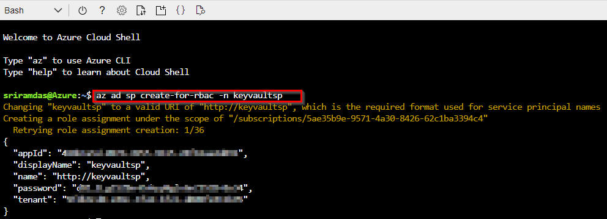
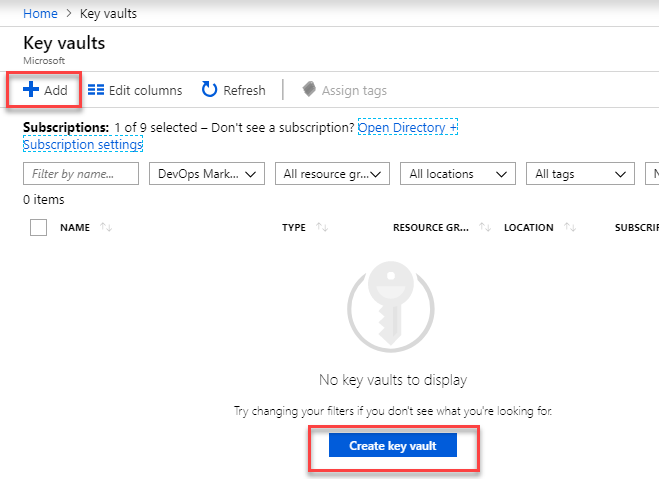
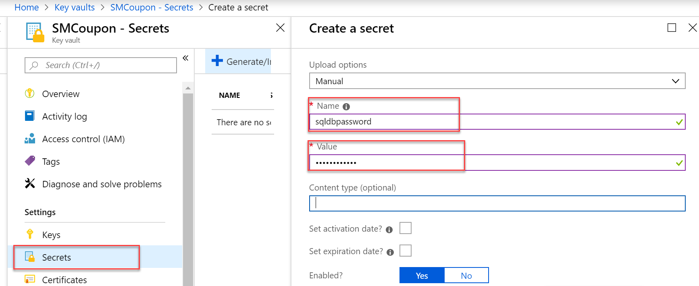
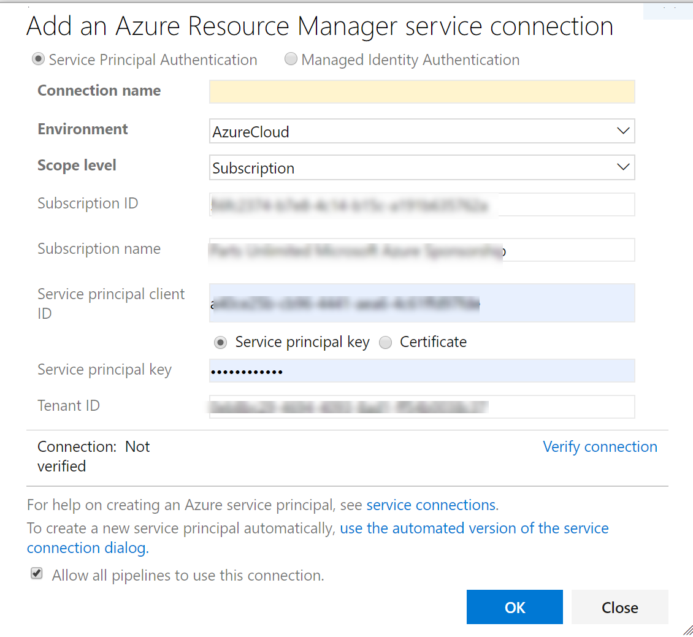
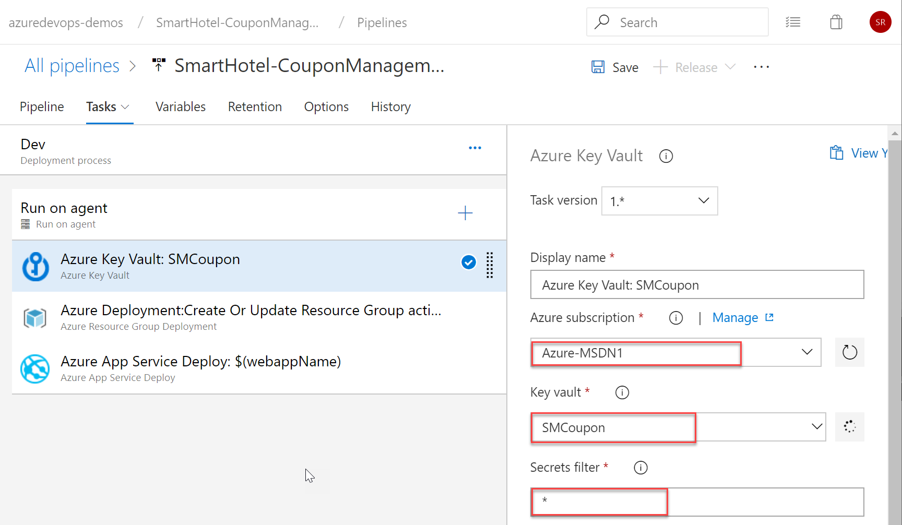
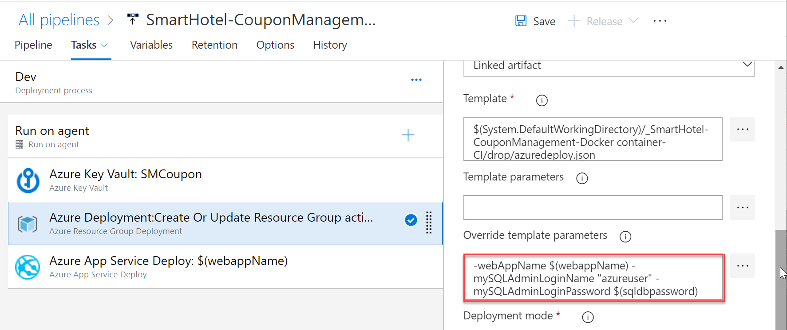

## Overview 
Azure Key Vault helps teams to securely store and manage sensitive information such as keys, password, certificates, etc. in a centralized storage which are safeguarded by industry-standard algorithms, key lengths, and even hardware security modules. This prevents information exposure through source code,  a common mistake that many developers make. Many developers leave sensitive information such as database connection strings, passwords, private keys, etc. in their source code which when gained by malicious users can result in undesired consequences. Access to a key vault requires proper authentication and authorization and with RBAC, teams can have even fine granular control who has what permissions over the sensitive data.

## What’s covered in this lab
In this lab, you will see how you can use Azure Key Vault in a pipeline

1. We will create a key vault, from the Azure portal, to store a MySQL server password
1. We will configure permissions to let a service principal to read the value
1. We will retrieve the password in an Azure pipeline and passed on to subsequent tasks

### Before you begin

1. Refer the [Getting Started](../Setup/) page before you begin following the exercises.

1. Use the [Azure DevOps Demo Generator](https://azuredevopsdemogenerator.azurewebsites.net/?name=keyvault) to provision a new project

### Task 1: Creating a service principal 

You will need a service principal to deploy an app to an Azure resource from Azure Pipelines. Since we are going to retrieve secrets in a pipeline, we will need to grant permission to the service when we create the key vault. 

A service principal is automatically created by Azure Pipeline when you connect to an Azure subscription from inside a pipeline definition or when you create a new service connection from the project settings page. You can also manually create the service principal from the portal or using Azure CLI,  and re-use it across projects. It is recommended that you use an existing service principal when you want to have a pre-defined set of permissions

We will create one manually using the Azure CLI. If you do already have a service principal, you can skip this task.

1. Login to the [**Azure Portal**](https://portal.azure.com) 

1. Open the Azure cloud shell. Select **Bash** when prompted to choose shell.

    

1. Enter the following command by replacing ServicePrincipalName and PASSWORD with your desired values.

   `az ad sp create-for-rbac --name ServicePrincipalName --password PASSWORD `

   It will give you a JSON output as shown in the image. Copy the output to notepad or text file. You will need them later.

    

1. Enter the following command to get Azure SubscriptionID and copy the subscription ID and name to notepad.

    `az account show`

### Task 2: Creating a key vault

Next, we will create a key vault in Azure. For this lab scenario, since we are using a node-based app that connects to a MySQL database, we will  store the password of MySQL database as a secret in the key vault.

1. If not already logged in, login to the [Azure Portal](https://portal.azure.com)

1. Enter "Key vault" in the search field and press enter. Select **Key Vaults** under services

1. Select **Add** or the **Create key vault** button to create a new key vault

    

1. Provide a name, subscription, resource group and location for the vault

    Because data in the Key Vaults are sensitive and business critical, you need to secure access to your key vaults by allowing only authorized applications and users. To access the data from the vault, you will need to provide read (Get) permissions to the service principal that you will be using for authentication in the pipeline. 

1. Select **Access policies** and then select **+Add new** to setup a new policy

1. You will need specify the permission that you intend to grant the application. This can be permissions to manage the keys, data(secrets), . In any case, applications can access the key vault in two ways:

    * User + Application access: Access is granted to specific user who can then be allowed to use any application or can be restricted to use a specific application. 

    * Application-only access: Access is granted to the application which can be run as a daemon service or background job. 

1. Select the **Select principal** and search for the security principal that you created earlier and select it. You can search by name or ID of the principal.

    

1. Next, we will select the permission to be granted. For now, we will select to provide **read-only** permissions (Get, List) to just the secrets.

    

1.  Click **OK** to close the open blades and select **Create** to create the vault.

1. It should only take a couple of minutes for the service to be created. Once it is provisioned, select the key vault and add a new secret. Let's name it **sqldbpassword**. Provide any value that will be accepted as a password for a MySQL database

    

### Task 3: Check the Azure Pipeline

Now, lets go to the Azure DevOps project that you provisioned using the demo generator and configure the Azure Pipelines to read the secret from the key vault

1. Navigate to the Azure DevOps project 

    

1. Select **Pipelines** and choose **Builds**

1. Select the **Queue** button to manually queue the build definition. Wait for the build to complete

    

1. Go to **Releases** under **Pipelines** and then select and edit the **SmartHotel-CouponManagement-CD** definition

1. You will notice the release definition for **Dev** stage has **Azure Key Vault** task at the top. This task downloads *Secrets* from an Azure Key Vault. You will need to point to the subscription and the Azure Key Vault resource you created earlier in the lab.

1. You need to authorize the pipeline to deploy to Azure. Azure pipelines can automatically create a service connection with a new service principal but we want to use the one we created earlier. So, choose the **Advanced Options** from the drop down next to the *Authorize* button and use the full service dialog to enter the Service principal ID, passphrase, tenant ID, etc., 

    

1. Press **OK** to save and close the dialog. Once the connection is established, you can enter the name or select the key vault you created from the drop-down

1. In the **Secrets filter** field, you can specify an *asterisk* (*) to read all secrets or if you want only specific ones, you can provide the names of the secrets as comma-separated values

    

    At runtime, Azure Pipelines will fetch the latest values of the secrets and set them as task variables which can be consumed in the following tasks which means  the password we stored earlier can be read using **$(sqldbpassword)**.  

1. We pass this value in the next task, **Azure Deployment** where we deploy an ARM template

    

Notice the **Override template parameters** field has the database user name as a string but the password value is passed as a variable

 `-webAppName $(webappName) -mySQLAdminLoginName "azureuser" -mySQLAdminLoginPassword $(sqldbpassword)`

This will provision the MySQL database defined in the ARM template using the password that you have specified in the key vault. It's that easy!!! ***It's that easy!!!***

You may want to complete the pipeline definition by specifying the subscription., location for the task. Repeat the same for the last task in the pipeline **Azure App Service Deploy**. Finally, save and create a new release to start the deployment



### Exercise Challenge

Try creating a new secret to store the user name for the MySQL Database and change the pipeline to fetch and use the secret

### Related Labs
* [Embracing Continuous Delivery with Azure Pipelines] (https://azuredevopslabs.com/labs/azuredevops/continuousdeployment/)

* [GitHub integration with Azure Pipelines](https://azuredevopslabs.com/labs/vstsextend/github-azurepipelines/)