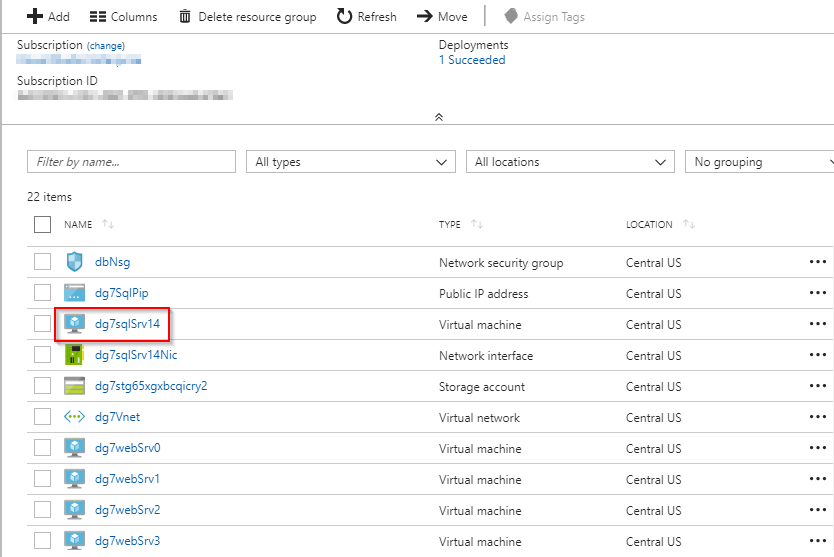
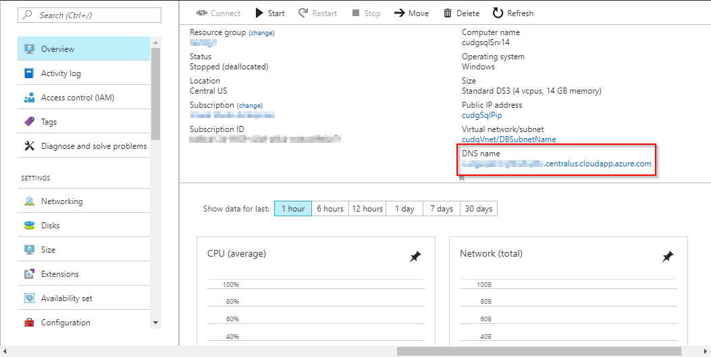
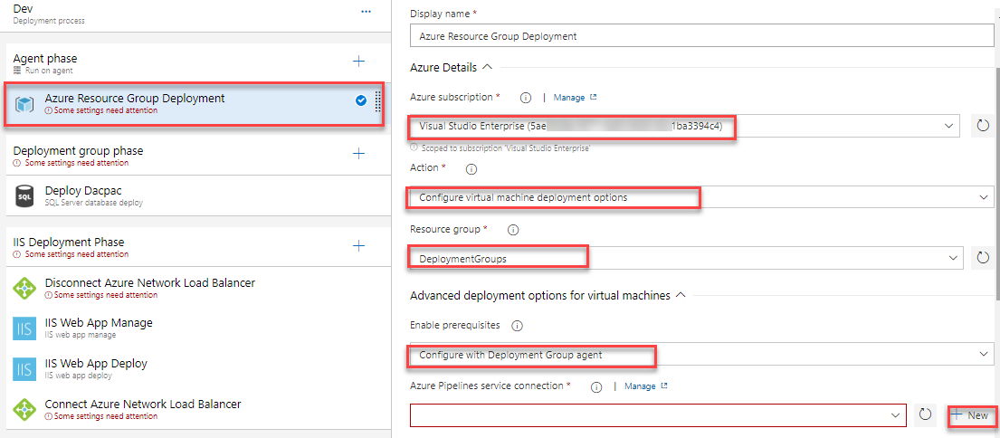
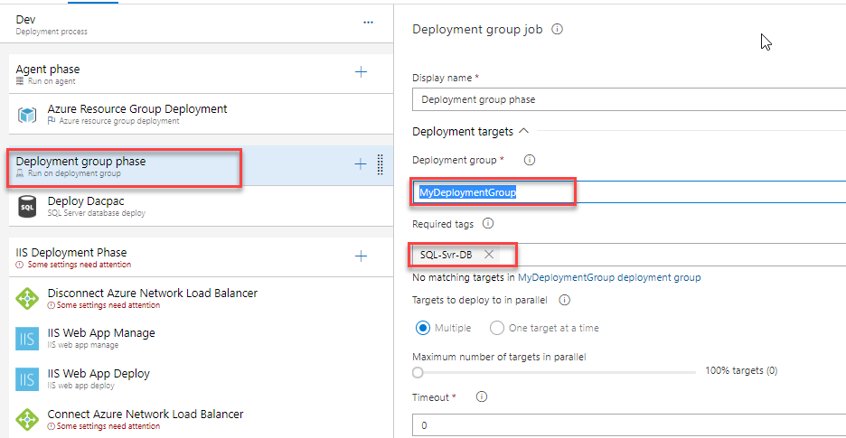
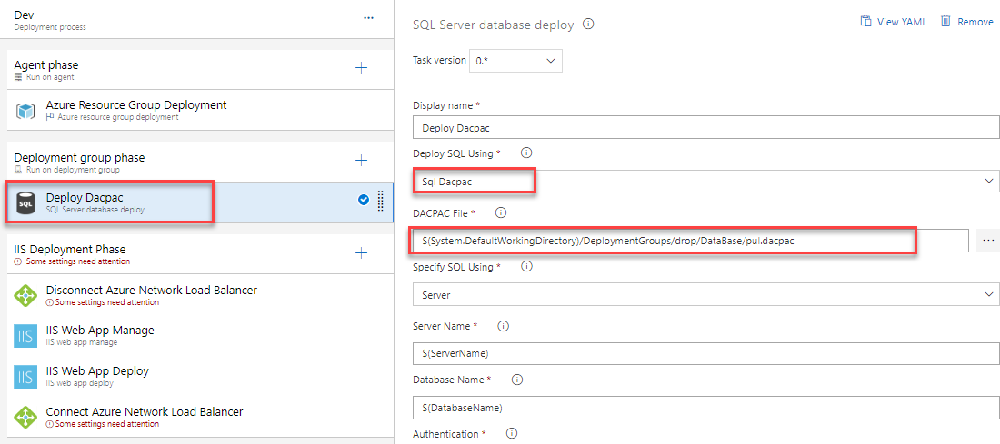
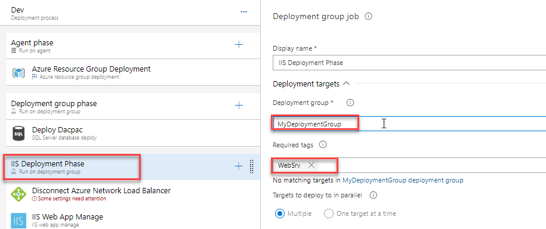
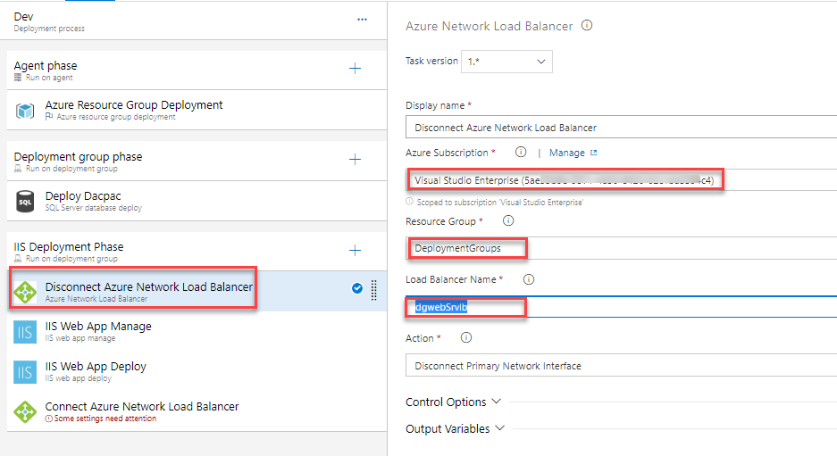
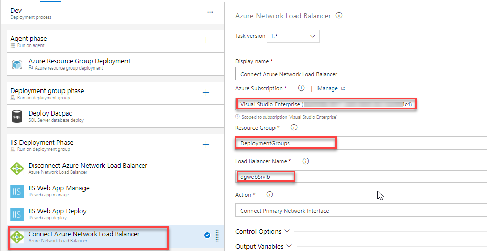
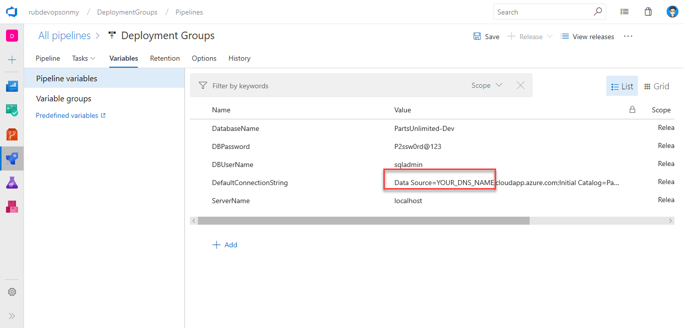
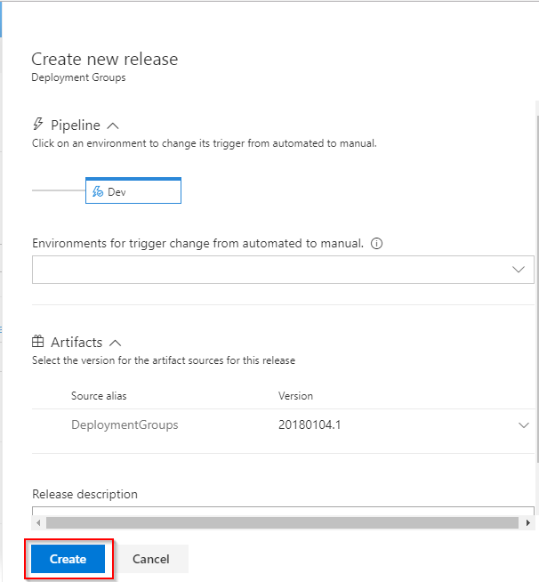

Last updated : {{ "now" | date: "%b %d, %Y" }}.

## Overview

 Earlier with VSTS Release Management, if you had to deploy an application to multiple servers, you had to manually enable Windows PowerShell remoting on each of the server, open the required ports and install the deployment agent. Also, for a roll-out deployment, the pipelines had to be managed manually.

With the introduction of [Deployment Groups](https://docs.microsoft.com/en-us/vsts/build-release/concepts/definitions/release/deployment-groups/), the above challenges are overcome.

Deployment Group installs a deployment agent on each of the target servers within a group and instructs the Release Management to gradually deploy to all machines belonging to that Deployment Group. Multiple pipelines can be created for roll-out deployments so that the latest version of the application can be provided gradually to multiple user groups for validating the new features.

## Pre-requisites

1. **Microsoft Azure Account**: You need a valid and active azure account for the labs.

1. You need a **Visual Studio Team Services Account** and [Personal Access Token](https://docs.microsoft.com/en-us/vsts/accounts/use-personal-access-tokens-to-authenticate)

## Setting up the Environment

We will use ARM template to provision the below resources on Azure:

- Six VMs (web servers) with IIS configured

- A SQL server VM (db server) and

- Azure Network Load Balancer

1. Click on **Deploy to Azure** to provision the resources. It takes approximately 10-15 minutes to complete the deployment.

   

   

1. Once the deployment is successful, you will see the resources in your Azure Portal.

   

1. Click on **DB server VM**.

   

1. Note down the **DNS** name. This value will be used later in an exercise.

   

## Setting up the VSTS Project

1. Use [VSTS Demo Data Generator](https://vstsdemogenerator.azurewebsites.net/?name=DeploymentGroups&templateid=77368) to provision a project on your VSTS account.

   

1. Once the project is provisioned, click the URL to navigate to the project.

   

## Exercise 1: Endpoint Creation

Since the connections are not established during project provisioning, we will manually create the endpoints.

1. In VSTS, navigate to **Services** by clicking on the gear icon, and click on **+ New Service Endpoint**. Select **Azure Resource Manager**. Specify **Connection name**, select your **Subscription** from the dropdown and click **OK**. We use this endpoint to connect **VSTS** and **Azure**.

   

   

1. Create an endpoint of type **Team Foundation Server/Team Services**. Select **Token based authentication** and specify the following details-

   - **Connection Name**: Give any name

   - **Connection Url**: Your VSTS account Url

   - **Personal Access Token**: Your VSTS Personal Access Token

   Created endpoint is used in release definition in later exercise. We create this connection because  agent registration with deployment group requires access to your VSTS project.

   

## Exercise 2: Creating Deployment Group

[Deployment Groups](https://docs.microsoft.com/en-us/vsts/build-release/concepts/definitions/release/deployment-groups/) in VSTS makes it easier to organize the servers that you want to use to host your app. A deployment group is a collection of machines with a VSTS deployment agent on each of them. Each machine interacts with VSTS to coordinate deployment of your app.

1. Go to **Deployment Groups** under **Build & Release** tab. Click **Add deployment group** .

   

1. Provide  **Deployment group name**, and click create. You will see the registration script generated.

   

   

## Exercise 3: Configure Release

We have target machines available in the deployment group to deploy the application. The release definition uses **Phases** to deploy to target servers.

A [Phase](https://docs.microsoft.com/en-us/vsts/build-release/concepts/process/phases) is a logical grouping of tasks that defines the runtime target on which the tasks will execute. A deployment group phase executes tasks on the machines defined in a deployment group.

1. Go to Release under **Build & Release** tab. Edit the release definition **Deployment Groups** and select **Tasks**.

    

    

1. You will see tasks grouped under **Agent phase**, **Database deploy phase** and **IIS Deployment phase**.

   

   - **Agent Phase**: In this phase , we will associate the target servers to the deployment group. The below task is used-

     - **Azure Resource Group Deployment**: This task will automate the configuration of the deployment group agents to the web and db servers.

       

   - **Database deploy phase**: This deployment group phase executes tasks on the machines defined in the deployment group. This phase is linked to **db** tag.

     - **Deploy Dacpac**: This task is used to deploy dacpac file to the DB server.

       

         

       

   - **IIS Deployment phase**: In this phase, we deploy application to the web servers.This phase is linked to **web** tag. We use following tasks-

      - **Azure Network Load Balancer**: As the target machines are connected to NLB, this task will disconnect machines from NLB before the deployment and re-connects to NLB after the deployment.

      - **IIS Web App Manage**: The task runs on the deployment target machine(s) registered with the Deployment Group configured for the task/phase. It creates a webapp and application pool locally with the name **PartsUnlimited** running under the port
      **80**

      - **IIS Web App Deploy**: The task runs on the deployment target machine(s) registered with the Deployment Group configured for the task/phase. It deploys the application to the IIS server using **Web Deploy**.

        

1. We can control the number of concurrent deployments by setting the **Maximum number of targets in parallel**. For example, in this lab we have 6 web servers, setting the target servers to **50%** will deploy the build artifact to 3 web servers parallely and then to the remaining 3 servers.

   

1. Go to **Disconnect Azure Network Load Balancer** task and update the following details-

   - **Azure Subscription**: ARM Endpoint created in **Exercise 1**

   - **Resource Group**: Name of the Resource Group which was created while provisioning the environment

   - **Load Balancer Name**: Select the name from the dropdown

   - **Action**: Set the action to **Disconnect Primary Network Interface**

   

1. Go to **Connect Azure Network Load Balancer** and update the following details-

    - **Azure Subscription**: ARM Endpoint created in **Exercise 1**

    - **Resource Group**: Name of the Resource Group which was created while provisioning the environment

    - **Load Balancer Name**: Select the name from the dropdown

    - **Action**: Set the action to **Connect Primary Network Interface**

    

1. Go to **Variables** tab and click on edit  to update the **DefaultConnectionString** value with **Your SQL_DNS name**.

   

1. Click **Save** and **Create release**.

   

   

   

1. Once the release is complete, you will see the deployments are done to DB and Web Servers. Go to Logs to see the summary.

    

1. In one of your web servers, go to **DNS** to access the application.

   > [**Azure Load Balancer**](https://docs.microsoft.com/en-us/azure/load-balancer/load-balancer-overview) is being used here which  distributes incoming traffic among healthy instances of services defined in a load-balanced set. So, **DNS** of all web servers are the same.

    

    

1. The deployed web application is displayed.

    

## Summary

With Visual Studio Team Services and Azure, we can build and release dotnet applications to multiple target servers using Deployment Groups.
