Last updated : {{ "now" | date: "%b %d, %Y" }}.

## Overview

The Azure DevOps Project simplifies the initial configuration of a continuous integration (CI) and continuous delivery (CD) pipeline for your Java app in Visual Studio Team Services (VSTS).


## What's covered in this lab?

 In this lab, you will
* create new VSTS account with Java project sample using **Azure DevOps Project** feature in Azure
* examine the CI/CD pipelines configured by **Azure DevOps Project**
* Commit the code changes and execute CI/CD


## Pre-requisites for the lab

 1. **Microsoft Azure Account**: You will need a valid and active Azure account for the Azure labs. If you do not have one, you can sign up for a [free trial](https://azure.microsoft.com/en-us/free/){:target="_blank"}

   * If you are a Visual Studio Active Subscriber, you are entitled for a $50-$150 credit per month. You can refer to this [link](https://azure.microsoft.com/en-us/pricing/member-offers/msdn-benefits-details/) to find out more including how to activate and start using your monthly Azure credit.

   * If you are not a Visual Studio Subscriber, you can sign up for the FREE [Visual Studio Dev Essentials](https://www.visualstudio.com/dev-essentials/)program to create **Azure free account** (includes 1 year of free services, $200 for 1st month).

## Exercise 1: Setting up Sample Java project using Azure DevOps Project

1. Sign into the [Microsoft Azure portal](https://portal.azure.com).

2. Choose the **+ Create a resource** icon in the left navigation bar, then search for **DevOps project**. Then choose **DevOps Project** in the list and click on **Create**

    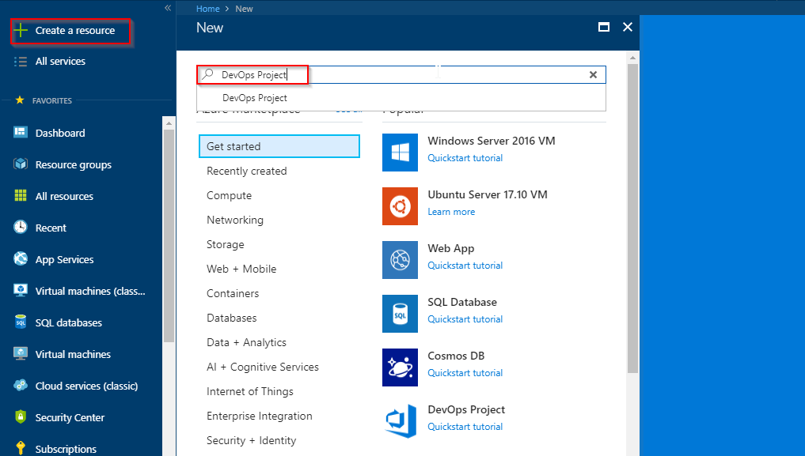

    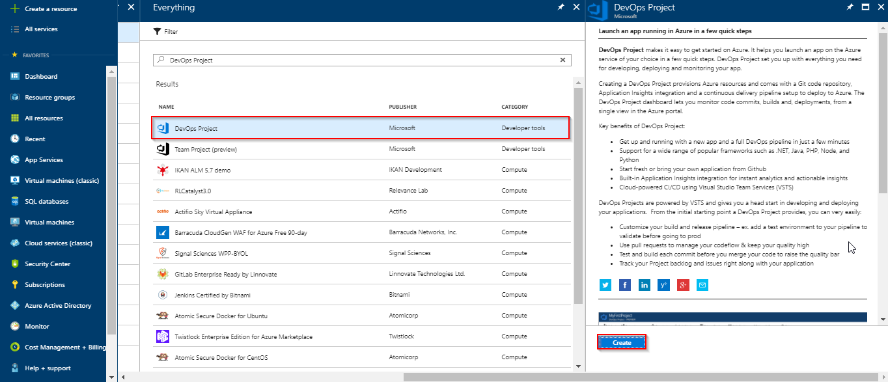

3. Select the **Java** sample application and click on **Next**. The Java samples include a choice of several application frameworks.

   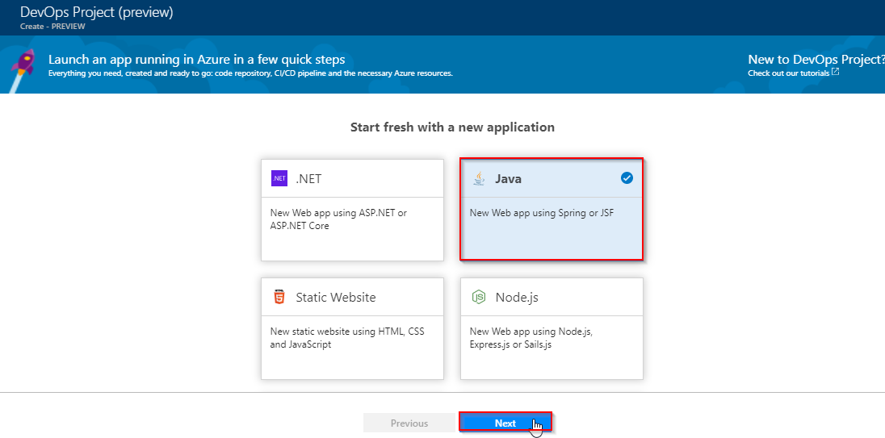

4. The default sample framework is **Spring**. Select a framework or leave the default setting. When you're done, choose **Next**.

   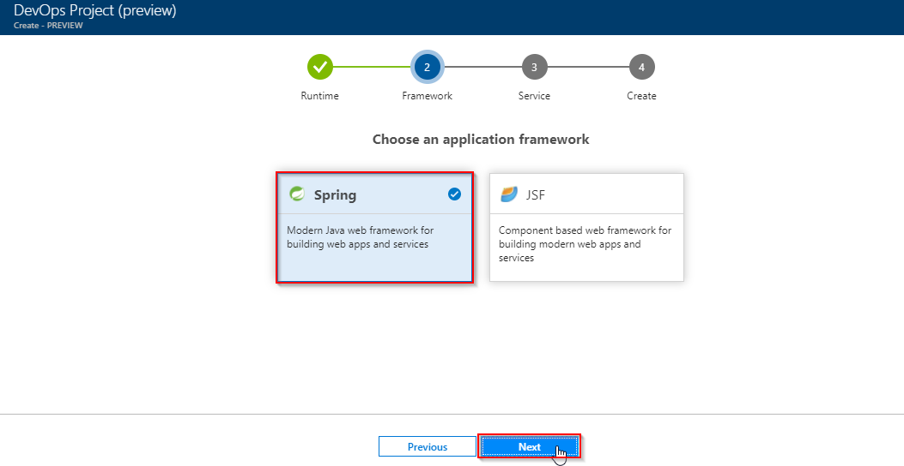

5. **Web App For Containers** is the default deployment target. The application framework, which you chose on the previous steps, dictates the type of Azure service deployment target available here. In this lab let us select **WebApp** as **target service**. When you're done, choose **Next**.

    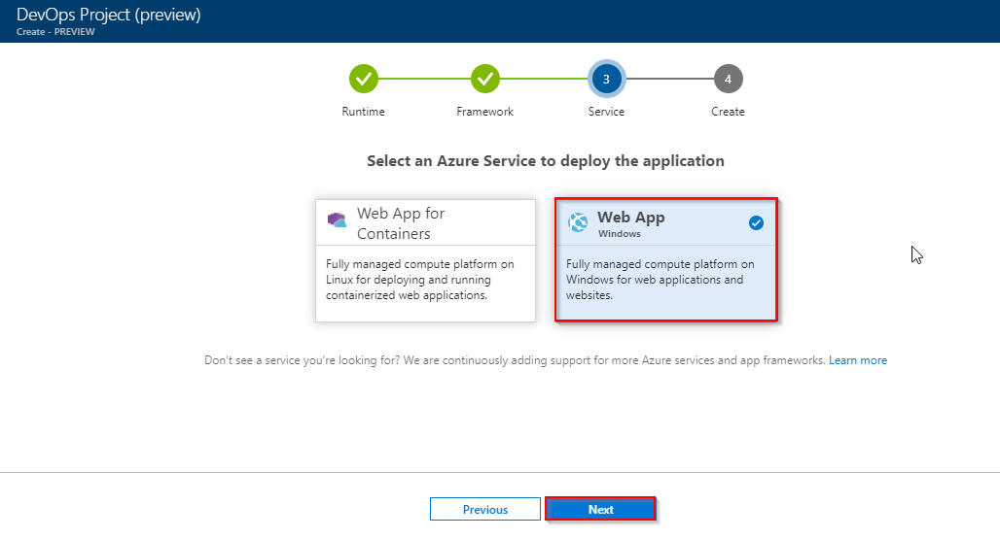

6. You can create a free **new VSTS** account or use an **existing account**. In this lab let us create **new VSTS account**. Choose a name for your VSTS **account** and **project**. Select your **Azure subscription**, **location**, and choose a **name** for your application. When you're done, choose **Done**.

    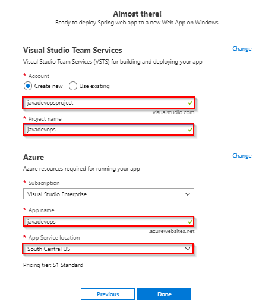

7. In a few minutes, the **project dashboard** loads in the Azure portal. A sample java application is set up in a repository in your VSTS account, a build executes, and your application deploys to Azure. This dashboard provides visibility into your **code repository**, **VSTS CI/CD pipeline**, and your **application in Azure**. 

   

8.  On the right side of the dashboard, select **Browse** to view your running application.
    

    The web app look like as shown in below figure
    
    

   The **Azure DevOps project** automatically configures a CI build and release trigger. You're now ready to collaborate with a team on a Java app with a CI/CD process that automatically deploys your latest work to your web site.


## Exercise 2: Examine the VSTS CI/CD pipelines configured by Azure DevOps Project

  The Azure DevOps project automatically configured a full VSTS CI/CD pipeline in your VSTS account. Explore and customize the pipeline as needed. Follow the steps below to familiarize yourself with the VSTS build and release definitions.

1. Select **Build Pipelines** from the top of the Azure DevOps project dashboard. This link opens a browser tab and opens the VSTS build definition for your new project.

    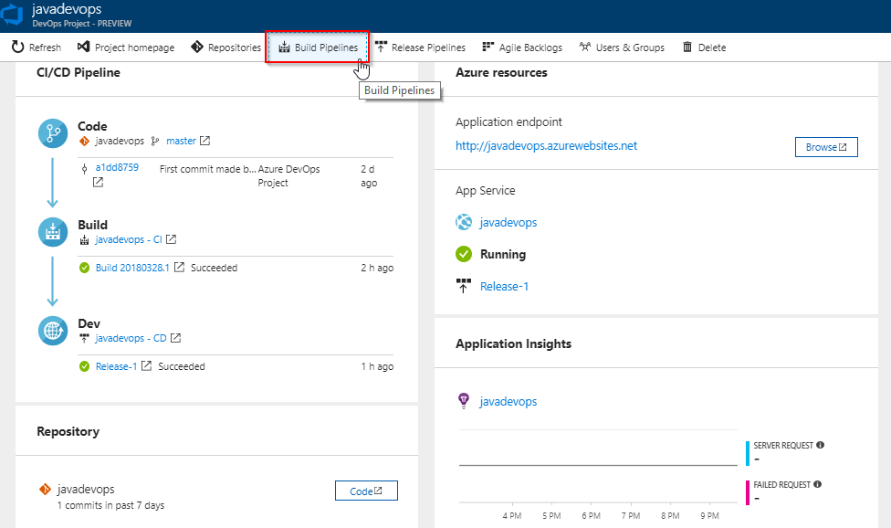

2. Select the **ellipsis** that appears. This action opens a menu where you can perform several activities such as queue a new build, pause a build, and edit the build definition. Select **Edit**.
      
    

3. From this view, **examine the various tasks** for your build definition. The build performs various tasks such as fetching sources from the Git repository, restoring dependencies, and publishing outputs used for deployments.

     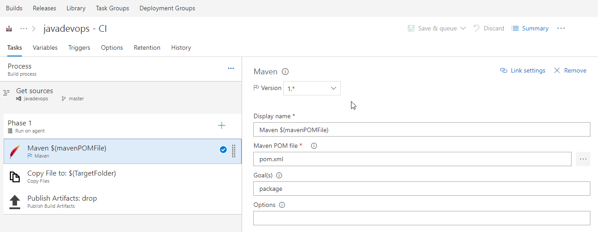

4. Under your build definition name, select **History**. You see an audit trail of your recent changes for the build. VSTS keeps track of any changes made to the build definition, and allows you to compare versions.

      

5. Select **Triggers**. The Azure DevOps project automatically created a CI trigger, and every commit to the repository initiates a new build. You can optionally choose to include or exclude branches from the CI process.

     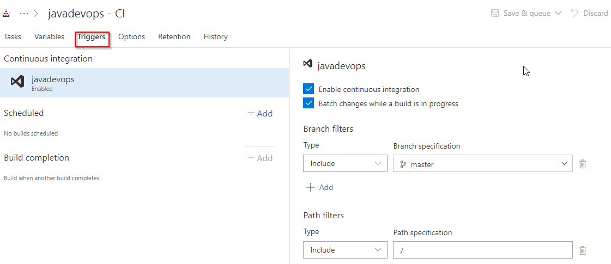

6. Select **Retention**. Based on your scenario, you can specify policies to keep or remove a certain number of builds.
  
      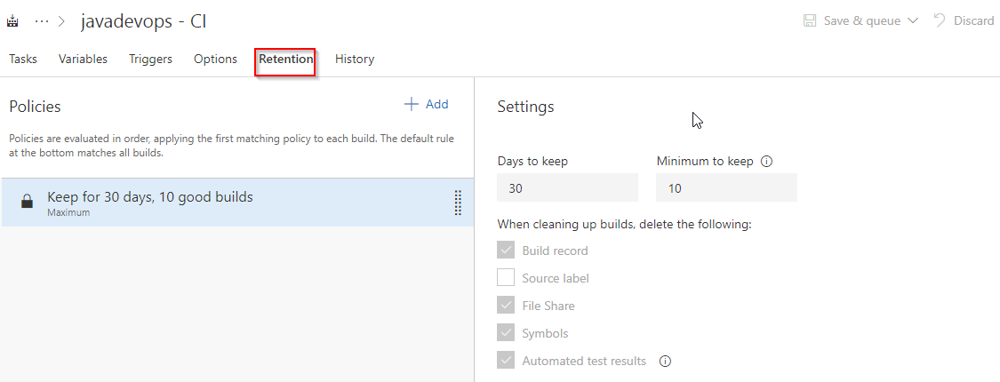

7. Select **Build and Release**, then choose **Releases**. The Azure DevOps project created a VSTS release definition to manage deployments to Azure.
     
      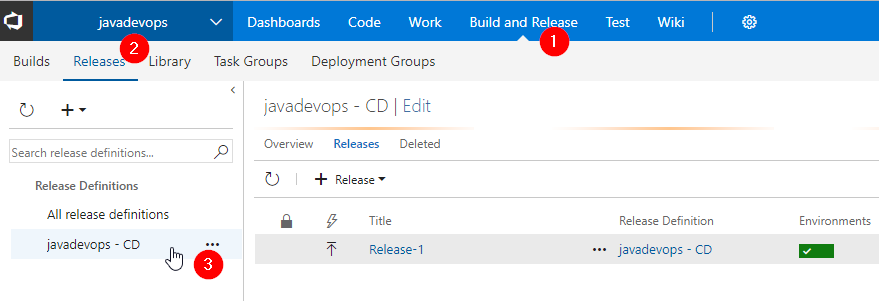

8. Select the **ellipsis** next to your release definition, then choose **Edit**.

     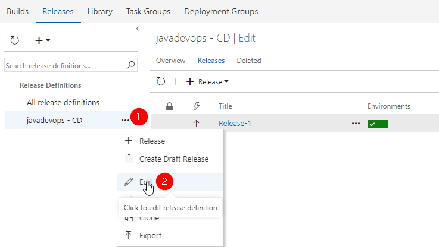

10. The release definition contains a **pipeline**, which defines the release process. Under **Artifacts**, select **Drop**. The build definition you examined in the previous steps produces the output used for the artifact.

    

11. To the right-hand side of the **Drop** icon, select the **Continuous deployment trigger**. This release definition has an enabled CD trigger, which executes a deployment every time there is a new build artifact available. Optionally, you can disable the trigger, when your deployments require manual execution.

    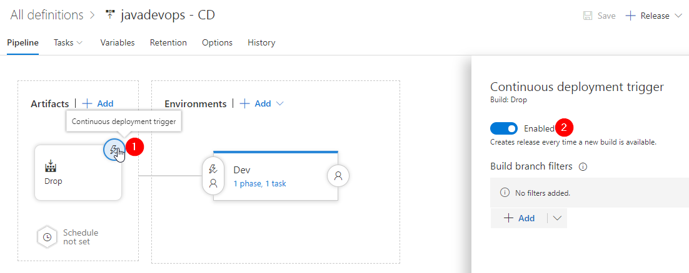

12. On the left-hand side of the browser, select **Tasks**. The tasks are the activities your deployment process performs. In this example, a task was created to deploy to **Azure App service**.

     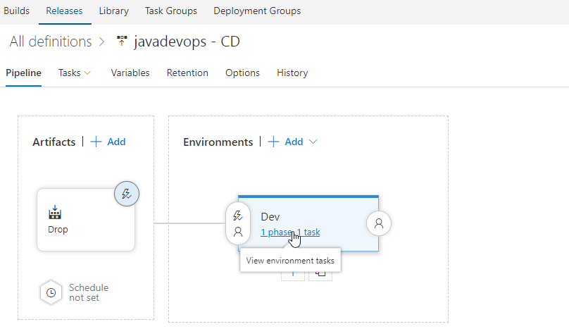

       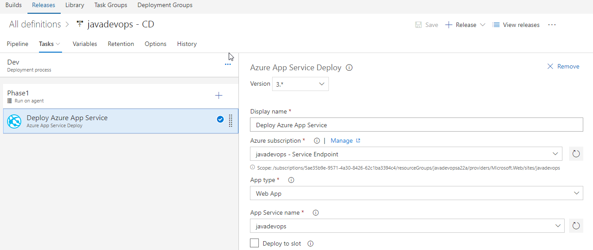

13. On the right-hand side of the browser, select **View releases**. This view shows a history of releases.

    

    

14. Select the **ellipsis** next to one of your releases, and choose **Open**. There are several menus to explore from this view such as a release summary, associated work items, and tests.

    

    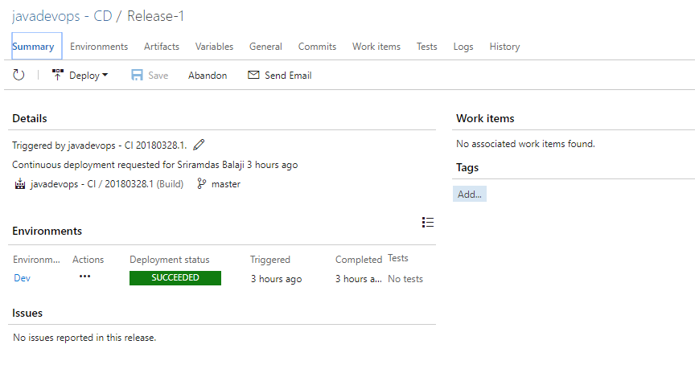

15. Select **Logs**. The logs contain useful information about the deployment process. They can be viewed both during and after deployments.

     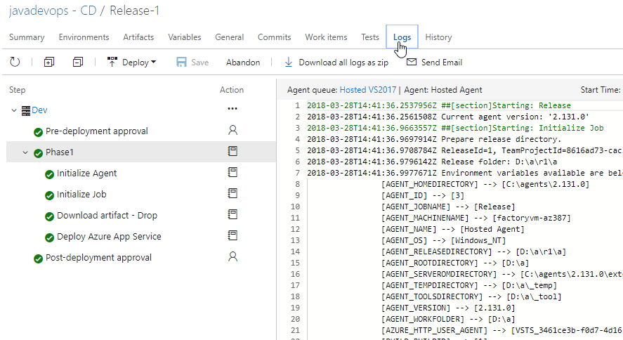

## Exercise 3: Commit the code changes and execute CI/CD

The Azure DevOps project created a Git repository in your VSTS account. Follow the steps below to view the repository and make code changes to your application.

1. Click on **Code** tab to view the created Git repository by Azure DevOps project.

     

2. To view the repository clone URL, select **Clone** from the top right of the browser. You can clone your Git repository in your favorite IDE. In this lab, you can use the web browser to make and commit code changes directly to the master branch.

     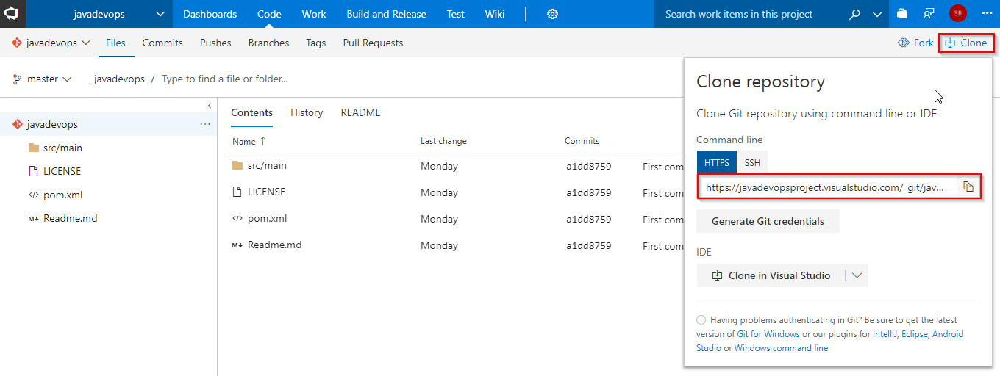

3. On the left-hand side of the browser, navigate to the **src/main/resources/static/index.html** file. Select **Edit**, and make a change. For example, add a new description line as shown in below figure.
         
    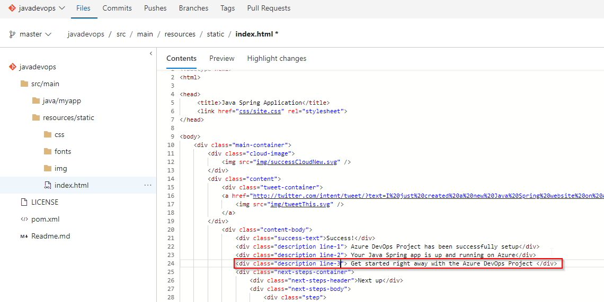

    ```csharp
         <div class="description line-3"> Get started right away with the Azure DevOps Project </div>
    ```
4. Choose **Commit**, to save and checkin your changes.

      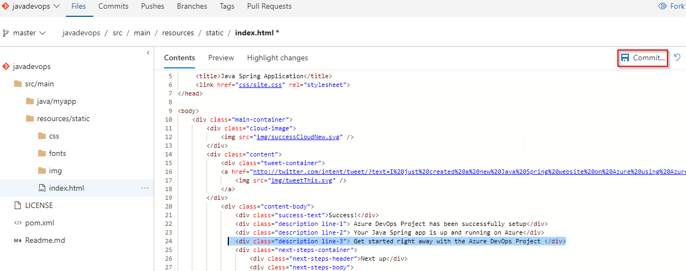

5. In your browser, navigate to the **Builds**. You should now see a build is in progress. The changes you just made are automatically built and deployed via a VSTS CI/CD pipeline.

    

6. In your browser, navigate to the **Azure DevOps project dashboard**. On the right side of the dashboard, select **Browse** to view your updated running application. You will the updated decription line in the web app.

    


   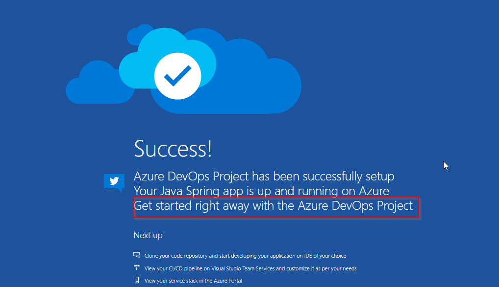