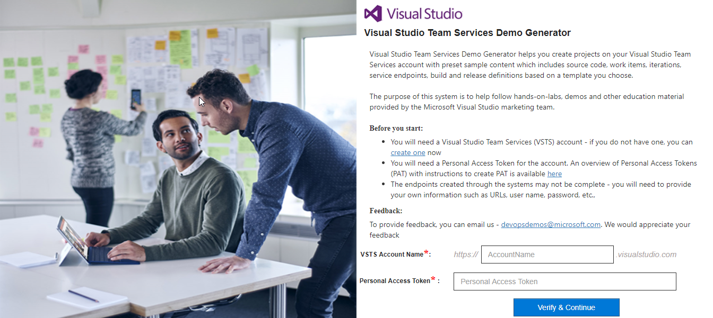
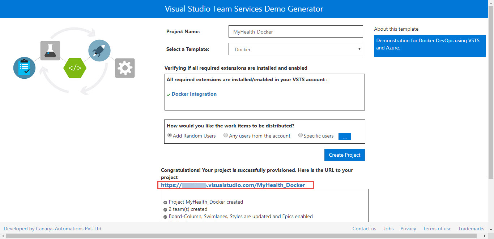
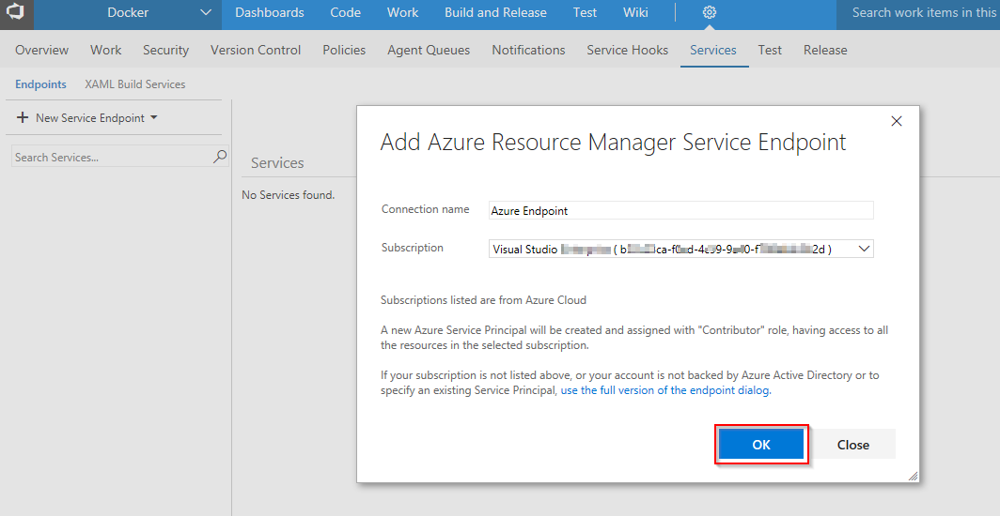
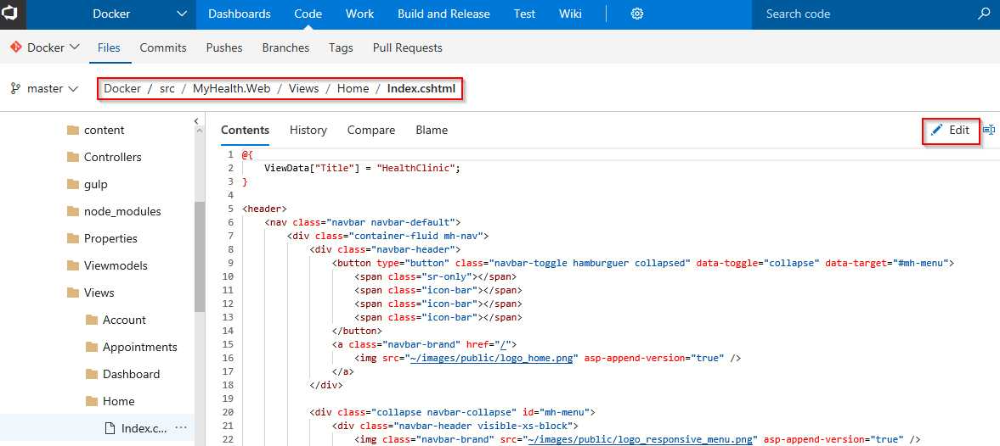
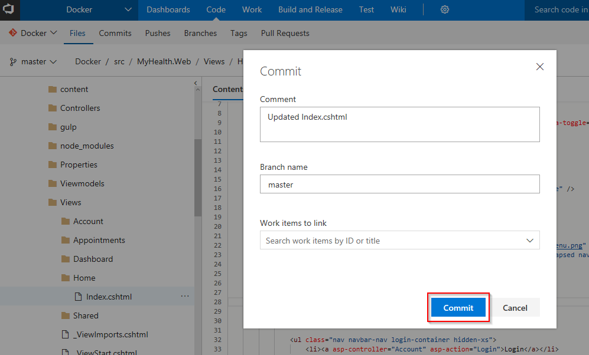
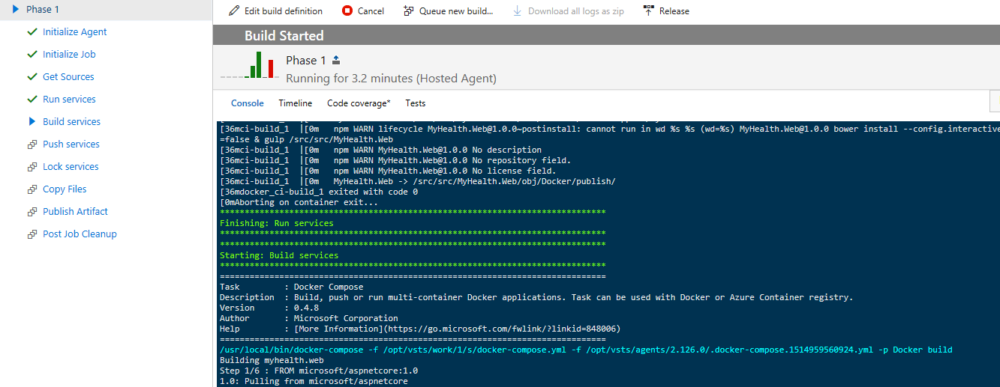
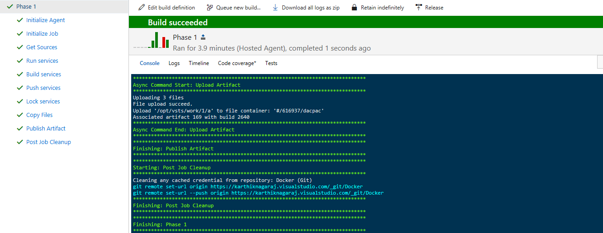
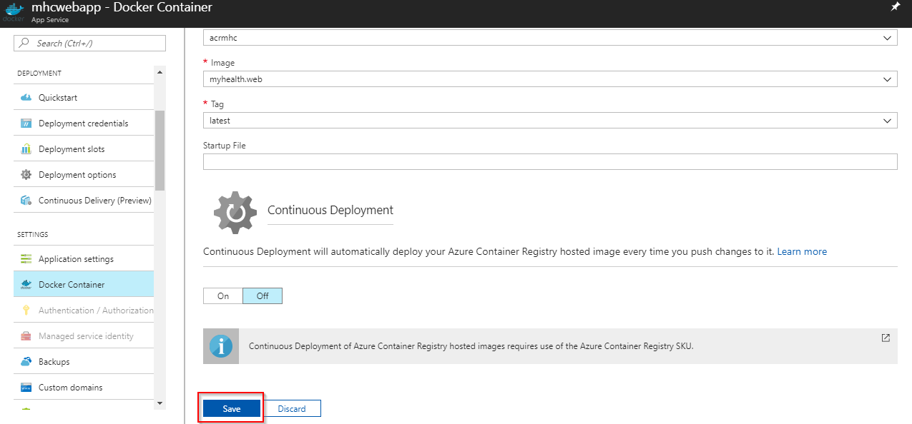
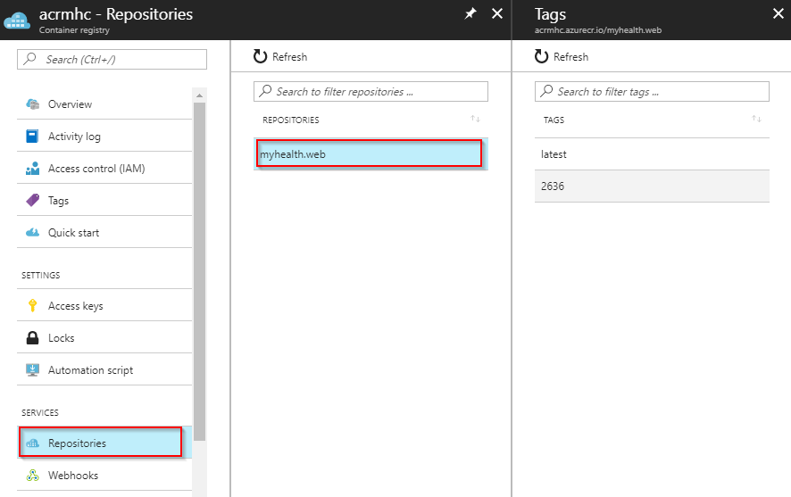

Last updated : {{ "now" | date: "%b %d, %Y" }}.

## Overview

This lab outlines the process to build custom Docker images of an [**ASP.NET Core**](https://docs.docker.com/engine/examples/dotnetcore/"){:target="_blank"} application, push those images to a private repository in [Azure Container Registry](https://azure.microsoft.com/en-in/services/container-registry/){:target="_blank"} (ACR). These images will be used to deploy the application to the Docker containers in the **Azure App Service** (Linux) using VSTS.

The Web App for Containers allows creation of custom [Docker](https://www.docker.com/what-docker){:target="_blank"} container images, easily deploy and run them at scale on Azure. Combination of VSTS and Azure integration with Docker will enable the following:

1. [Build](https://docs.docker.com/engine/reference/commandline/build/){:target="_blank"} custom Docker images using [VSTS Hosted Linux agent](https://docs.microsoft.com/en-us/vsts/build-release/concepts/agents/hosted){:target="_blank"}

1. [Push](https://docs.docker.com/engine/reference/commandline/push/){:target="_blank"} and store the Docker images in a private repository

1. Deploy and [run](https://docs.docker.com/engine/reference/commandline/run/){:target="_blank"} the images inside the Docker Containers

The below diagram details the VSTS DevOps workflow with Docker:

## Image to be added here

### Prerequisites for the lab

1. **Microsoft Azure Account**: You will need a valid and active Azure account for the Azure labs. If you do not have one, you can sign up for a [free trial](https://azure.microsoft.com/en-us/free/){:target="_blank"}

    * If you are a Visual Studio Active Subscriber, you are entitled for a $50-$150 credit per month. You can refer to this [link](https://azure.microsoft.com/en-us/pricing/member-offers/msdn-benefits-details/){:target="_blank"} to find out more including how to activate and start using your monthly Azure credit.

    * If you are not a Visual Studio Subscriber, you can sign up for the FREE [Visual Studio Dev Essentials](https://www.visualstudio.com/dev-essentials/){:target="_blank"} program to create **Azure free account** (includes 1 year of free services, $200 for 1st month).

1. You will need a **Visual Studio Team Services Account**. If you do not have one, you can sign up for free [here](https://www.visualstudio.com/products/visual-studio-team-services-vs){:target="_blank"}

1. You will need a **Personal Access Token** to set up your project using the Demo Generator. Please see this [article](https://docs.microsoft.com/en-us/vsts/accounts/use-personal-access-tokens-to-authenticate){:target="_blank"} for instructions to create your token.

    

1. Installation of the **Docker Integration** extension from [Visual Studio Marketplace](https://marketplace.visualstudio.com/items?itemName=ms-vscs-rm.docker){:target="_blank"}

## Setting up the Environment

1. Click on the **Deploy to Azure** button to initiate the configuration.

   

1. In the Custom deployment window, select the **Subscription** type, leave the default selection for the resource group and select the **Location**. Provide the **ACR Name, Site Name**, **DB Server Name**, accept the **Terms and Conditions** and click on the **Purchase** button to provision the following resources:

   * Azure Container Registry

   * Azure Web App

   * Azure SQL Server Database

   > Use lower case letters for ***DB Server Name***

   

1. It takes approximately 3 to 4 minutes to provision the environment. Click on the **Go To resource group** to view the resource group.

   

1. The following components are provisioned post deployment.

   Azure Components | Description
   -----------------|------------
    Container Registry | Used to store images privately
    Storage Account | Container Registry resides in this storage account
    App Service | Docker images are deployed to containers in this App Service
    App Service Plan | Resource where App Service resides
    SQL Server | SQL Server to host database
    SQL database | SQL database to host MyHealthClinic data

   

1. Click on the **mhcdb** SQL database and make a note of the server under the header **Server name**.

   

1. Navigate back to the resource group. Click on the container registry and make a note of the server under the header **Login server**. These server details will be required in the Exercise 2.

   

## Setting up the VSTS Project

1. Use the [VSTS Demo Generator](https://vstsdemogenerator.azurewebsites.net/?name=Docker&templateid=77363){:target="_blank"} to provision the team project on the VSTS account.

   

1. Once the team project is provisioned, click on the URL to navigate to the team project.

   

## Exercise 1: Endpoint Creation

The connection between the VSTS and the Azure is not automatically established during the team project provisioning, and hence the endpoints need to be created manually. This endpoint will be used to connect **VSTS** with **Azure**. Follow the steps outlined below to create the endpoint.

1. In the VSTS home page, click on the **Settings** gear icon  and then click on the **Services** option to navigate to the **Services** screen.

1. Click on the **+New Service Endpoint** button and select the **Azure Resource Manager** option. Provide  `Connection name`, select the `Azure Subscription` from the list and the click on the **Ok** button. The Azure credentials will be required to be provided to authorize the connection.

   

   

## Exercise 2: Configure Continuous Integration (CI) and Continuous Delivery (CD)

Now that the connection is established, the Azure endpoint and the Azure Container Registry need to be manually configured for the build and release definitions. The dacpac will also be deployed to the mhcdb database so that the schema and data is configured for the backend.

{% include note.html content= "TFS.WebApi.Exception: Page not found may be encountered for the Azure tasks in the build / release definition. This issue can be fixed by typing a random text in the Azure Subscription field and then clicking the **Refresh** icon next to it. Once the field is refreshed, the endpoint can be selected from the drop down list. This issue occurrence is due to a recent change in the VSTS Release Management API. The VSTS Demo Generator is being updated to handle this change to prevent this issue." %}

1. Navigate to the **Builds** option under the **Build and Release** tab. Select the build definition `MHCDocker.build`, click on the optionsa and select the **Edit** option.

   

1. In the **Process** section, update the **Azure subscription** and the **Azure Container Registry** with the endpoint component from the dropdown. (use the arrow keys to choose Azure Container Registry for the first time). Click on the **Save** button.

   

   |Tasks|Usage|
   |-----|-----|
   | **Run services**| prepares suitable environment by restoring required packages|
   | **Build services**| builds **myhealth.web** image |
   | **Push services**| pushes **myhealth.web** image tagged with **$(Build.BuildId)** to container registry|
   | **Publish Build Artifacts**| used to share dacpac for database deployment through VSTS artifacts  |

1. Navigate to the **Releases** section under the **Build & Release** tab. Select the release definition `MHCDocker.release`, click on the **Edit** option and then click on the **Tasks** section.

   

   

1. The usage details of the agents are provided below:

   |Agents|Usage Details|
   |------|-----|
   |**DB deployment**|The **Hosted VS2017** agent is used to deploy the database|
   |**Web App deployment**|The **Hosted Linux Preview** agent is used to deploy the application to the Linux Web App|

1. Under the **Execute Azure SQL:DacpacTask** section, select the **Azure Subscription** from the dropdown.

    **Execute Azure SQL:DacpacTask**: This task will deploy the dacpac to the **mhcdb** database so that the schema and data is configured for the backend.

    

1. Under the **Azure App Service Deploy** task, update the **Azure subscription** and the **Azure Service name** tasks with the endpoint components from the dropdown.

    **Azure App Service Deploy** will pull the appropriate docker image corresponding to the BuildID from repository specified, and deploys the image to the Linux App Service.

    

1. Click on the **Variables** section, update the **ACR** details and the **SQLserver** details with the information noted earlier while setting up the environment. Click on the **Save** button.

    

   >The **Database Name** is set to **mhcdb**, the **Server Admin Login** is set to **sqladmin** and the **Password** is set currently to **P2ssw0rd1234**.

## Exercise 3: Initiating the CI-CD with source Code Change

In this exercise, the source code will be modified to trigger the CI-CD.

1. Click on the **Files** section under the **Code** tab, and navigate to the `Docker/src/MyHealth.Web/Views/Home` folder and open the `Index.cshtml` file for editing.

   

1. Modify the text **JOIN US** to **CONTACT US** on the line number 28 and then click on the **Commit** button.

    

1. In the **Commit** window, provide comments and then click on the **Commit** to commit the changes to the repository.This action would initiate an automatic build for the source code.

    

1. Select the **Builds** tab and click on the build number to view the build in progress.

    

1. The Build will generate and push the docker image of the web application to the Azure Container Registry. Once the build is completed, the build summary will be displayed.

    

1. Navigate to the [Azure Portal](https://portal.azure.com){:target="_blank"} and click on the **App Service** that was created at the beginning of this lab. Select the **Docker Container** option and provide the information as suggested and then click the **Save** button.
   1. **Image Source**: Select the value **Azure Container Registry**
   1. **Registry**: Select the registry value from the dropdown
   1. **image**: Select the value **myhealth.web**
   1. **Tag**: Select the value **latest**. This is required to map Azure Container Registry with the Web App.

    

    

    

1. Navigate to the **Azure Container Portal** and then select the **Repositories** option to view the generated images.

    

1. Navigate to the **Releases** section under **Build & Releases** in the VSTS, and double-click on the latest release displayed on the page. Click on the **Logs** section to view the release in progress.

    

1. The release will deploy the docker image to the App Service based on the **BuildID** tagged with the docker image. Once the release is completed, the release sumamry will be displayed.

    

1. Navigate back to the [Azure Portal](https://portal.azure.com){:target="_blank"}   and click on the **Overview** section of the **App Service**. Click on the **URL** to browse the application and view the changes.

    

    

> Use the credentials **Username**: `user` and **Password**: `P2ssw0rd@1` to login to the **HealthClinic** web application.

## Summary

Using the **VSTS** and the **Azure**, DevOps can be configured for dockerized applications by leveraging docker capabilities enabled on VSTS Hosted Agents.