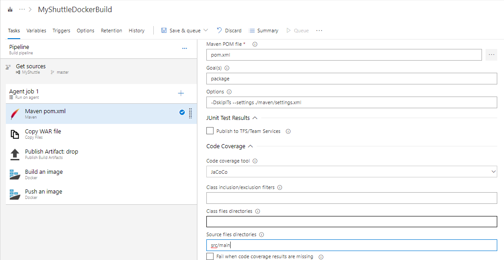
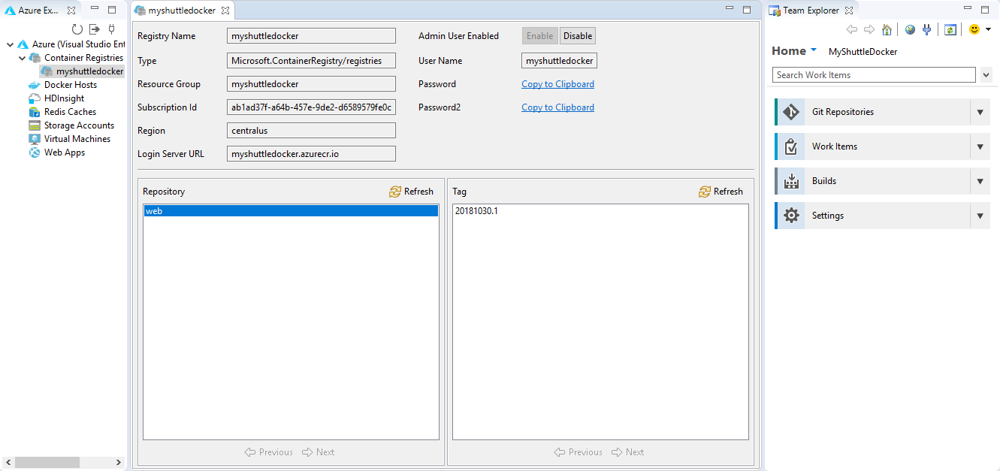
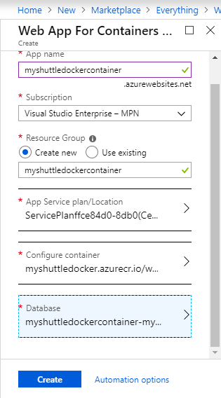
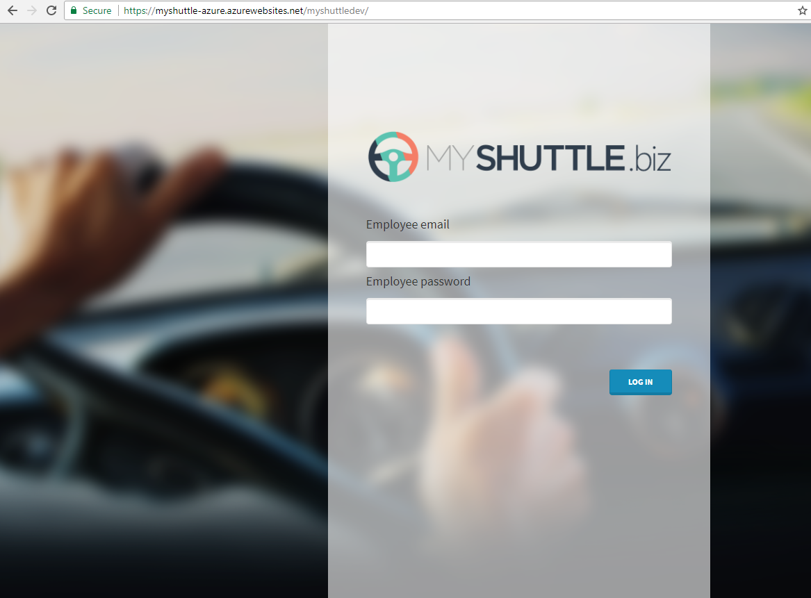
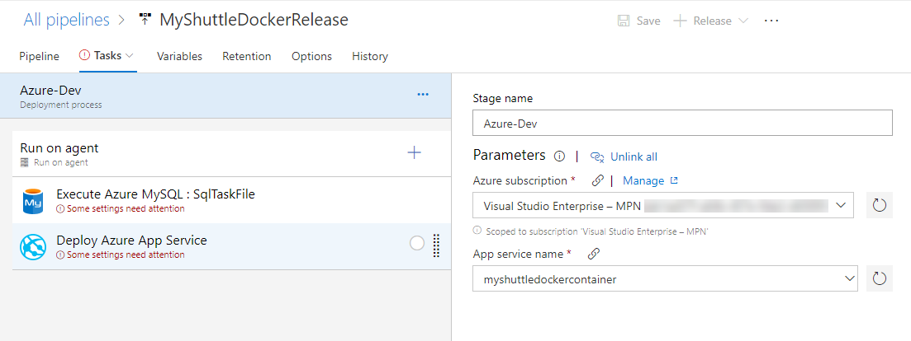
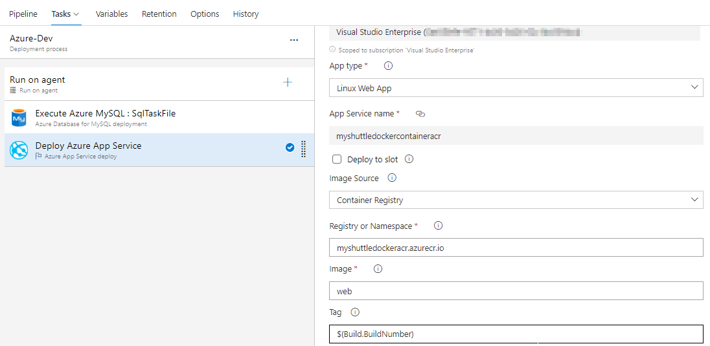
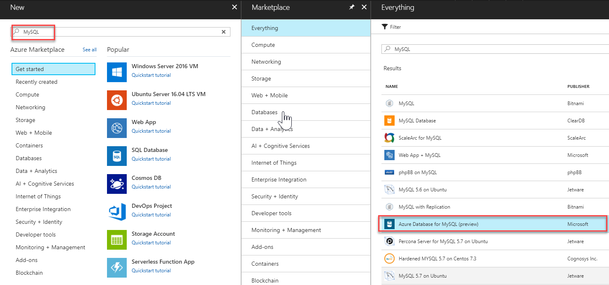
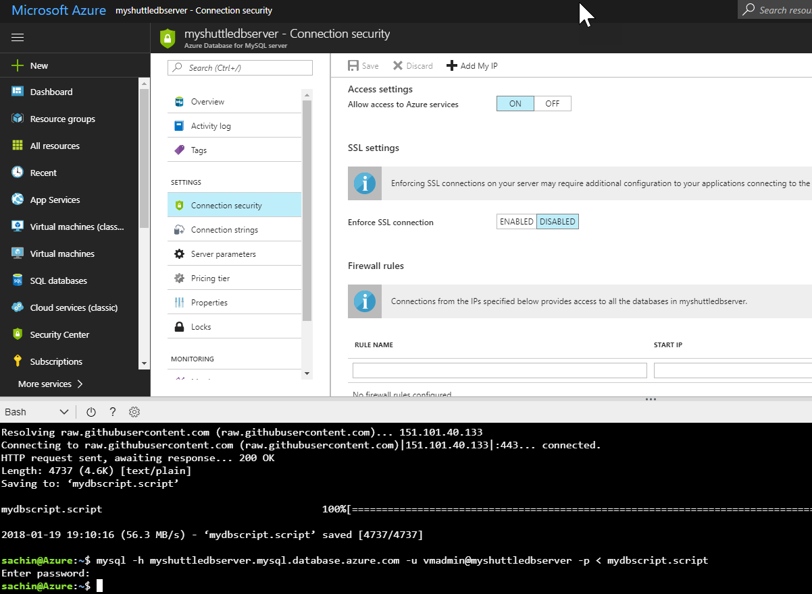

Last updated : {{ "now" | date: "%b %d,%Y" }}

## Overview

In this lab, you will learn how you can use Release Management(RM) in Visual Studio Team Services (VSTS) to deploy a Java web application to [Apache Tomcat](http://tomcat.apache.org/) with a MySQL database on Azure. Apache Tomcat is an open-source Java Servlet Container developed by the Apache Software Foundation (ASF). MySQL is a popular open-source relational database management system.

For this purpose of the lab, we will use Azure App Service and Azure Database for MySQL, a relational database service based on the open source MySQL Server engine. It is a fully managed database as a service offering capable of handing mission-critical workload with predictable performance and dynamic scalability.

### What's covered in this lab?

This lab will show how you can

- Create a new Azure App Service and configure it to use Apache Tomcat
- Create a new MySQL database
- Use Azure App Service Task to deploy a WAR file

### Prerequisites

1. **Microsoft Azure Account:** You will need a valid and active azure account for the labs.

1. You need a **Visual Studio Team Services Account** and [Personal Access Token](https://docs.microsoft.com/en-us/vsts/accounts/use-personal-access-tokens-to-authenticate)

1. You will need the [**Docker Integration**](https://marketplace.visualstudio.com/items?itemName=ms-vscs-rm.docker) extension installed and enabled on your Team Services account.

If you are following this lab from "Working with Jenkins, VSTS and Azure, you can skip the next two exercises and go to [deploy](#deploying-to-an-azure-web-app-for-containers). 

## Exercise 1: Setting up Visual Studio Team Services

If you are following this lab from "Working with Jenkins, VSTS and Azure, you can skip this exercise. Otherwise,

1. Provision a new VSTS project using the [VSTS Demo Data Generator](https://vstsdemobuildertest.azurewebsites.net/?TemplateId=77373&Name=myshuttledocker){:target="_blank
}

    

1. Use  **MyShuttleDocker** for the template. Provide the Project Name and select **Create Project**. After the project is provisioned, click the URL to navigate to the project.

    

## Exercise 5:  Create a VSTS Build to Build Docker Images

In this task you will configure the VSTS build definition that will build and push the image to an Azure Container Registry

1. Open the [**Azure Portal**](https://portal.azure.com){:target="_blank"} in a separate tab

1. Select **+New** and search for **Azure Container**. Select **Create**. In the *Create Container Registry* dialog, enter a name for the service, select the resource group, location, etc., and select **Create**.  

    

1. Return to  VSTS, from the **Build** hub, select and edit the **MyShuttle** build. This build definition contains a *maven* task to build the pom.xml file. The maven task has the following settings

    | Parameter | Value | Notes |
    | --------------- | ---------------------------- | ----------------------------------------------------------- |
    | Options | `-DskipITs --settings ./maven/settings.xml` | Skips integration tests during the build |
    |Code Coverage Tool | JaCoCo | Selects JaCoCo as the coverage tool |
    | Source Files Directory | `src/main` | Sets the source files directory for JaCoCo |

      

1. Then there is **Copy** and **Publish** tasks to copy the artifacts to the staging directory and publish to VSTS (or a file share).

1. Next we use the **Docker Compose** task to build and publish the images. The settings of the Docker compose tasks are as follows:
    | Parameter | Value | Notes |
    | --------------- | ---------------------------- | ----------------------------------------------------------- |
    | Container Registry Type | Azure Container Registry | This is to connect to the Azure Container Registry you created earlier |
    | Azure Subscription | Your Azure subscription | The subscription that contains your registry |
    | Azure Container Registry | Your registry | Select the Azure Container registry you created earlier |
    | Additional Image Tags | `$(Build.BuildNumber)` | Sets a unique tag for each instance of the build |
    | Include Latest Tag | Check (set to true) | Adds the `latest` tag to the images produced by this build |

1. Click the "Save and Queue" button to save and queue this build.Make sure you are using the **Hosted Linux Agent** 

1. The build will push the image to the ACR we created earlier. We can verify if the images were pushed correctly from the **Azure Explorer** view. *Sign in* to Azure, refresh Azure Container Registry. Right click and select **Explore Container Registry**. You should see the image - tagged with the build number.

    

## Deploying to an Azure Web App for containers

In this exercise, we will setup a CD pipeline to deploy the web application to an Azure web app. First, let's create the Web App

1. Sign into your [Azure Portal](https://portal.azure.com)

1. In the Azure Portal, choose **New, Web + Mobile** and then choose **Web App for Containers**

     

1. Provide a name for the new web app, select existing or create new resource group for the web app. Then select **Configure Container** to specify the source repository for the images. Since we are using ACR to store the images, select **Azure Container Registry**. Select the **Registry, Image and Tag** from the respective drop-downs.Select **OK** and then select **Create** to start provisioning the web app

    

1. Once the provisioning is complete, go to the web app properties page, and select the URL to browse the web app. You should see the default **Tomcat** page

1. Append **/myshuttledev** the web application context path for the app, to the URL to get to the MyShuttle login page. For example if your web app URL is `https://myshuttle-azure.azurewebsites.net/` , then your URL to the login page is `https://myshuttle-azure.azurewebsites.net/myshuttledev/`

    

    We could configure *Continuous Deployment* to deploy the web app is updated when a new image is pushed to the registry, within the Azure portal itself. However, setting up a VSTS CD pipeline will provide more flexibility and additional controls (approvals, release gates, etc.) for application deployment

1. Back in VSTS, select **Releases** from the **Build and Release**hub. Select **+** and then **Create Release Definition**

1. Select **Pipeline**. Click **+Add** to add the artifacts. Select **Build** for the source type. Select the **Project**, **Source** and the **Default version**.  Finally select **Add** to save the settings

1. Select the **Azure App Service Deployment** template and click **Apply**
    

1. Open the environment. Select **Environment 1** and configure as follows

    * Pick the Azure subscription
    * Select **Linux App** for the **App Type**
    * Select the **App Service** that you created
    * Enter the **Container Registry** name and then
    * Enter ***Web*** for the **Repository**

    

1. Select the **Deploy Azure App Service** task and make sure that these settings are reflected correctly. Note that the task allows you to specify the **Tag** that you want to pull. This will allow you to achieve end-to-end traceability from code to deployment by using a build-specific tag for each deployment. For example, with the Docker build tasks  you can tag your images with the Build.ID for each deployment.

    

1. Select **Save** and then click **+ Release**  \| **Create Release** to start a new release

1. Check the artifact version you want to use and then select **Create**

1. Wait for the release is complete and then navigate to the URL `http://{your web app name}.azurewebsites.net/myshuttledev`. You should be able to see the login page

## Setting up MySQL database

 Next, let's set up the MySQL database for the application

 1. From the Azure portal, select **+ New** and search for **MySQL**. Choose **Azure Database for MySQL(preview)** from the filtered result list and click **Create**

    

 1. Enter all required information and select **Create**

    

 1. Select **Properties**. Note down **SERVER NAME** and **SERVER ADMIN LOGIN NAME**

 1. In this example, the server name is *myshuttle-1-mysqldbserver.mysql.database.azure.com* and the admin user name is *mysqldbuser@myshuttle-1-mysqldbserver*

 1. We will use the MySQL command-line tool to establish a connection to the Azure Database for MySQL server. We will run the MySQL command-line tool from the Azure Cloud Shell in the browser.To launch the Azure Cloud Shell, click the `>_` icon in the top right toolbar.

 1. Enter the following command

    ```HTML
    wget https://raw.githubusercontent.com/hsachinraj/azure-arm-templates/master/vstsazurejl_arm/mydbscript.script
    ```
    This should download the file that we want to execute on the server

1. Next, we will execute the SQL from the downloaded file on the database server. Enter the following command
    ````SQL
    mysql -h myshuttle-1-mysqldbserver.mysql.database.azure.com -u mysqldbuser@myshuttle-1-mysqldbserver -p < mydbscript.script
    ````
    Enter the password that you specified during provisioning the database

    

    >This should create the database, tables and populate records for us.

1. Next, navigate to the Web app that you have created. Click **Application Settings** and scroll down to the **Connection Strings** section

1. Add a new MySQL connection string with **MyShuttleDb** as the name and the following string for the value - `jdbc:mysql://{MySQL Server Name}:3306/alm?useSSL=true&requireSSL=false&autoReconnect=true&user={your user name}&password={your password}`

1. Click **Save** to save the connection string

   >**Note** - Connection Strings configured here will be available as environment variables, prefixed with connection type for Java apps (also for PHP, Python and Node apps). In the `DataAccess.java`file under `src/main/java/com/microsoft/example` folder, we retrieve the connection string using the following code
    ````Java
    String conStr = System.getenv("MYSQLCONNSTR_MyShuttleDb");
    ````

You have now setup and configured the database needed to deploy and run the MyShuttle application.

1. You should be able to login to the application now. Return back to the login page and try logging is using any of the username/password combination:

    * *fred/fredpassword*
    * *wilma/wilmapassword*
    * *betty/bettypassword* 
