# Deploy an ASP.NET Core application to Azure App Service using VSTS

This lab shows how to deploy an ASP.NET Core application to Azure App Service with Visual Studio Team Services.

[ASP.NET Core](https://docs.microsoft.com/en-us/aspnet/core/) is a cross-platform, high-performance, open-source framework for building modern, cloud-based, Internet-connected applications. With ASP.NET Core, you can:

- Build web apps and services, IoT apps, and mobile backends.
- Use your favorite development tools on Windows, macOS, and Linux.
- Deploy to the cloud or on-premises
- Run on .NET Core or .NET Framework.

## Prerequisites for the lab

1. **Microsoft Azure Account**: You will need a valid and active Azure account for the Azure labs. If you do not have one, you can sign up for a [free trial](https://azure.microsoft.com/en-us/free/){:target="_blank"}

    - If you are an active Visual Studio Subscriber, you are entitled for a $50-$150 credit per month. You can refer to this [link](https://azure.microsoft.com/en-us/pricing/member-offers/msdn-benefits-details/){:target="_blank"} to find out more information about this including how to activate and start using your monthly Azure credit.

    - If you are not a Visual Studio Subscriber, you can sign up for the FREE [Visual Studio Dev Essentials](https://www.visualstudio.com/dev-essentials/){:target="_blank"} program to create a **Azure free account** (includes 1 year of free services, $200 for 1st month).

1. You will need a **Visual Studio Team Services Account**. If you do not have one, you can sign up for free [here](https://www.visualstudio.com/products/visual-studio-team-services-vs){:target="_blank"}

1. You will need a **Personal Access Token** to set up your project using the **VSTS Demo Generator**. Please see this [article](https://docs.microsoft.com/en-us/vsts/accounts/use-personal-access-tokens-to-authenticate){:target="_blank"} for instructions to create your token.

    

## Setting up the VSTS Project

1. Use the [VSTS Demo Generator](https://vstsdemogenerator.azurewebsites.net) to provision the team project on the VSTS account.

   > **VSTS Demo Generator** helps you create team projects on your VSTS account with sample content that include source code, work items,iterations, service endpoints, build and release definitions based on the template you choose during the configuration.

   

1. Once the team project is provisioned, click on the URL to navigate to the team project.

   

## Exercise 1: Endpoint Creation

Since the connections are not established during project provisioning, we will manually create the endpoints.

In VSTS, navigate to **Services** by clicking the gear icon , and click **+ New Service Endpoint**. Select **Azure Resource Manager**. Specify **Connection name**, select your **Subscription** from the dropdown and click **OK**. We use this endpoint to connect **VSTS** with **Azure**.

   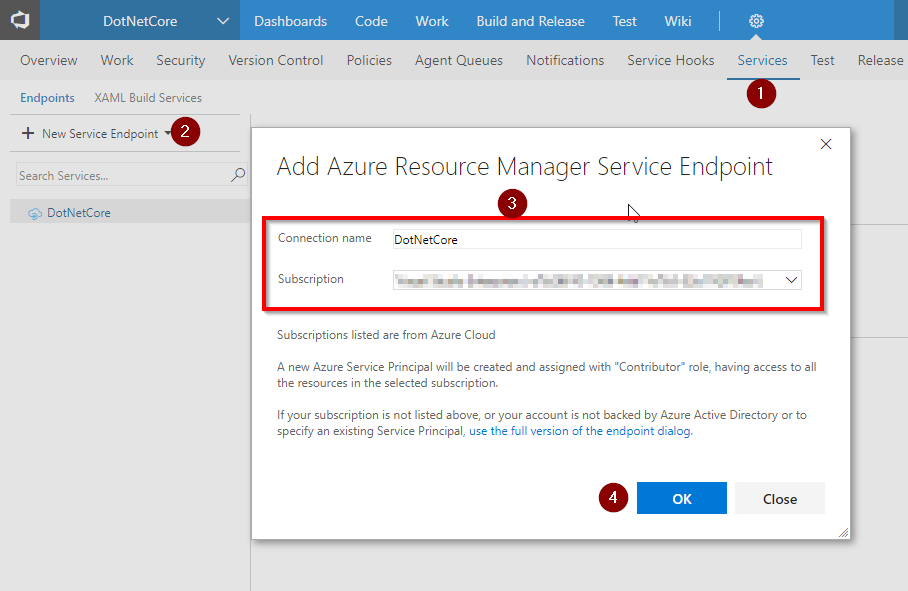

   You will be prompted to authorize this connection with Azure credentials. Disable pop-up blocker in your browser if you see a blank screen after clicking OK, and retry the step.

## Exercise 2: Configure Release

Now that connections are established, we will manually map the endpoints to release definition.



1. Go to **Releases** under **Build & Release** tab, edit the release definition **MyHealthClinicE2E**.

   

1. Select **Tasks** and click **Dev**.

   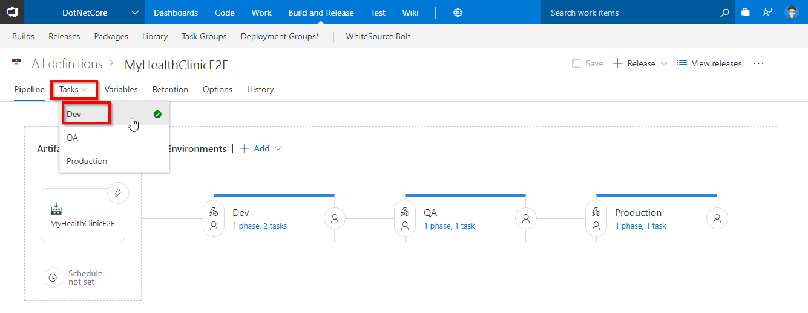

1. Under **Azure Resource Group Deployment** task, update **Azure subscription** with the endpoint components from the dropdown and select the desired **location**.

   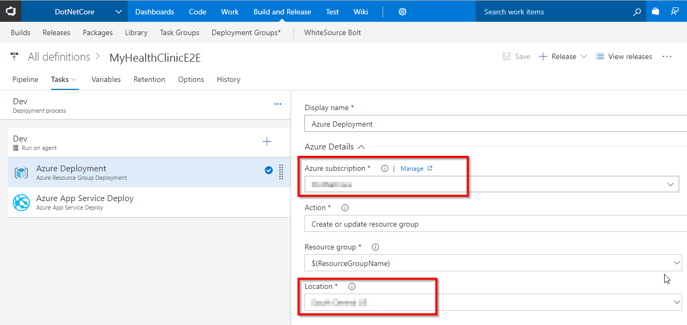

1. Under **Azure App Service Deploy** task, update **Azure subscription** with the endpoint components from the dropdown. Under the **Slot** section enter the slot name as **Dev**.

   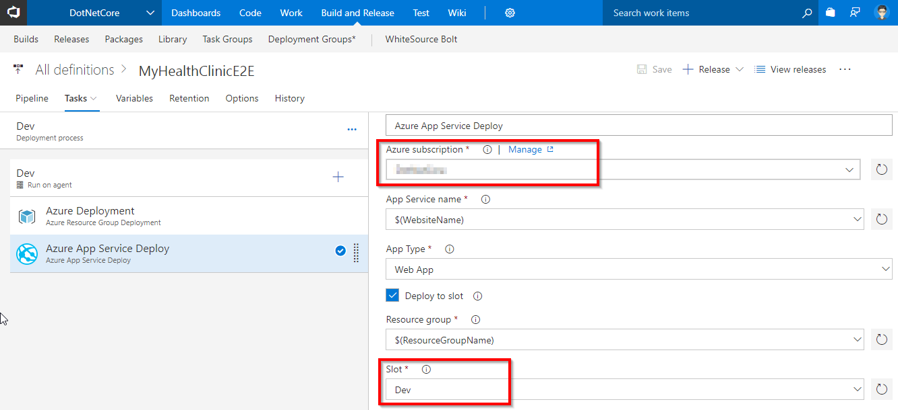

1. Similarly update **Azure subscription** with the endpoint components for **QA** and **Production** environments. Go to **Tasks** and select **QA**.

   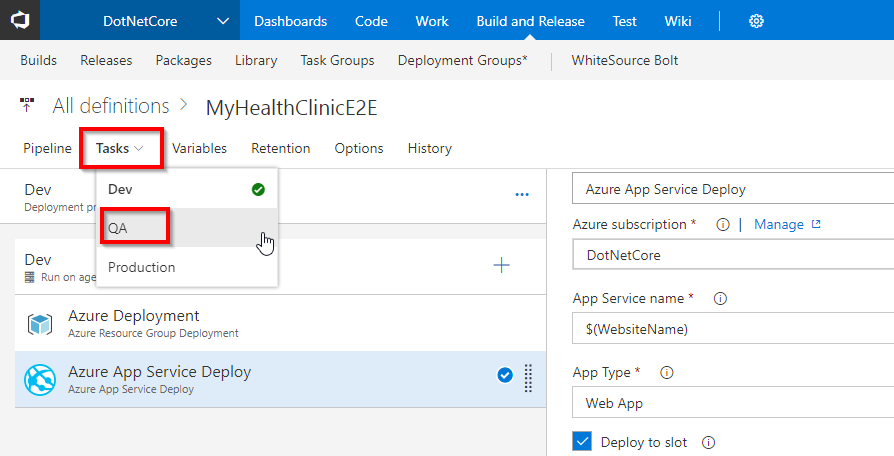

1. Under **Azure App Service Deploy** task, update **Azure subscription** with the endpoint components from the dropdown. Under the **Slot** section enter the slot name as **Staging**.

   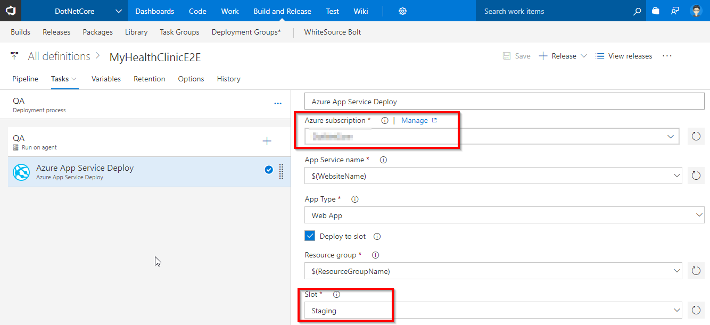

1. Go to **Tasks** and select **Production**.

   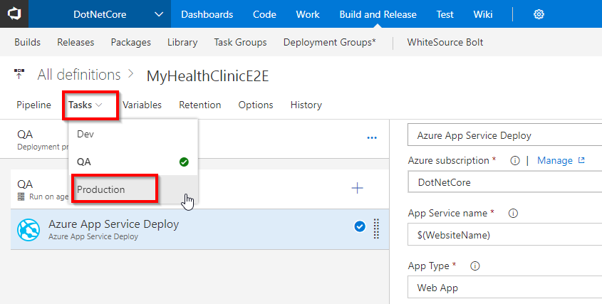

1. Under **Azure App Service Deploy** task, update **Azure subscription** with the endpoint components from the dropdown and click **Save** to save the release definition.

   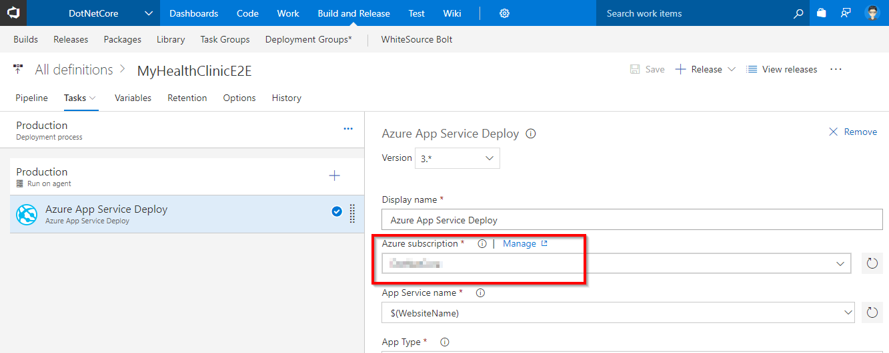

## Exercise 3: Triggering a Continuous Integration (CI) build

1. Go to the **Code** hub.

   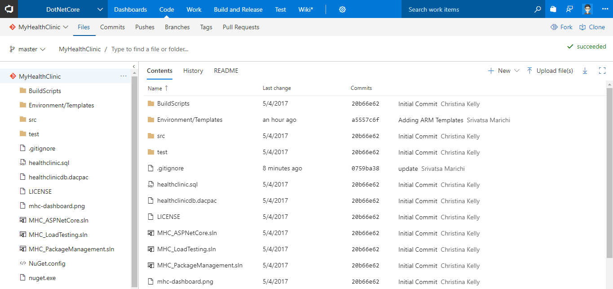

1. We have a **DOTNETCORE** app code provisioned by the demo generator system. We will deploy this to Azure app service.

1. We have a Continuous Integration (CI) build setup to run upon a code commit. Let's make a simple change to the code to trigger the CI build.

1. Open the file **Index.cshtml** by navigating to the below path-

   > **MyHealthClinic/src/MyHealth.Web/Views/Home/Index.cshtml**

   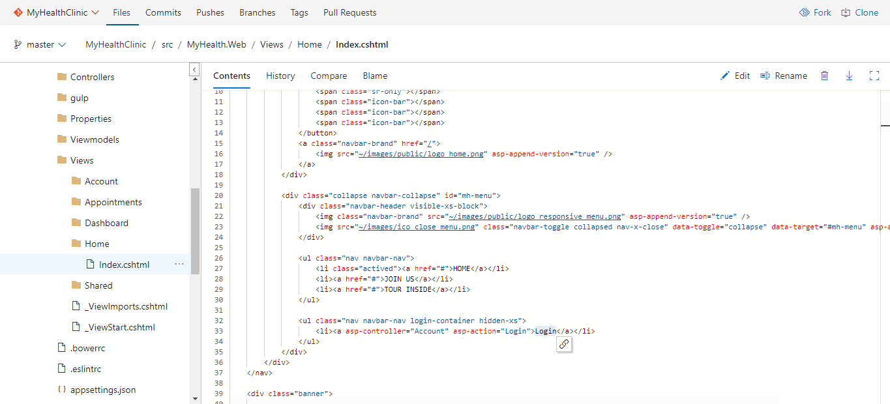

1. Edit the code. For this example, let's change **line 33** to change the text from **Login** to **Private Area**.

   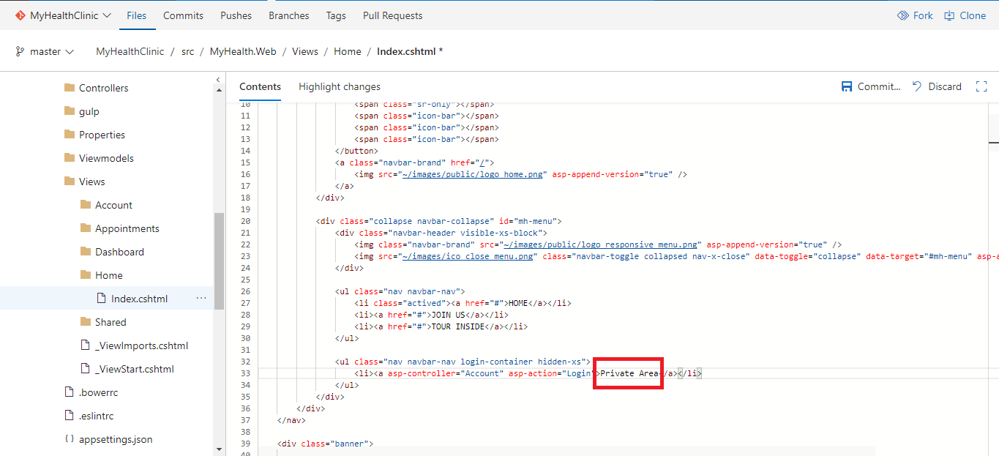

1. Select **Commit** to save and commit the changes.

1. The code commit will trigger the CI build. Go to the **Build** tab to see the CI build running in progress.

   

   While the build is in progress, let's explore the build definition. The tasks that is used in the build definition are listed in the table below.

   |Tasks| Usage|
   |-----|------|
   | **Restore**| dotnet command-line tool restores all the package dependencies like **ASP.NET Core Identity, ASP.NET Core session** etc. required to build this project|
   | **npm Install**| npm task installs the npm packages (javascript dependencies) like **babelify, browserify** etc. required to build this project|
   | **Bower Install**|We will use this task to manage components that contain HTML, CSS, JavaScript, fonts and even image files. Example: jquery, angular, webcomponentsjs etc|
   | **Gulp**| gulp task compiles sass files, uglify and compress js files|
   | **Build**| We will use dotnet command-line tool to build the project and its dependencies into a set of binaries|
   | **Test**| dotnet command-line tool wil run unit tests as part of build process to ensure the code quality. This project contains 6 unit tests|
   | **Publish**| We will use this task to create a package with published content for the web deployment|
   | **Publish Test Results**| We will use this task to publish the unit test result|
   | **Copy Files**| We will copy the zipped file and the ARM template to a staging directory|
   | **Publish Build Artifacts**| And finally, we will publish the files in the staging directory which were copied in the previous step|

1. Click on the build number to open the live console.

   

   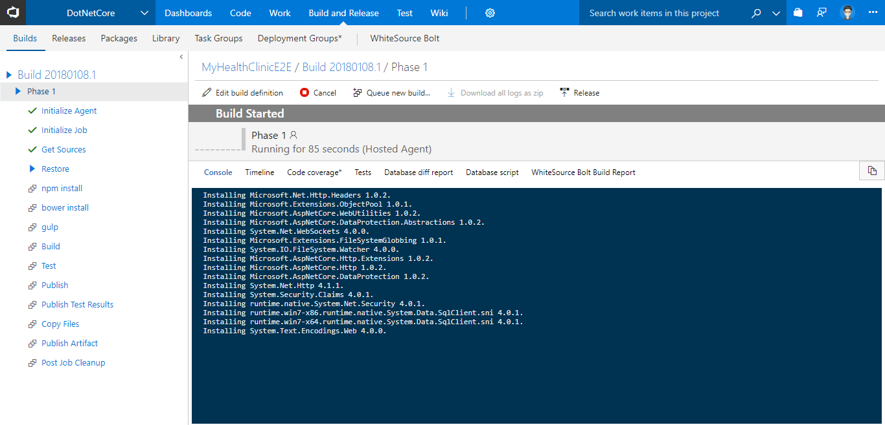

1. Once the build is complete click on the build number, to see the summary which shows **Test Results** as shown.

   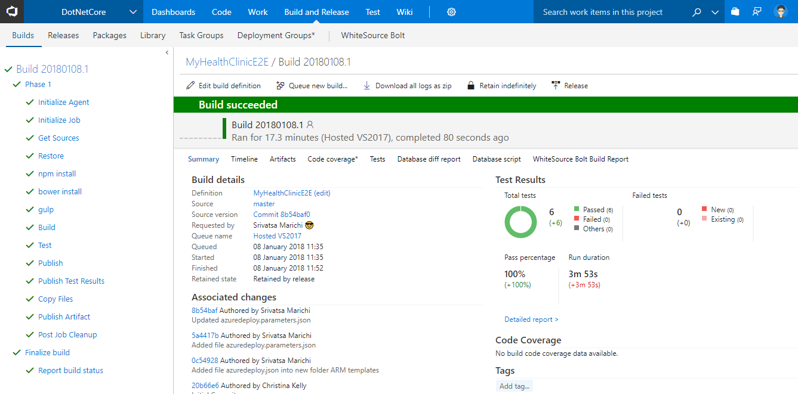

## Exercise 4: Continuous Delivery

We are using **Infrastructure as a Code** in the release pipeline. We have a release configured to deploy the application which is associated to the build and triggered when the build is successful.

1. Go to **Releases** tab under **Build and Release** hub.

1. Select the **MyHealthClinicE2E** definition, you will see the release in-progress.

   

1. While the release is in-progress, let's explore the tasks used. Click **edit** to see the release pipeline. We have three environments **Dev, QA** and **Production**.

   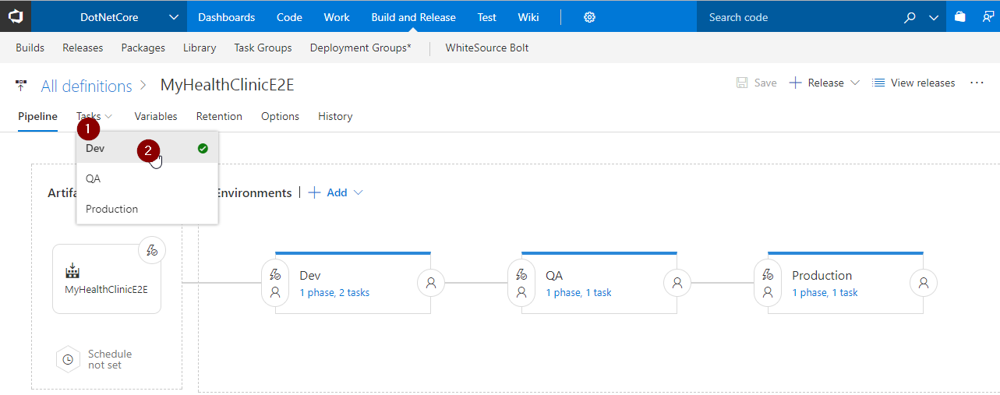

   >Go to the Dev environment, you will see 2 tasks are used. Let us explore the tasks.

   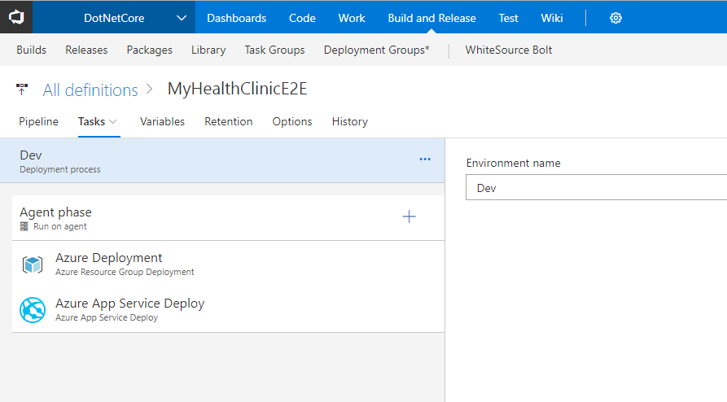

   - **Azure Resource Group Deployment**: The project used in this lab contains frontend (Azure App Service) and backend (Azure SQL DB) services. We will provision these services as PAAS on Azure using ARM templates. This task will create the above services in a resource group **dotnetcore.**

   - **Azure App Service Deploy**: The task is used to deploy a Web project to the Azure App Service created above.

1. Click on **View releases**.

   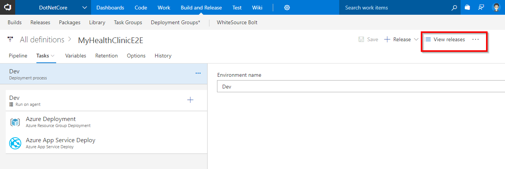

1. Double click on the release to see the release summary.

   

   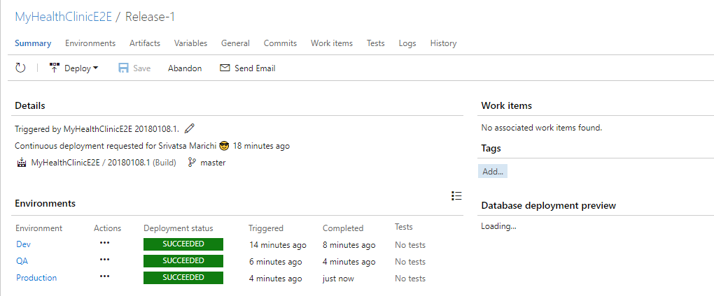

1. Login to [Azure Portal](https://portal.azure.com) and search a **Resource Group** with the name **dotnetcore**.

   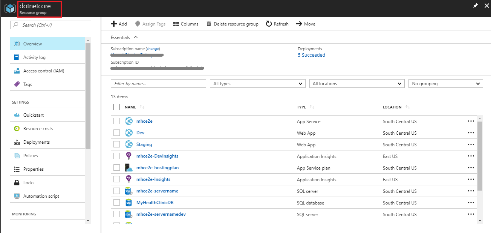

1. Navigate to either Dev or Staging web app in the resource group and you will see the application is deployed successfully with the changes.

   

## Summary

**Visual Studio Team Services** simplifies creation of continuous integration and continuous delivery pipelines for your application to be deployed to Azure.
