<div class="rw-ui-container"></div>

## Overview 

 **Azure Boards** provides a wealth of project management functionality that spans Kanban boards, backlogs, team dashboards, and
custom reporting. By connecting Azure Boards with GitHub repositories, teams can take advantage of the rich project management capabilities. You can create links between GitHub commits and pull requests to work items tracked in Azure Boards. This enables a seamless way for you to use GitHub for software development while using Azure Boards to plan and track your work.

 


In this lab, you'll see how easy it is to set up
**Azure Boards** with your **GitHub** projects and how you can achieve an end-to-end traceability from work items to code change, commit, to build and release.

 

## Exercise 1: Managing GitHub Projects with Azure DevOps

## Task 1: Connecting GitHub with Azure Boards 


1. Return to the web app tab and click **Login**.

    
   
   

1. Log in with any email and password.

    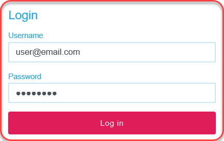
   

1. Click **Book**.

    
   

1. Expand the airport dropdown to note that it's not sorted
    alphabetically by city.

    

     Let us assume in our scenario, we want to change the sort order of the airport listing by cities. We will create a new
    user story to sort the airports listed in the booking form in alphabetical order by city. Ordinarily, we would create the user
    story at a higher level and add tasks to define how the story is to be implemented, but for our demo purposes here we'll leave it as
    a single work item.

1.  Return to the **Azure DevOps** tab.

1.  Navigate to **Boards \| Backlogs**.

    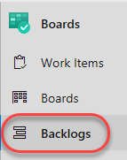

    > If you don't see the **Boards** navigate to **Project settings** and enable **Azure Boards**
       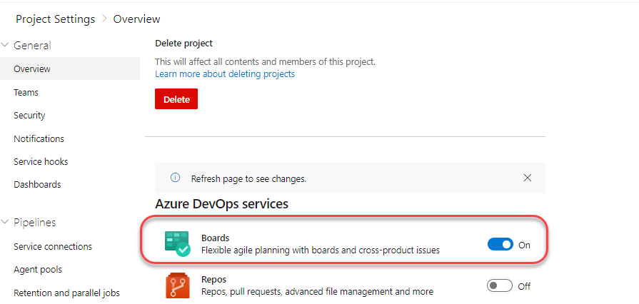
    
1.  Click **New Work Item** and add a user story with the title **User can select airport by city**. Press **Enter** to create.

    

    In addition to working with work items in a backlog, we have a very flexible Kanban board option. With the
    board, we can edit items on a card in line, or even drag cards around to change their state and assignment. Let's take ownership of
    the new user story so we can begin work.

    >  Add a work item—Issue (Basic), User Story (Agile), or Product Backlog Item (Scrum)—depending on the process model used by your Azure Boards project. 

1.  Click **View as board**.

    

1.  Drag the newly created user story to the **Active** column.

    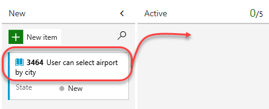

1.  Dropping the user story onto the **Active** column assigns it to you
    and sets its **State** to **Active**. Make note of the task ID for
    reference later during a future commit and pull request.

    

    In order to complete our integration, we'll need to wire up a connection between this project and the GitHub repo.


## Task 2: Configure the Azure Boards app for GitHub

Azure Boards is now available on GitHub Marketplace which simplifies the installation process and configuration of your GitHub repository connections. 

1. To install it, navigate to the  [**Azure Boards**](https://github.com/marketplace/azure-boards) page on GitHub.

1. Choose **Set up a plan**.

     

1. Azure Boards offers free licenses (first five users for private and many more for public repos) for you to start. Select **Install it for free**

     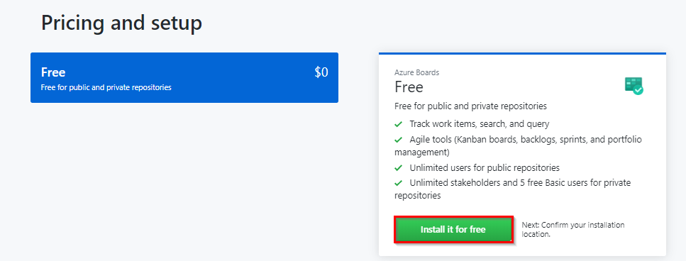

1. Select the **Complete the order and begin installation** button to start the installation
    
     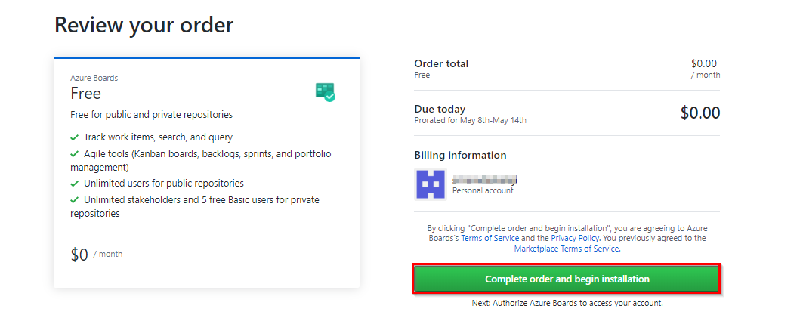

1. Select the repositories you want to connect to Azure Boards (or all repositories) and click **Install**.

     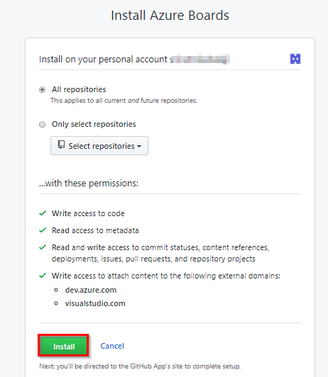

1. Select the Azure DevOps organization and Azure Boards project you want to connect to GitHub.com.
     
     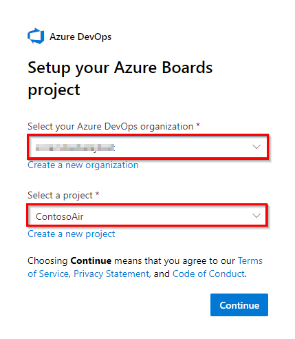

   >You can only connect one project at a time. If you have other projects you want to connect, you can do that later as described in [Configure additional projects or repositories](https://docs.microsoft.com/en-us/azure/devops/boards/github/install-github-app?view=azure-devops#configure).

1. Authorize your Azure Boards organization to connect with GitHub.com.
      
      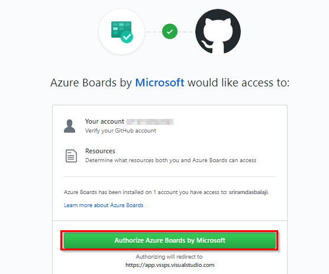
    
1. If you have selected **All repositories**, you will need to confirm the GitHub repositories that you want to use with Azure Boards project to complete the integration.     
      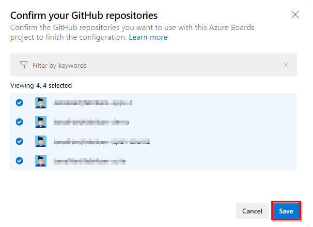

## Task 3: Committing to Complete a Task


1.  Return to **Visual Studio Code**.

    We'll start off by creating a new branch for this
    task. The work itself is pretty straightforward. We just need to
    locate the place where airports are provided to the user experience
    and make sure they're being sorted by city name.

2.  Click the **master** branch at the bottom of the window.

    
   

3.  From the top of the screen, click **Create new branch**.

    
   

4.  Enter the name **"airport-sorting"** and press **Enter**. This will
    activate the new branch.

    
   

5.  From the **Explorer** tab, open
    **src/services/airports.service.js**.

    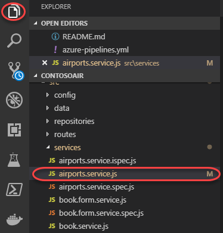
   

6.  Locate the **getAll** function and replace the existing code
    with the code below. This will sort the
    airports by the city.

    ````JavaScript

        getAll(){
                return this._airports.filter(a => a.code).map(avoidEmptyCity).sort((a, b) => (a.city > b.city) ? 1 : -1);
            }

    ````

    
   

7.  Press **Ctrl+S** to save the file.

    We'll commit it using a comment that includes special syntax to link it to the Azure Boards task we saw earlier. Now this commit will become trackable from project management, as
    long as we include the phrase "Fixes AB\#ID".

8.  Switch to the **Source Control** tab and enter a commit message of
    **"Changes airport sorting. Fixes AB\#3464."**, but replace **3464**
    with the actual ID of the Azure Boards task. Press **Ctrl+Enter**
    and confirm the commit if prompted.

    

    > For more information on how to use **AB#** mention to link from GitHub to Azure Boards work items see [here](https://docs.microsoft.com/en-us/azure/devops/boards/github/link-to-from-github?view=azure-devops#use-ab-mention-to-link-from-github-to-azure-boards-work-items)
   

9.  Click the **Publish Changes** button at the bottom of the screen.

    
   

10. When the push has completed, return to the GitHub browser tab.

    With the commit pushed, we'll create a pull
    request to drive those changes back into the master branch. In this
    case we're inheriting the title from the commit, but having the pull
    request mention "Fixes AB\#ID" will link and complete the target
    work item when the pull request is merged.

11. Click **Compare & pull request**, which should appear on its own. If
    not, refresh.

    
   

12. Change the **base fork** to point at your project. By default **base fork**
    points at the original Microsoft repo, so be sure to change **base fork**.

    
   

13. The title should initialize to the commit message entered earlier.
    Click **Create pull request**.

    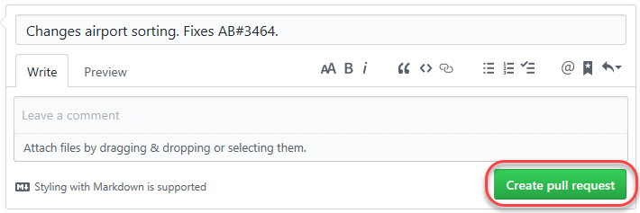
   

14. Return to Visual Studio Code.

    Now we'll switch to the other side of the pull
    request and take on the role of reviewer. We can use Visual Studio
    Code to check out the pull request, analyze changes, and comment.
    Assuming we trust the fix, we can merge the pull request to update
    master and kick off the CI/CD.

15. Under **GitHub Pull Requests \| All**, right-click the pull request
    and select **Checkout Pull Request**.

    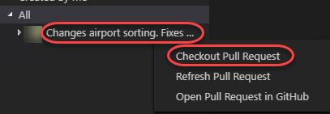
   

16. Expand the **Changes in Pull Request** tree.

    
   

17. Select the **Description** from under the original pull request.

    
   

18. Review the details of the pull request.

    
   

19. Click **Merge pull request** and confirm the merge.

    
   

    Once the deployment works its way through the build
    and release, we can confirm the new functionality.

1. Follow the CI/CD pipeline through to completion.

1. Refresh the web app site. Return to the booking page (you'll need to
    log in again) and confirm the airports are sorted by the city now
    (scroll down past the airports with no city name).

    
   
1. Return to the Azure DevOps tab open to the Kanban board.

    Since the user story, we were working on was
    linked in a pull request that was approved, Azure DevOps will
    automatically transition the state of the work item to "Closed". You
    can also see that the related GitHub commits and pull request were
    linked to the work item.

1. The user story should have already moved to the **Closed** state and
    column. Click to open it.

    
   

1. The commit and pull request should now be visible under
    **Development**.

    

## Task 4: Linking GitHub Issues to Azure Boards

You can also link GitHub issues to work items in Azure Boards.

1. To link to an issue, choose the **Links** tab, and then choose **Add Link -> Existing item**.

     

    You can also manually connect a GitHub Commit or a pull request by selecting **Add Link** under the Development section.  This is useful in sutuations where you missed to assoaciate the commit or pull request using the AB#{ID} method. 

1. From the **Add link** dialog, select one of the GitHub link types, enter the URL to the commit, pull request, or issue and then choose **OK**.

   Here, we add a link to GitHub commit with **GitHub Commit** link type, enter the URL to the commit and then choose **OK**.

    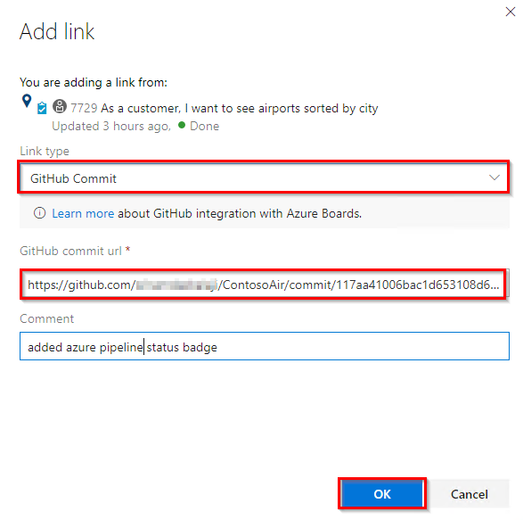

    Azure Boards performs a check to ensure that you've entered a valid link. Then commit will appear under the **Development** section as shown below

    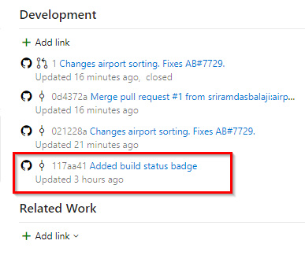

1. **View or open links from the Development section** : The Development section within the work item form lists the links created to GitHub commits and pull requests with the   GitHub icon. Choose the link provided to open the commit or pull request in GitHub.

     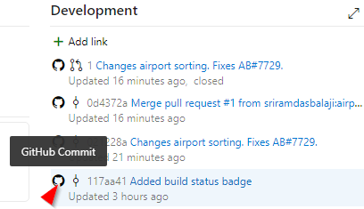