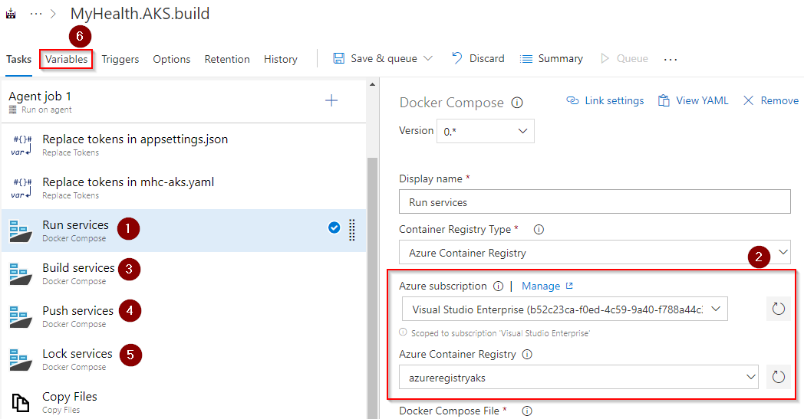
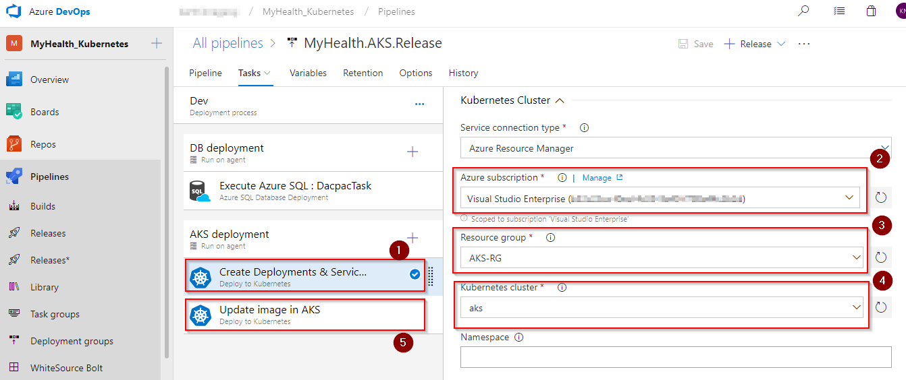
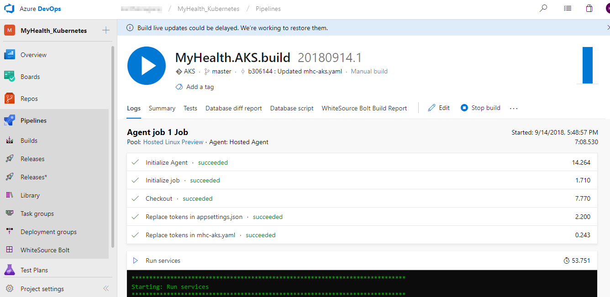
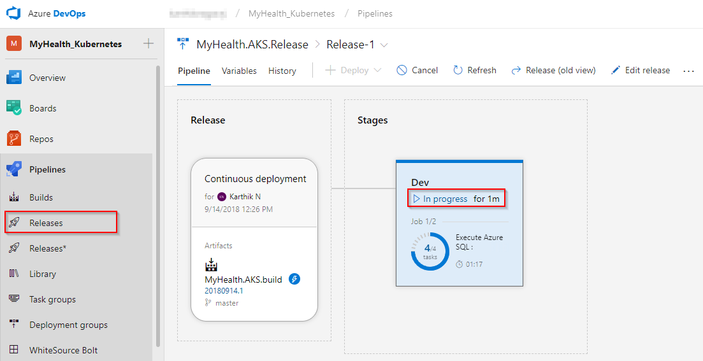
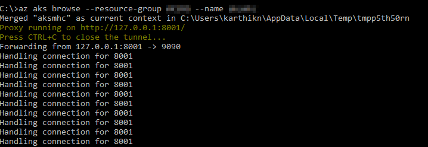

Last updated : {{ "now" | date: "%b %d, %Y" }}.

## Overview

This lab shows how to compile a Docker-based ASP.NET Core web application and deploy it to a **Kubernetes** cluster running on **Azure Container Service (AKS)** using the **Visual Studio Team Services (VSTS)**.

[**Azure Container Service (AKS)**](https://azure.microsoft.com/en-us/services/container-service/) is the quickest way to use Kubernetes on Azure. AKS allows to deploy and manage Docker containers using Kubernetes, Docker Swarm and Mesosphere DC/OS orchestrators. With AKS, customers get the benefits of the open source Kubernetes without the complexity and the operational overhead. VSTS helps in creating the application container Docker images for faster deployments reliably using the continuous build option.

Below are the description for the terminolgy used in the lab document to help you get started:

[**Docker**](https://www.docker.com/): Docker is a software technology that provides operating-system-level virtualization to easily deploy applications in a sandbox (called containers) to run on Linux.

[**Images**](https://docs.docker.com/engine/docker-overview/#docker-objects): An image is a read-only template with instructions needed to make the application run.

[**Containers**](https://docs.docker.com/engine/docker-overview/#docker-objects): Provides an isolated environment in which an app along with its environment, is run.

[**Kubernetes**](https://kubernetes.io/): Kubernetes is an open source system for managing containerized applications across multiple hosts, providing basic mechanisms for deployment, maintenance, and scaling of applications.

[**Pods**](https://kubernetes.io/docs/concepts/workloads/pods/pod/): A Pod is the basic building block of Kubernetes and represents a executable unit of work. A Pod usually contains a single container.

[**Services**](https://kubernetes.io/docs/concepts/services-networking/service/): A service tells other pods what services your application provides.

[**Deployments**](https://kubernetes.io/docs/concepts/workloads/controllers/deployment/): A Deployment controller provides declarative updates for Pods

[**Kubernetes Manifest file**](https://kubernetes.io/docs/reference/kubectl/cheatsheet/): Kubernetes manifests with deployments, services and pods can be defined in json or yaml. The file extensions .yaml, .yml, and .json can be used.

In this lab, the following tasks will be performed:

* Create an Azure Container Registry (ACR), AKS and Azure SQL server
* Provision VSTS Team Project with .NET Core application using the [VSTS Demo Generator](https://vstsdemogenerator.azurewebsites.net/) tool
* Configure endpoints (properties) in VSTS to access Azure and AKS
* Configure application database deployment and configure Continuous Deployment (CD) in VSTS
* Modify database connection string & ACR configuration in the source code
* Initiate the build to automatically deploy the application

The below diagram details the VSTS DevOps workflow with Azure Container Service with AKS:

* Firstly, the source code changes are committed to the VSTS git repository
* VSTS will create the custom Docker image **myhealth.web** and push the image tagged with the build ID to the ACR. Subsequently it will publish the [Kubernetes deployment YAML file](https://kubernetes.io/docs/concepts/workloads/controllers/deployment/) as a build artifact.
* VSTS will deploy **mhc-front** and **mhc-back** services into the Kubernetes cluster using the YAML file.
  >**mhc-front** is the application hosted on a load balancer whereas **mhc-back** is the [Redis](https://redis.io/) Cache
* The Kubernetes cluster will then pull the **myhealth.web** image from the ACR into the [Pods](https://kubernetes.io/docs/concepts/workloads/pods/pod/) and complete the deployment file instructions
* The myhealth.web application will be accessible through a browser, once the deployment is successfully completed

## Pre-requisites for the lab

1. An active **Microsoft Azure Account** account

1. An active **Visual Studio Team Services (VSTS)** account. Click [here](https://www.visualstudio.com/team-services/) to create a new VSTS account.

1. A valid [Personal Access Token](https://docs.microsoft.com/en-us/vsts/accounts/use-personal-access-tokens-to-authenticate) for VSTS

1. **Kubernetes extension** from [Visual Studio Marketplace](https://marketplace.visualstudio.com/items?itemName=tsuyoshiushio.k8s-endpoint) installed to the VSTS account

## Preparing the user machine

This lab requires all the pre-requisite executables to be installed and configured in an **Administrator** mode on the user machine. If the administrative privileges are not available on the user machine, it is suggested to create a Windows Virtual Machine (VM) on Azure and follow the exercises in the VM.

1. Spin up a [Windows virtual machine on Azure](https://portal.azure.com/#create/Microsoft.WindowsServer2016Datacenter-ARM).

1. Disable the [Internet Explorer Enhanced Configuration](https://support.microsoft.com/en-in/help/815141/internet-explorer-enhanced-security-configuration-changes-the-browsing) to allow download of the rest of the pre-requisite tools.

1. Enable the [JavaScript](https://support.microsoft.com/en-in/help/3135465/how-to-enable-javascript-in-windows) to allow lab required specific features on the webpage.

1. Download and install the [Git Bash](https://git-scm.com/downloads) in the Azure VM.

1. Install the [Azure CLI version 2.0.23](https://azurecliprod.blob.core.windows.net/msi/azure-cli-2.0.23.msi) on the Azure VM.

   > This is the **Azure Command Line Interface** tool required to authenticate to the Azure subscription and fetch the Azure resource group details required in the Exercise 2.

1. Download the [KubeCtl](https://storage.googleapis.com/kubernetes-release/release/v1.9.0/bin/windows/amd64/kubectl.exe), and make sure the path of **kubectl.exe** is included in the [PATH Environment Variable](https://msdn.microsoft.com/en-us/library/office/ee537574(v=office.14).aspx) of the lab machine.

   > Kubectl is a command line interface for running commands against Kubernetes clusters. In this lab, Kubectl is used to check the status of pods.

1. Follow the below instructions to create a pair of SSH RSA public & private keys which will be used in the next exercise.
    1. Open the **Git Bash**, type the command `ssh-keygen -t rsa` and press the **Enter** button.
    2. Provide the following values:
        * **File path** : Path to which the generated key file should be saved. Leave it blank to save the file to default path.
        * **Passphrase** : Provide a passphrase or leave it blank for an empty passphrase.
    3. Access the path where the keys are generated. The contents of the public key **id_rsa.pub** is required for setting up environment which are of format

1. You need [Azure Service Principal Client ID and Client Secret](https://docs.microsoft.com/en-us/azure/azure-resource-manager/resource-group-create-service-principal-portal) for the next exercise.

## Setting up the environment

We require below azure resources for this lab:

Azure resources | Description
----------------|------------
 Azure Container Registry | Used to store images privately
 AKS | Docker images are deployed to Pods running inside AKS
 SQL Server | SQL Server to host database

1. Click on **Deploy to Azure** (or right click and select ***Open in new tab***) to spin up **Azure Container Registry**, **Azure Container Service (AKS)** and **Azure SQL Server**. Enter required details for the below fields and agree to ***Terms and Conditions***, and click **Purchase**.

   > Since the Azure SQL Server name does not support **UPPER** / **Camel** casing for its naming convention, use lower case for ***DB Server Name*** field value.

    * Subscription
    * Resource Group
    * Location
    * Acr Name
    * DB Server Name
    * AKS Name
    * DNS Prefix
    * SSH RSA Public Key
    * Service Principal Client
    * Service Principal Client Secret

   

   > At the time of writing this lab, regions **East US**, **Central US**, **West Europe**, **Canada Central** and **Canada East** are supported locations. For more information, refer [AKS Azure Regions](https://docs.microsoft.com/en-in/azure/aks/container-service-quotas).

1. It takes approximately 5 minutes to provision the environment. Once the deployment succeeds, a notification is displayed in the Azure portal. Click on the **Go to resource group** button.

   

1. The components - a **Storage account**, a **Container Registry**, a **Container Service**, a **SQL Server** along with a **SQL Database**. Let us access each of these components and gather their details which are required in Exercise 2.

   

1. Click on **mhcdb** SQL database and note down the **Server name** .

   

1. Go back to the resource group, click on the created container registry and note down the **Login server** name.

    

1. Switch back to the resource group. Click on your container service and note down the **API server address**.

   

   Now that required the azure components are created, let us create a VSTS project.

## Setting up the VSTS Project

1. Use [VSTS Demo Generator](https://vstsdemogenerator.azurewebsites.net/?TemplateId=77372&name=AKS) to provision the project on your VSTS account. The VSTS Demo Generator creates a Kubernetes project in your VSTS account with preset source code, work items, build and release definitions.

    

1. Provide the Project Name, and click on the **Create Project** button.

   

1. Once the project is provisioned, click the **URL** to navigate to the project.

   

## Exercise 1: Service Endpoint creation

Service endpoints are a bundle of properties securely stored by VSTS and is a way for VSTS to connect to external systems or services.

Since the connections are not established during project provisioning, let us manually create 2 endpoints -  **Azure Resource Manager** and **Kubernetes**.

**Azure Resource Manager Service Endpoint** : Defines and secures a connection to a Microsoft Azure subscription using Service Principal Authentication (SPA).

1. In VSTS, navigate to the **Services** by clicking on the gear icon , and click on the **+ New Service Endpoint**. Select **Azure Resource Manager**. Specify the **Connection name**, select your **Subscription** from the dropdown and click **OK**. We use this endpoint to connect **VSTS** and **Azure**.

    You will be prompted to authorize this connection with Azure credentials. Disable pop-up blocker in your browser if you see a blank screen after clicking OK, and retry the step.

   > If your subscription is not listed or to specify an existing service principal, click the link in the dialog which will switch to manual configuration mode and follow the [Service Principal creation](https://blogs.msdn.microsoft.com/devops/2015/10/04/automating-azure-resource-group-deployment-using-a-service-principal-in-visual-studio-online-buildrelease-management/) link.

   

## Kubernetes Service Endpoint

1. Click **+ New Service Endpoint**, and select **Kubernetes** from the list. We use this endpoint to connect **VSTS** and **Azure Container Service (AKS)**.

    * **Connection Name** : Provide the connection name.

    * **Server URL** : Provide the container service address in the format `http://{API server address}`

    * **Kubeconfig** : To get the Kubeconfig value, run the following Azure commands in a command prompt logged in with Administrator privilege.

      1. Type **az login** and hit Enter. Authorize your login by accessing the url given in the prompt and enter the provided unique code to complete the authentication.

         

      1. **az aks get-credentials --resource-group yourResourceGroup --name yourAKSname** : Get access credentials for the Kubernetes cluster.

      

    * Navigate to the **.kube** folder under your home directory (eg: C:\Users\YOUR_HOMEDIR\ .kube)

    * Copy contents of the **config** file and paste it in the Kubernetes Connection window. Click **OK**.

      

## Exercise 2: Configure Build and Release definitions

  Now that the connections are established, we will manually map the created Azure endpoint, AKS and Azure Container Registry to build and release definitions.

 >Note : If you encounter an error - ***TFS.WebApi.Exception: Page not found*** for Azure tasks in the build/ release definition, you can fix this by typing a random text in the Azure Subscription field and click the **Refresh** icon next to it. Once the field is refreshed, you can select the endpoint from the drop down. This is due to a recent change in the VSTS Release Management API. We are working on updating VSTS Demo Generator to resolve this issue.

1. Go to the **Builds** section under the **Build and Release** hub and **Edit** the build definition **MyHealth.AKS.Build**.

   

1. In the **Process** section under **Tasks**, select the previously created endpoints from the dropdown for parameters - **Azure subscription** and **Azure Container Registry** as shown. Click the **Save** option under **Save & queue**.

    

    |Tasks|Usage|
    |-----|-----|
    | **Run services**| prepares suitable environment by restoring required packages|
    | **Build services**| builds images specified in a **docker-compose.yml** file with registry-qualified names and additional tags such as **$(Build.BuildId)**|
    | **Push services**| pushes images specified in a **docker-compose.yml** file, to container registry|
    | **Publish Build Artifacts**| publishes the **myhealth.dacpac** file to VSTS|

1. Navigate to the **Releases** section under the **Build & Release** menu, **Edit** the release definition **MyHealth.AKS.Release** and select **Tasks**.

   

   

1. In the **Dev** environment, under the **DB deployment** phase, update the **Azure Subscription** value from the dropdown for **Execute Azure SQL: DacpacTask** task.

    

1. In the **AKS deployment** phase, Under the **Create Deployments & Services in AKS** task, update the **Kubernetes Service Connection** value from the dropdown. Expand the **Container Registry Details** section and update the parameters - **Azure subscription** and  **Azure Container Registry** with the endpoint components from the dropdown.

1. Repeat similar steps for **Update image in AKS** task.

    

    * **Create Deployments & Services in AKS** will create the deployments and services in AKS as per the configuration specified in **mhc-aks.yaml** file. The Pod, for the first time will pull the latest image.

    * **Update image in AKS** will pull the appropriate image corresponding to the BuildID from the repository specified, and deploys the image to the **mhc-front pod** running in AKS.

1. Click on the **Variables** section under the release definition, update **ACR** and **SQL server** values for **Process Variables** with the details noted earlier while setting up the environment. Click the **Save** button.

   >Note: The **Database Name** is set to **mhcdb**, **Server Admin Login** is **sqladmin** and **Password** is **P2ssw0rd1234**.

   

## Exercise 3: Update Connection String & ACR URL in the manifest file

We will update the database connection string for the .NET Core application and ACR URL in the manifest YAML file.

1. Go to the **Code** tab, and navigate to the below path to **edit** the file **appsettings.json**

   >AKS/src/MyHealth.Web/**appsettings.json**

    Scroll down to line number **9** and provide the database server name as given in the step 6 of the previous exercise and manually update the **User ID** to ***sqladmin*** and **Password** to ***P2ssw0rd1234***. Click **Commit**.

    > "DefaultConnection": "Server=YOUR_SQLSERVER_NAME.database.windows.net,1433;Database=mhcdb;Persist Security Info=False;User ID=sqladmin;Password=P2ssw0rd1234"

   

1. Navigate to the below path to **edit** the file **mhc-aks.yaml**. This YAML manifest file contains configuration details of **deployments**, **services** and **pods** which will be deployed in Kubernetes.

    >AKS/**mhc-aks.yaml**

    Scroll to line number **93**. Update **YOUR_ACR** with your **ACR Login server** which was noted earlier while setting up the environment. Click **Commit** button.

## Exercise 4: Trigger a Build and deploy application

In this exercise, let us trigger a build manually and upon completion,an automatic deployment of the application will be triggered. Our application is designed to be deployed in the pod with **load balancer** in front-end and **Redis cache** in the back-end.

1. Go to the **Builds** section under the **Build and Release** menu, click the build definition **MyHealth.AKS.Build** and then click **Queue new build...**.

    

1. Once the build process starts, navigate to the **Builds** tab. Click on the build number to see the build in progress.

    

    

1. The build will generate and push the image to ACR. After build completes, you will see the build summary. To see the generated images in Azure Portal, go to the **Azure Container Registry** and navigate to **Repositories**.

    

1. Switch back to the VSTS portal. Go to the **Releases** tab, and double click on the latest release. Click the **Logs** section to see the release summary.

    

    

1. Once the release is complete, open command prompt and run the below command to see the pods running in AKS:

    >**kubectl get pods**

    

    The deployed web application is running in these pods.

1. To access the application, run the below command. If you see that **External-IP** is pending, wait for sometime until an IP is assigned.

    >**kubectl get service mhc-front --watch**

    

1. Copy **External-IP** and paste in your browser and hit Enter to see the application.

    

    **To access AKS through browser:**

    >**az aks browse --resource-group yourResourceGroup --name yourAKSname**

    

     

    **AKS Dashboard:**

    

## Summary

AKS reduces the complexity and operational overhead of managing a Kubernetes cluster by offloading much of that responsibility to Azure. With **Visual Studio Team Services** and **Azure Container Services (AKS)**, we can build DevOps for dockerized applications by leveraging docker capabilities enabled on VSTS Hosted Agents.
