# Lift and Shift - Adding Docker to Nerd Dinner

## Overview

When you decide to modernize your web applications and move them to the cloud (also known as "Lift and Shift".), you don’t necessarily have to entirely re-architect your apps. Establishing an environment that emulates your on-premises architecture and putting your application "gets" you there, but doesn't accomplish much more than that.

Re-architecting an application by using an advanced approach like micro-services isn't always an option, because of cost and time restraints. Ripping apart the app and re-writing what sometimes can be years of work and iterations of people and business decisions probably wouldn't be the advised first step.

Depending on the type of application, re-architecting your apps might not be necessary. But adding a Dockerfile, and maybe migrating the database to a service offering like Azure's SQL Database require no code change other than connection strings.

In this Lab we will use Nerd Dinner Application. Nerd Dinner is an Open Source ASP.NET MVC Project that helps nerds and computer people plan get-togethers. You can see the site running LIVE at http://www.nerddinner.com. We will move the application DB to Azure SQL instance and add the Docker support to the application to run the application in Azure Container Instances.

What's covered in this lab?

In this lab, you will


* Migrate the LocalDB to SQL Server in Azure
* Using the Docker tools in Visual Studio 2017, add the Docker support for the application
* Publish Docker Images to Azure Container Registry (ACR)
* Push the new Docker images from ACR to Azure Container Instances (ACI)

## Pre-requisites for the lab

1.  **Microsoft Azure Account**: You will need a valid and active Azure account for the Azure labs. If you do not have one, you can sign up for a [free trial](https://azure.microsoft.com/en-us/free/){:target="_blank"}

    * If you are a Visual Studio Active Subscriber, you are entitled for a $50-$150 credit per month. You can refer to this [link](https://azure.microsoft.com/en-us/pricing/member-offers/msdn-benefits-details/) to find out more including how to activate and start using your monthly Azure credit.

    * If you are not a Visual Studio Subscriber, you can sign up for the FREE [Visual Studio Dev Essentials](https://www.visualstudio.com/dev-essentials/)program to create **Azure free account** (includes 1 year of free services, $200 for 1st month).


2. **Visual Studio 2017** latest version  with **.Net Core SDK** and **Azure Development Tools** for Visual Studio are installed.

3. **Docker for windows** needs to be installed. Click [here](https://docs.docker.com/docker-for-windows/install/#download-docker-for-windows) for download and install instructions for **Docker for windows**

## Setting up the Environment

1. Clone the application repo from https://github.com/spboyer/nerddinner-mvc4 in your local machine and open the solution in Visual Studio 2017.

     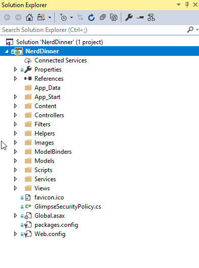

2. Rebuild the solution and run the application locally to ensure that the application is working fine.
The application looks like as shown in below figure.
   
   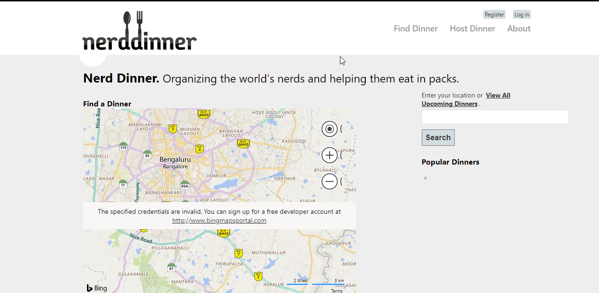

## Exercise 1: Migrate the LocalDB to SQL Server in Azure
  In this exercise we will create a SQL azure instance and  migrate the application LoaclDB to SQL Server in Azure.

1. Create a new SQL Azure instance in the Azure portal by following the below document. 

   [Create an Azure SQL database in the Azure portal](https://docs.microsoft.com/en-us/azure/sql-database/sql-database-get-started-portal).

2. Once the SQL database is provisioned in Azure, open the **SQL Server Object Explorer** in Visual Studio.
Click on **Add Server** icon and connect to the Azure SQL server which you have deployed in previuous step.

    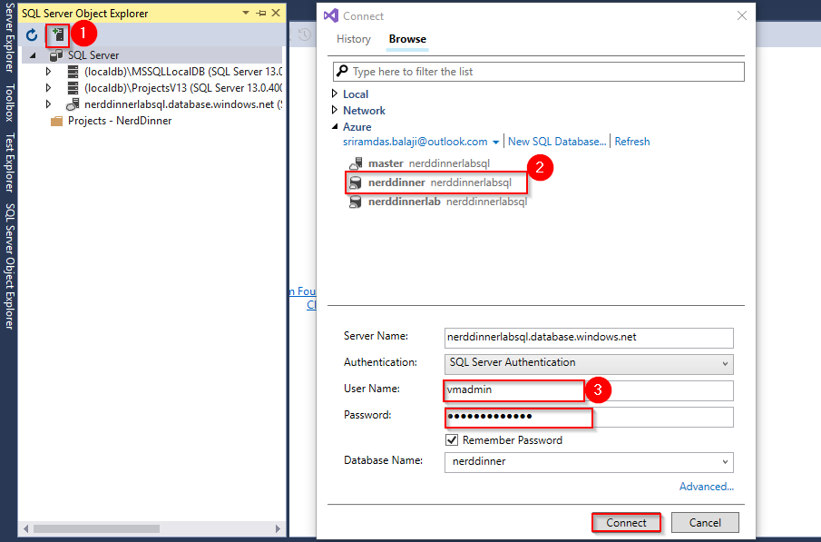
3. To get the schema moved from the LocalDB to the new SQL Azure instance right-click on the LocalDB Instance and select the Schema Compare option.

   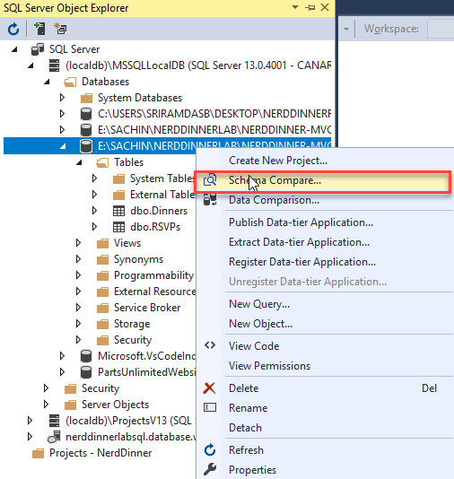

   In the schema compare wizard select target as Azure sql database and click on compare.

   

   Click on **Update** in the next wizard to update the schema to Azure SQL database.

   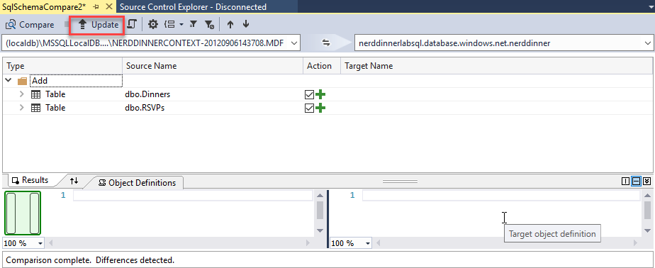
   

4. Similarly to get the data moved from the LocalDB to the SQL Azure instance right-click on the LocalDB Instance and select the Data Compare tool and walk through the SQL Data Compare wizard.
      
      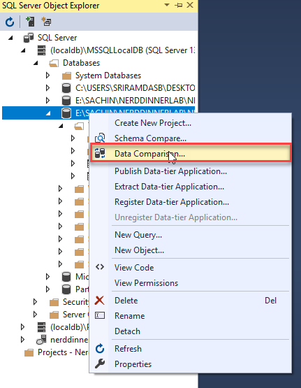

   In the wizard select target as Azure sql database and click on compare.

      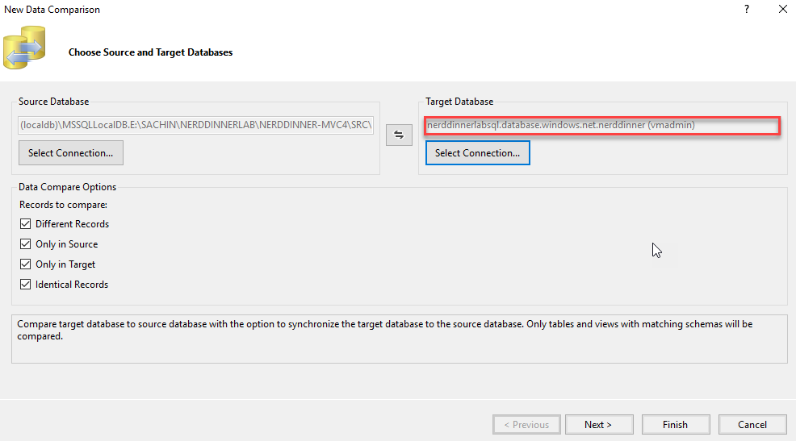

   Click on **Update** to move data to Azure SQL database.
   
      

5. In order to accomplish the **zero code change mantra**, using web.config transforms is the best way to accomplish. Here we will add a new **web.release.config** with a new entry. Open the **web.release.config** in Visual Studio and add the below entry.
   ```csharp
   <connectionStrings>  
      <add name="DefaultConnection" connectionString="Data Source=nerddinnerlabsql.database.windows.net;Initial Catalog=nerddinnerlab;Integrated Security=False;User ID=yourUserID;Password=yourdbpassword;Connect Timeout=30;Encrypt=True;TrustServerCertificate=False;ApplicationIntent=ReadWrite;MultiSubnetFailover=False" providerName="System.Data.SqlClient"  
        xdt:Transform="SetAttributes" xdt:Locator="Match(name)"/>
</connectionStrings>  


   >**Note**: Replace the connection string with your Azure SQL database connection string.

  Now we  have successfully migrated the application LocalDB to Azure SQL Db, and also updated connection string to refer to Azure SQL.

## Exercise 2: Add the Docker Support and run the application locally & debug within the Docker container using Visual Studio

1. Visual Studio has great support for Docker. In order to containerize the application using Docker, all you have to do is right-click on the project, select **Add->Docker Support**

   

2. Visual Studio then adds the Docker file, compose files and a specific Docker project to the solution. It also inspects the project to determine the proper base image to use for your project.

   

   In the case of Nerd Dinner, it chose to use microsoft/aspnet:4.7.1-windowsservercore-ltsc2016. Here is the complete file.

   ```csharp
   FROM microsoft/aspnet:4.7.1-windowsservercore-ltsc2016
   ARG source
   WORKDIR /inetpub/wwwroot
   COPY ${source:-obj/Docker/publish} .

3. To run the application locally and debug within the Docker container using Visual Studio and to test the connectivity to the SQL Azure instance, set the **docker-compose** as startup project and click on **Docker**.

   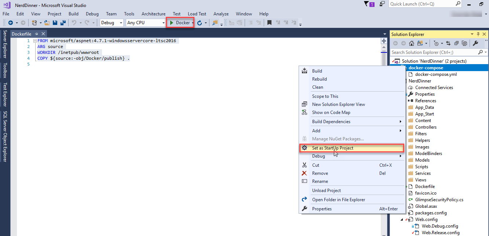

   Visual Studio downloads the base images and subsequently builds your dev images

   

   Once the images are downloaded and build is done you will see the application launching in local browser.

    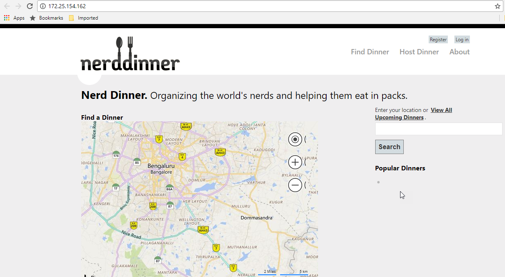

   Now the application is running in local docker. To see the list of docker images you can run the following commad 
   ```csharp
    docker images
   ```

     You will see the images similar to this
   
   


## Exercise 3: Publish Docker Images to Azure Container Registry (ACR)

 Now that you have validated that the application is running successfully in local Docker, you can publish the image to a new or existing Azure Container Registry using the publishing wizard in Visual Studio.

1. Right-click on the project, select **Publish**

   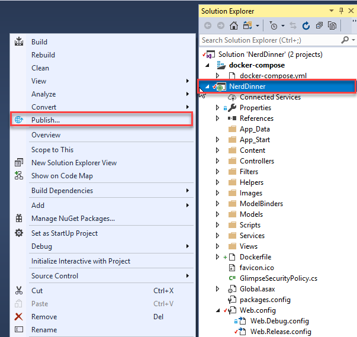

2. In the Publish wizard select **Container Registry** and select **Create New Azure Container Registry** and click on **Publish**

   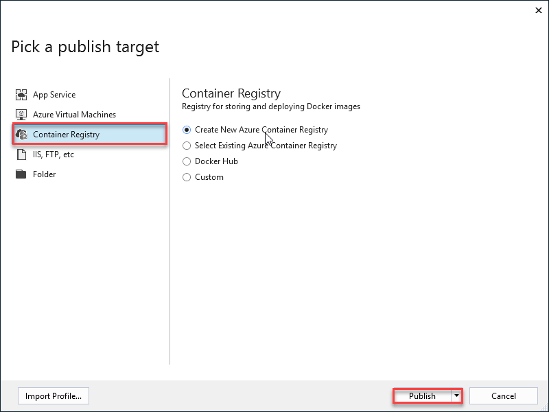

3. Fill the required details and click on **Create**

   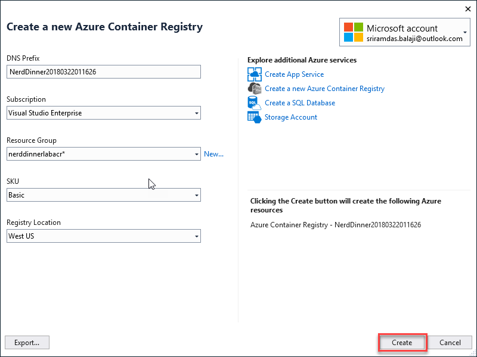

4. When publishing, the production Docker image is created and pushed to the Azure Container Registry.

   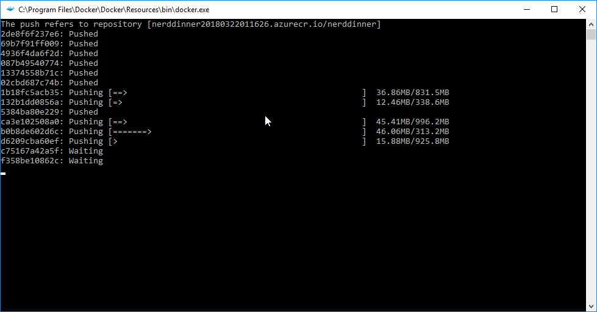

5. Once the publish is successfull, navigate to the deployed ACR in Azure portal. You will see **nerddinner** repository with image Tag is published.

   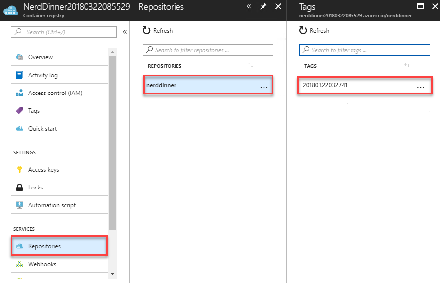


6. Selcect **Access Keys** under settings in ACR and copy the **password**. This password is required in the next exercise.

   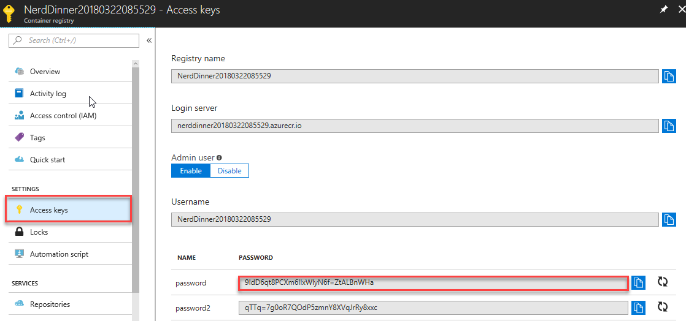

## Exercise 4: Push the new Docker images from ACR to Azure Container Instances (ACI)

  In this exercise we will create Azure Container Instance and push the new Docker image from ACR to Azure Container Instance.

 we have options as to where the application can be deployed.
* Azure Container Instances
* Azure Container Service
* Service Fabric

In this Lab, we will use a Windows Container on Azure Container Instances (ACI) to bring up Nerd Dinner.

1. We will use Azure CLI to create and push image to Azure Container Instance. Click on **Cloud Shell** in Azure portal.

   
2. Run the following command to create a new resource group for ACI
   ```csharp
    az group create --name nerddinnerapp --location westus
   ```

     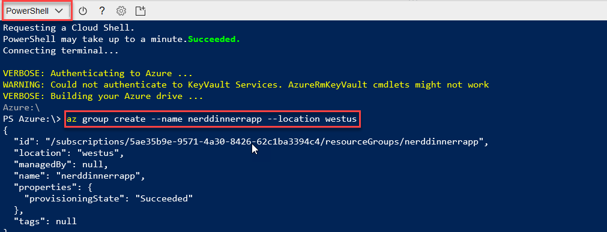

3. Run the following command to Create windows ACI and push the Nerd Dinner image from ACR
   ```csharp
   az container create --name nerddinnerapp --resource-group nerddinnerapp --os-type windows --image {your acr name}.azurecr.io/nerddinner:{Image Tag} --ip-address public 
   ```
   

   When prompted for **image registry password** paste the password which we have copied in the previous exercise
   > Replace **your acr name** and **Image tag** with your resources details

   It would take approximately 5-10 minutes to deploy ACI.

4. Navigate to the resource group where we ACI is being deployed or deployed, and select the **nerddinnerapp** container group.

    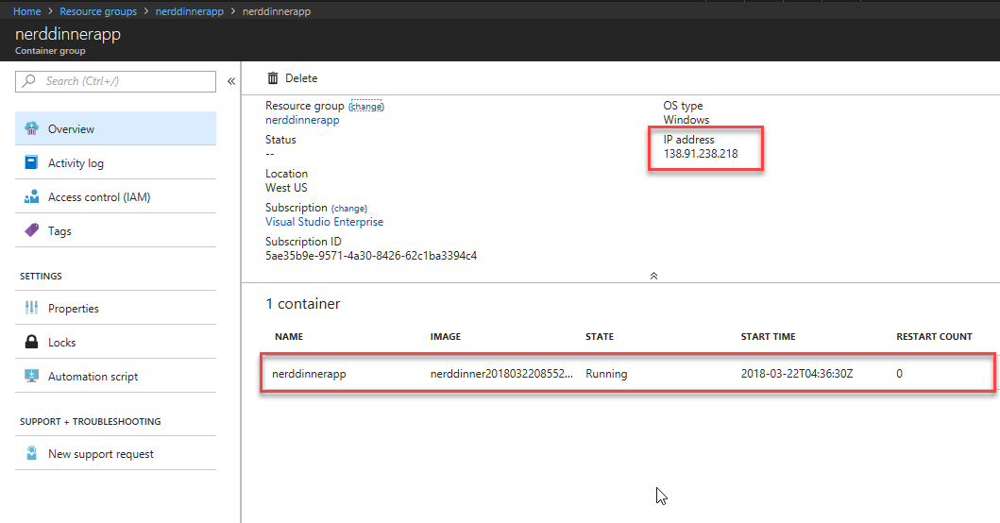

    Once the **State** of the container is **Running** we can access the deployed **Nerd Dinner** application using **IP address**. Copy the **IP address** and paste in the browser to see the application running.

    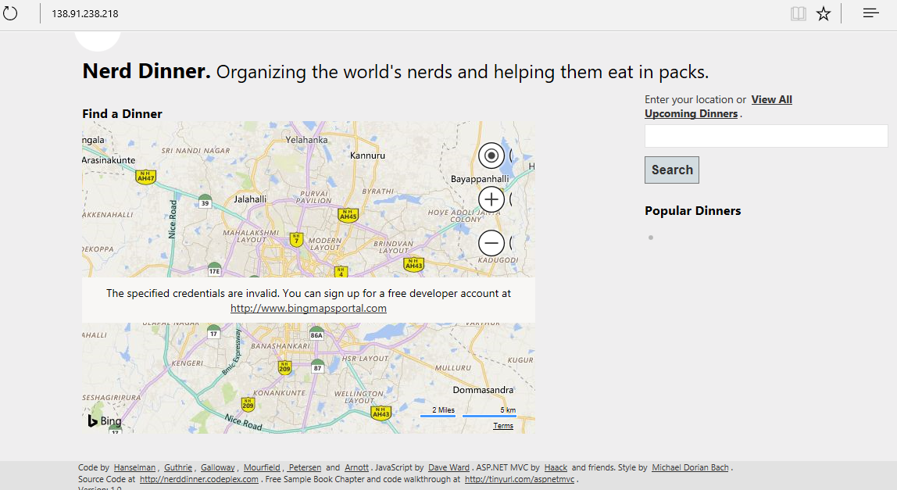
