

## Overview

[Octopus Deploy](https://Octopus.com) is an automated deployment server that makes it easy to automate deployment of ASP.NET web applications, Java applications, NodeJS application and custom scripts to multiple environments.

<!-- Azure DevOps includes a first-class, powerful release management capability that simplifies deployment of any application to any platform. But teams who prefer or already have chosen Octopus deploy, can use the **[Octopus Deploy Integration](https://marketplace.visualstudio.com/items?itemName=octopusdeploy.octopus-deploy-build-release-tasks)** extension available on **Extensions for Azure DevOps** that provides Build and Release tasks to integrate Octopus Deploy with Azure DevOps and Azure DevOps Server.

This lab shows how we can integrate Azure DevOps/Azure DevOps Server Build with Octopus to automate build and deployment of an ASP.NET Core application to an Azure App Service. -->

Azure DevOps will be handle the build/CI automation part of the process and will work with Octopus Deploy to handle deployment orchestration. The Octopus setup contains a central deployment server, along with “Tentacle” agents that run on any target VMs where deployment will take place. 

Here, we will see how to use Octopus Deploy in conjunction with Azure DevOps to deploy in the cloud in a repeatable and reliable way. 

## Before you begin

1. Refer the [Getting Started](../Setup/) before you begin to follow the below exercises.

## Setting up the Environment

Octopus Deploy has two components:

* **Octopus Server** - a centralized web front-end that orchestrates deployments , and
* **Tentacle** - agent that needs to be on every target endpoint.

We will spin up an Octopus server on Azure. Click the **Deploy to Azure** button below to provision an Octopus Server.

   {:target="_blank"}

1. It takes approximately 15 minutes for the deployment to complete. Once the deployment is successful, connect to Octopus server using DNS, and login with Octopus Admin username and password.

   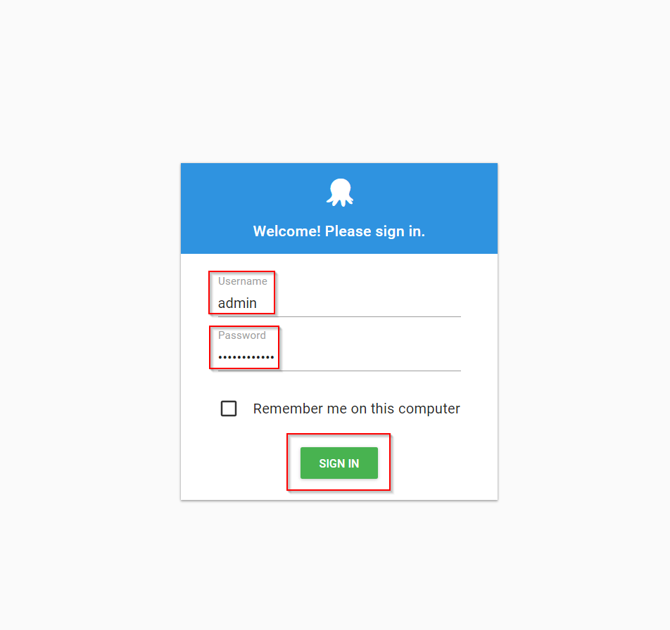

1. You will see the Octopus deploy web portal.

    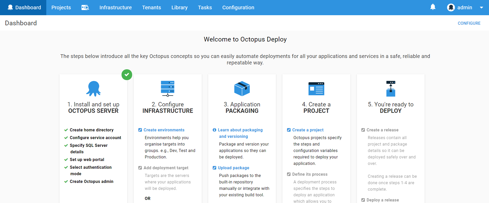

## Generating Service Principal Names(SPN) details from Azure

We need to generate SPN details to get **Tenant ID**, **Application ID** and **Application Password/Key** which will be used in the later part of the lab.

1. Login to your Azure account and click on **Cloud Shell**.

    

1. Select **Bash** or **Powershell** to run the command which will generate the SPN details.
 
    

1. Create Storage account as Azure Cloud Shell requires an Azure file share to persist files, If you already have one select it or create new. Select the subscription and click on **Create storage**. 
    

1. Once the storage account is provisioned, replace the variables within in brackets with values below  and run the command to get the SPN details.

    `az ad sp create-for-rbac --name (provide a short name) --password (provide a password)`
    
    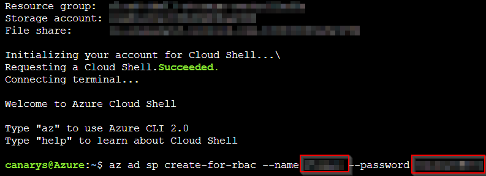

1. Note down the **Tenant ID**, **Appliction ID** and the **Password** in a notepad. 

    

## Setting up the Deployment Target

Since, the deployment target is an Azure WebApp, we need to create one.

Click the button below to provision an Azure WebApp.

{:target="_blank"}

## Generate Octopus API Key

An *API key* is used to authenticate Azure DevOps with Octopus server. Using API key lets you keep your username and password a secret.

1. From the Octopus Deploy portal, select **Profile** under *User* menu.

   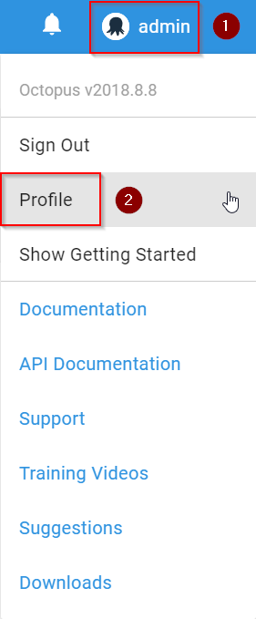

1. Select **My API Key** and click **New API Key** to create one. We will use the API Key to connect Octopus Deploy with Azure DevOps

   

1. Specify a **purpose**, for instance, **Azure DevOps Integration** and click **Generate New**.

   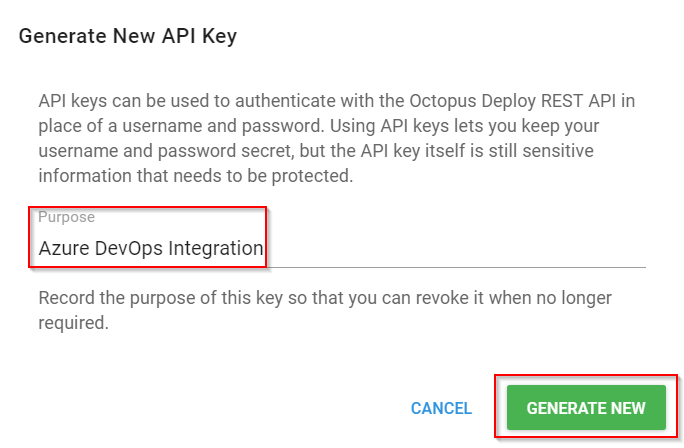

1. Copy the API Key to clipboard and save this to a notepad as you might use it for future requests.

   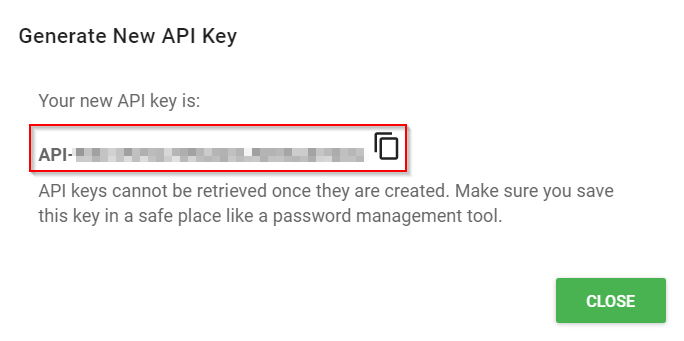

## Setting up the Azure DevOps team project

1. Use [Azure DevOps Demo Generator](https://azuredevopsdemogenerator.azurewebsites.net/?Name=octopus&TemplateId=77370){:target="_blank"} to provision the project on your Azure DevOps Organization.

## Exercise 1: Configure Deployment Target in Octopus Server

Let us create a deployment environment in Octopus server and link to Azure using Management Certificate. Environments are deployment targets consisting of machines or services used by Octopus Deploy to deploy applications. With Octopus Deploy,  we  can deploy applications to Windows servers, Linux servers, Microsoft Azure, or even an offline package drop.

Grouping  our deployment targets by environment lets you define your deployment processes and have Octopus deploy the right versions of our software to the right environments at the right time.

In this lab, we are using **Azure App Service** as the deployment target.

1. On the Octopus portal dashboard, select **Create environments** to go into the **Infrastructure** page.

   

1. Once inside, click **Add Environment**.

   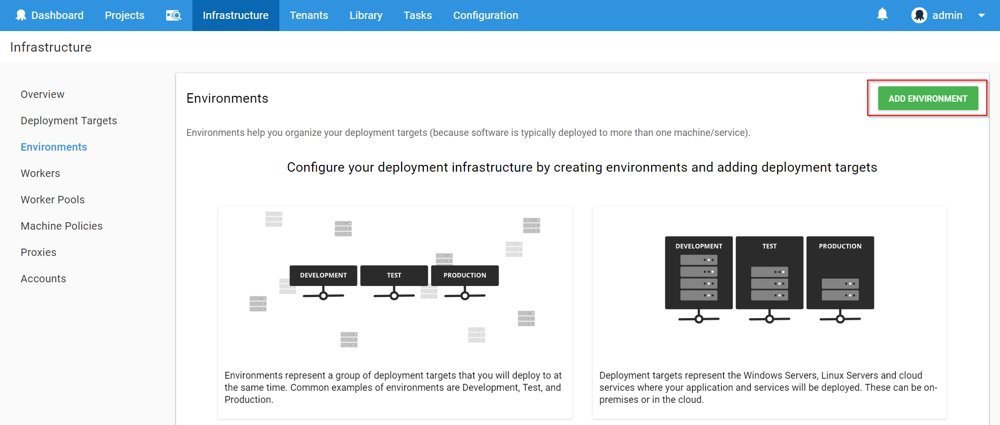

1. Provide the environment name and click **Save**.

   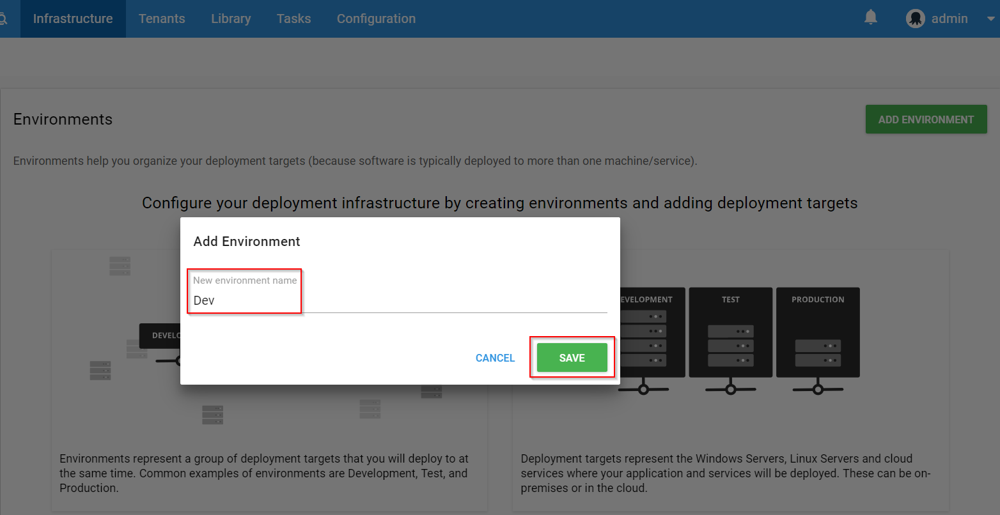

1. Octopus Deploy provides first-class support for deploying Azure Cloud Services and Azure Web Applications. To deploy software to Azure,   we must add  our  Azure subscription to Octopus Deploy, and then use the built-in step templates to deploy to the cloud. Once the environment is created, click on **Accounts** select **Azure Subscription** from **ADD ACCOUNT** dropdown.

   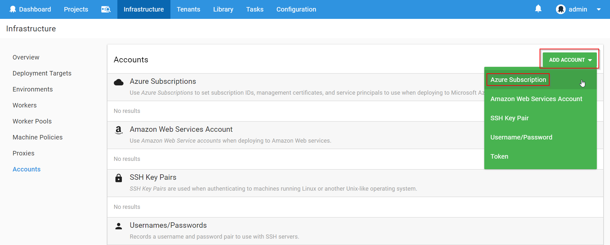

1. Octopus Deploy authenticates with Azure with one of the two methods:

    * To deploy to Azure Resource Manager (ARM), Octopus requires [**Azure Service Principal Account**](https://octopus.com/docs/infrastructure/azure/creating-an-azure-account/creating-an-azure-service-principal-account){:target="_blank"}.

    * To deploy to Cloud Services and Azure Web Apps, Octopus requires [**Azure Management Certificate**](https://octopus.com/docs/infrastructure/azure/creating-an-azure-account/creating-an-azure-management-certificate-account){:target="_blank"}. 

    Enter the following details -

    * **Name**: Provide an account name
    * **Subscription ID**: Your [Azure Subscription ID](https://blogs.msdn.microsoft.com/mschray/2016/03/18/getting-your-azure-subscription-guid-new-portal/){:target="_blank"}
    * **Authentication Method**: Choose **Use a Service Principal**
    * **Tenant ID**, **Application ID**, **Application Password/Key**: Created earlier in the lab

   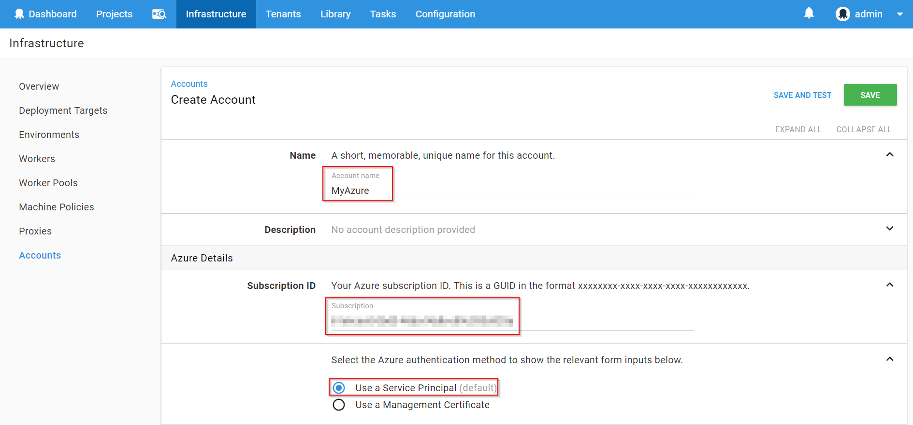

   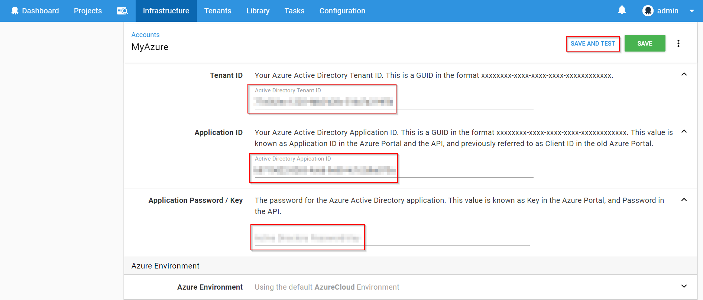

1. Click **SAVE AND TEST** and notice that your account is verified.

   

1. To add the deployment target, go to **Deployment Targets**, click on **ADD DEPLOYMENT TARGET**, select **Azure Web App** and click **NEXT**.

   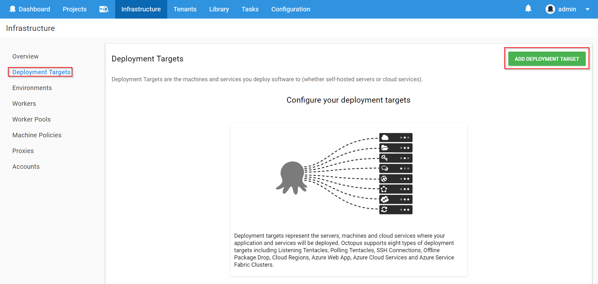

   

1. In **Create deployment target** page, provide **Display Name**, choose **Environment** from the dropdown, add **Target Roles**(Tags), select the **Account** which was created earlier and select **Azure Web App** from the dropdown as shown below and click **Save**..

   

   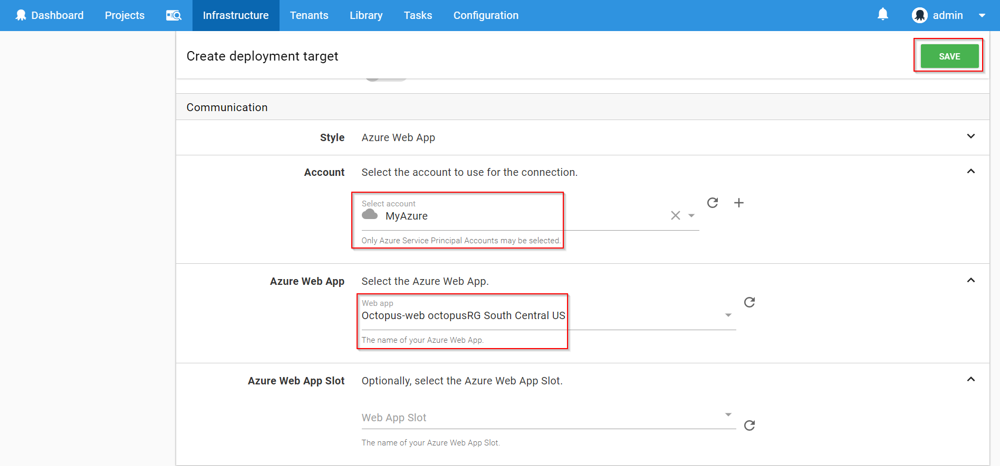

## Exercise 2: Create Project in Octopus

Let us create a Project in Octopus to deploy the package to **Azure App Service**. A [**Project**](https://octopus.com/docs/deployment-process/projects){:target="_blank"} is a collection of deployment steps and configuration variables that define how your software is deployed.

1. Go to the Octopus dashboard and click on **Create a project**.

   

1. Click on **ADD PROJECT**, provide the project name, description and click on **SAVE**.

   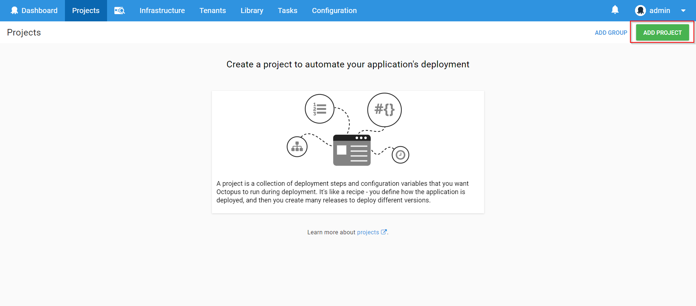

   

1. Once the project is created, click **Define your deployment process**. The [deployment process](https://octopus.com/docs/deploying-applications/deployment-process){:target="_blank"} is like a recipe for deploying your software.

   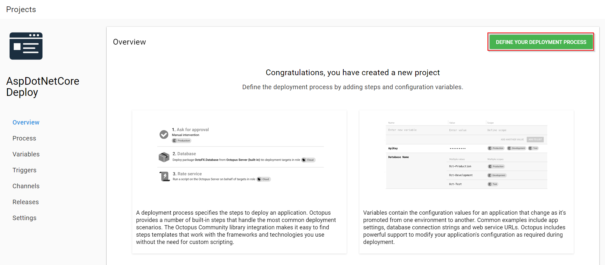

1. Click on **ADD STEP** to see a list of built-in step templates, custom step templates, and community contributed step templates.

   

1. **Search** for **Azure Web App** template and click **Add**.

   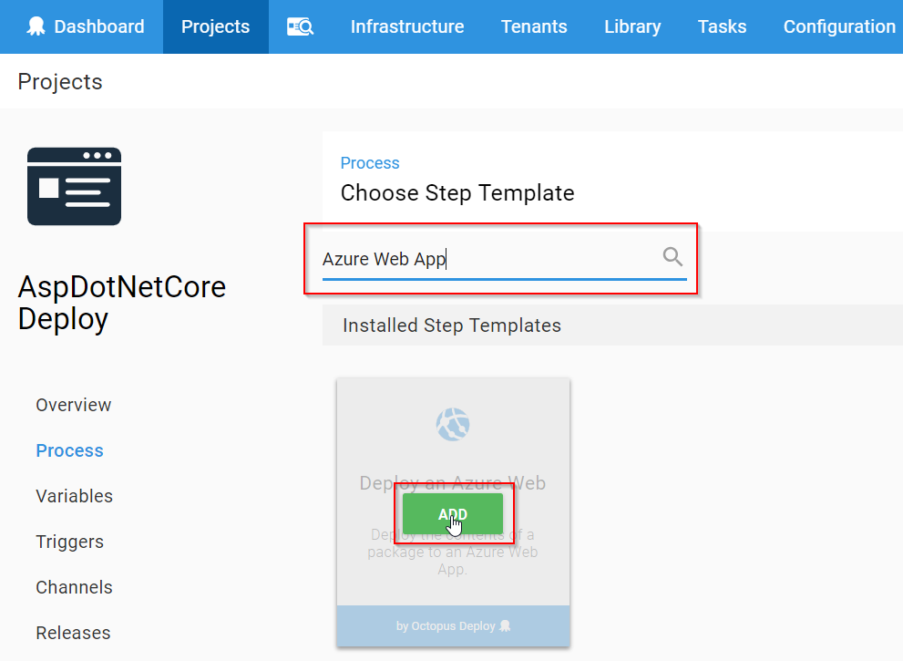

1. Populate the step template with required details -

   * **Step Name** : A short, unique name for the template.
   * **On Behalf Of** : Choose the target role from the drop down that was created in previous exercise step **8**. 
   * **Package ID** : Type-in as **Asp.netcore** (if you are providing different package ID, update it in Package Application task of the build definition)

   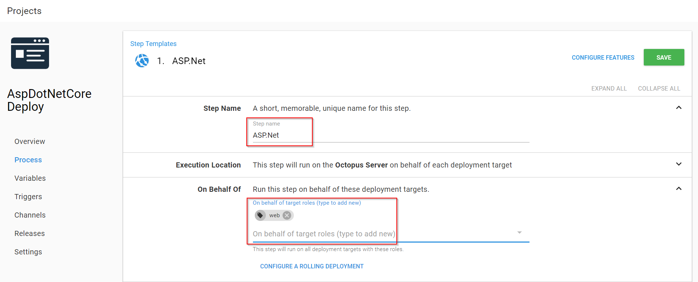

   

1. Click **Save** to complete the project creation and its deployment process.

## Exercise 3: Triggering CI-CD

In this exercise, we will package the ASP.NET Core application and push the package to Octopus Server. We will use build tasks of **Octopus Deploy Integration** extension which was installed during Team Project provisioning.

| Tasks| Usage|
|-------| ------|
| **Restore**| dotnet command-line tool restores all the package dependencies like **ASP.NET Core Identity, ASP.NET Core session** etc. required to build this project|
| **Build**| We will use dotnet command-line tool to build the project and its dependencies into a set of binaries|
| **Publish**| We will use this task to create a package with published content for the web deployment|
| **Package Application** | We will package the ASP.NET Core build output into a zip file with the version number|
| **Push packages to Octopus**| The copied package will be pushed to Octopus server from the artifacts directory|
| **Create Octopus Release**|Automates the creation of release in Octopus server. A release captures all the project and package details to be deployed over and over in a safe and repeatable way|
| **Deploy Octopus Release**| Automates the deployment of release in Octopus server. A deployment is the execution of the steps to deploy a release to an environment. An individual release can be deployed numerous times to different environments|

1. Go to **Builds** under **Pipelines** tab, select **Octopus** build definition and click on **Edit**.

   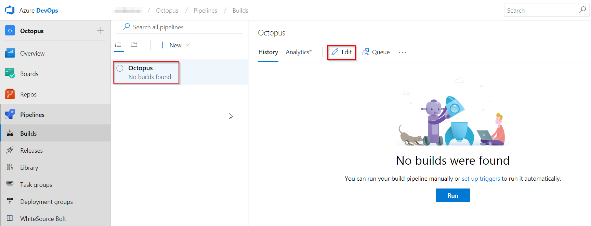

1. In **Push Packages to Octopus** task, update **Octopus Deploy Server** field with the created endpoint value.

   

1. In **Create Octopus Release** task, update **Octopus Deploy Server** field with the created endpoint value and choose the created **Project** from drop down.

    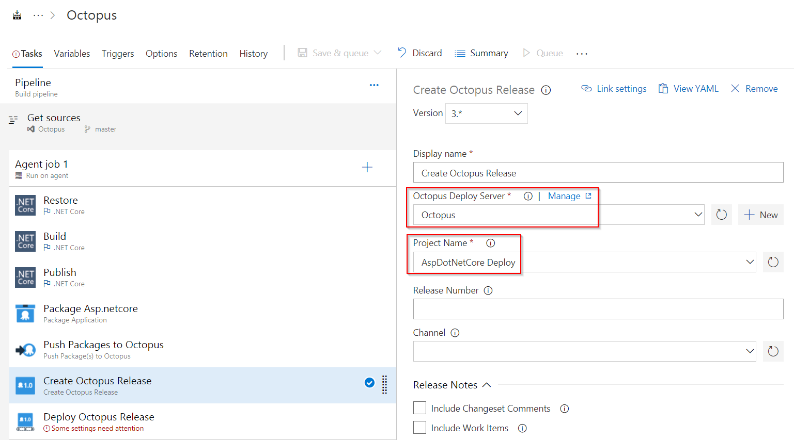

1. In **Deploy Octopus Release** task, update **Octopus Deploy Server** field with the created endpoint value, choose the appropriate values from the drop down for fields - **Project**  and **Deploy to Environments** and **Save & Queue** the build definition.

    

1. Navigate back to the **Build** tab see progress of the build.

    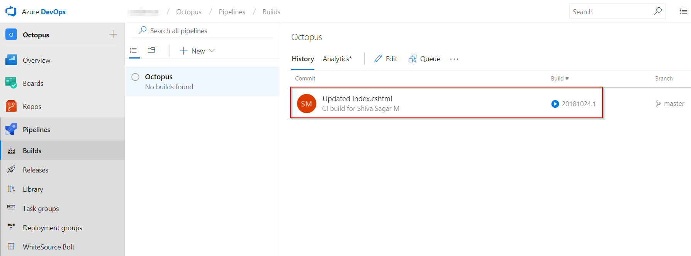

1. Once the build completes, go to Octopus portal project dashboard to see the release progress.

    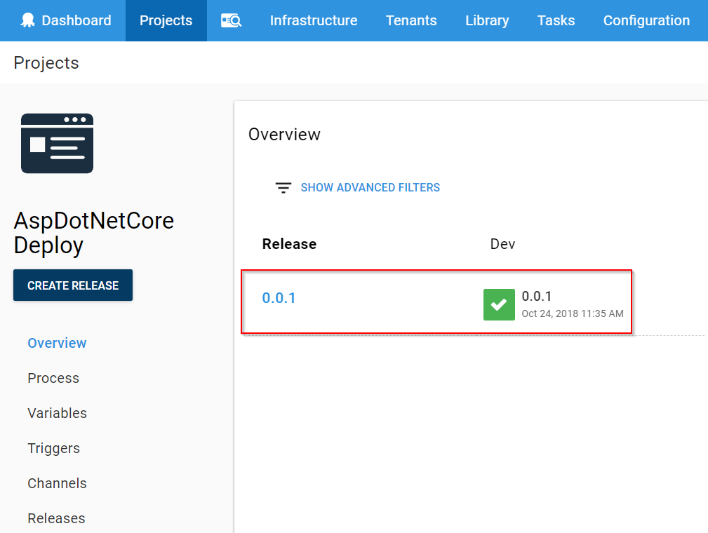

1. Go to the created Azure Web App from your **Azure Portal** and click **Browse**.

   

1. You will see the associated ASP.NET Core application up and running.

   

## Summary

The lab demonstrates how Azure Pipelines pick up a code commit, build the changes and push the deployment to Octopus which deploys to an Azure Web App.