

## Overview

[Selenium](http://www.seleniumhq.org/){:target="_blank"} is a portable open source software-testing framework for web applications. It has the capability to operate on almost every operating system. It supports all modern browsers and multiple languages including .NET (C#), Java.

In this lab, you will learn how to execute selenium test cases on a C# web application, as part of the Azure DevOps Release pipeline. 

### Before you begin

1. Refer to the [Getting Started](../Setup/) before you follow the below exercises.

1. Click on the deploy to Azure button below, to provision a Windows Server 2016 virtual machine along with SQL Express 2017 and browsers - Chrome and FireFox.    

   {:target="_blank"}

   It should take approximately 20-25 minutes to provision the resources. Once the deployment is successful, you will see the resources as shown.

   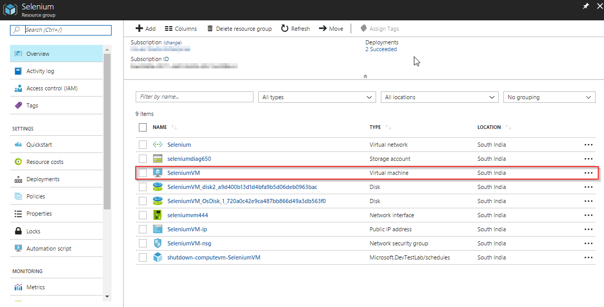

1. Use the [Azure DevOps Demo Generator](https://azuredevopsdemogenerator.azurewebsites.net/?Name=Selenium&TemplateId=77367){:target="_blank"} to provision the project on your Azure DevOps Organization. This URL will automatically select Ansible template in the demo generator. If you want to try other projects, use this URL instead - https://azuredevopsdemogenerator.azurewebsites.net/

Follow the [simple walkthrough](https://docs.microsoft.com/en-us/azure/devops/demo-gen/use-vsts-demo-generator-v2?view=vsts) to know how to use the Azure DevOps Demo Generator.

## Exercise 1: Configure agent on the VM

Let us configure a ***private*** slef-hosted agent on this VM. Selenium requires the agent to be run in **interactive** mode to execute the UI tests.

1. Login to the VM using [RDP](https://docs.microsoft.com/en-us/azure/virtual-machines/windows/connect-logon){:target="_blank"} with the following credentials

   - **Username**: vmadmin
   - **Password**: P2ssw0rd@123

1. In the VM open web browser, sign in to your Azure DevOps organization and navigate to the Agent pools tab:

    - Choose  **Azure DevOps**, **Organization settings**.

      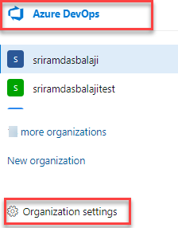

    - Choose **Agent pools**.

       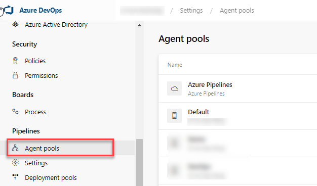

    - Select the **Default** pool, select the **Agents** tab and choose **New agent**.

    - On  **Get the agent** dialog box, choose **Windows** and **Download** agent.
       
         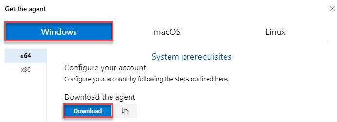

1. Make a directory in **C Drive** with the name **AzAgent** and extract the downloaded agent zip file  to this directory.
  
    

1. Open Powershell in **administrator mode**. Change the path to **C:\AzAgent** and type **Config.cmd** and hit **Enter**.

1. Provide the following details:

    - Enter server URL: Your Azure DevOps Organization URL
    - Authentication type: Press the **enter key** for **PAT** as the authentication type and paste the PAT in the next prompt.
    - Let us use the default options for the rest of the configuration. Press **Enter** for all prompts until the command execution completes.
    - Once the agent is registered, type **run.cmd** and hit **Enter** to start the agent.

    Click [here](https://docs.microsoft.com/en-us/vsts/build-release/actions/agents/v2-windows){:target="_blank"} for more information on how to configure the agent.

   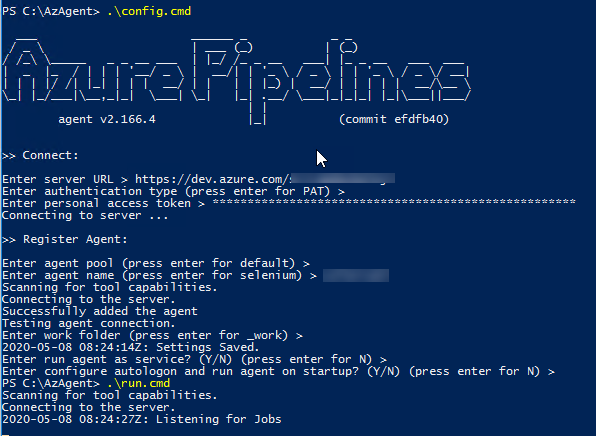

## Exercise 2: Configure Release Pipeline

The target machine is having agent configured to deploy the applications and run selenium testcases. The release definition uses **[Phases](https://docs.microsoft.com/en-us/vsts/build-release/concepts/process/phases){:target="_blank"}** to deploy to target servers.

1. Go to **Releases** under **Pipelines** tab. Select **Selenium** release definition and click on **Edit**.

   

1. Open **Dev** environment to see the three deployment phases.

   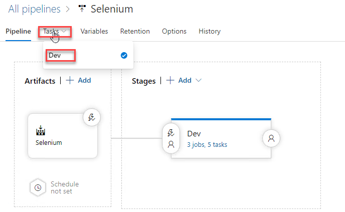

   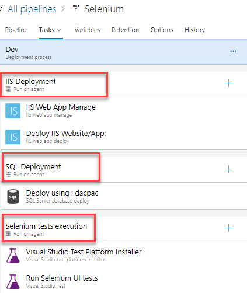

   - **IIS Deployment phase**: In this phase, we deploy application to the VM using the following tasks-

      - **IIS Web App Manage**: This task runs on the target machine where we registered agent. It creates a *website* and an *Application Pool* locally with the name **PartsUnlimited** running under the port **82** , [**http://localhost:82**](http://localhost:82)

      - **IIS Web App Deploy**: This task deploys the application to the IIS server using **Web Deploy**.

   - **Database deploy phase**: In this phase, we use [**SQL Server Database Deploy**](https://github.com/Microsoft/vsts-tasks/blob/master/Tasks/SqlDacpacDeploymentOnMachineGroup/README.md){:target="_blank"} task to deploy [**dacpac**](https://docs.microsoft.com/en-us/sql/relational-databases/data-tier-applications/data-tier-applications){:target="_blank"} file to the DB server.

   - **Selenium tests execution**: Executing **UI testing** as part of the release process is a great way of detecting unexpected changes, and need not be difficult. Setting up automated browser based testing drives quality in your application, without having to do it manually. In this phase, we will execute Selenium tests on the deployed web application. The below tasks describes using Selenium to test the websites in the release pipeline.

     - **Visual Studio Test Platform Installer**: The [Visual Studio Test Platform Installer](https://docs.microsoft.com/en-us/azure/devops/pipelines/tasks/tool/vstest-platform-tool-installer?view=vsts){:target="_blank"} task will acquire the Microsoft test platform from nuget.org or a specified feed, and add it to the tools cache. It satisfies the 'vstest' demand and a subsequent Visual Studio Test task in a build or release pipeline can run without needing a full Visual Studio install on the agent machine.
     - **Run Selenium UI tests**: This [task](https://github.com/Microsoft/azure-pipelines-tasks/blob/master/Tasks/VsTestV2/README.md){:target="_blank"} uses **vstest.console.exe** to execute the selenium testcases on the agent machines.

1. Click on **IIS Deployment** phase and select the **Default** Agent pool where we registered the agent in **Exercise 1**. In case if you have registered the agent to different agent pool, you need to select that.

   

1. Repeat the above step for **SQL Deployment** phase

   

1. Click on **Selenium tests execution** phase and set Agent pool to **Default** then **Save** the changes.

   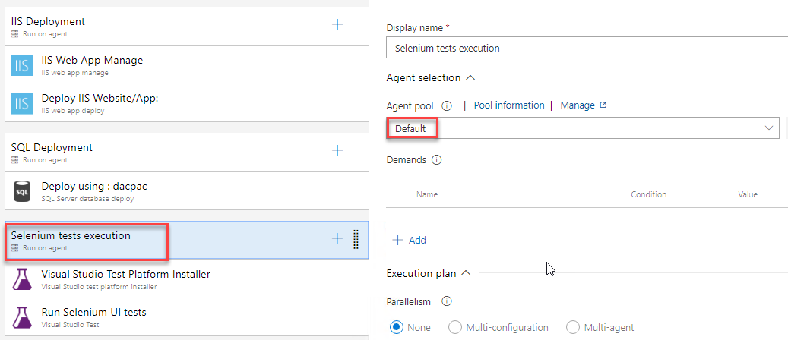

## Exercise 3: Trigger Build and Release

In this exercise, we will trigger the **Build** to compile Selenium C# scripts along with the Web application. The resulting binaries are copied to Azure VM and finally the selenium scripts are executed as part of the automated **Release**.

1. Navigate to **Pipelines** under **Pipelines**. Select **Selenium** build pipeline and click **Run pipeline**.

   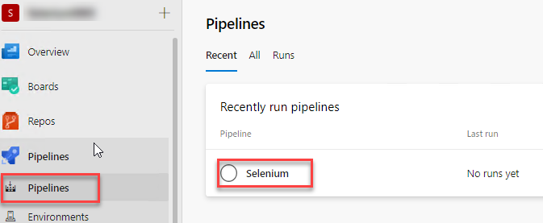

    

1. This build will publish the test artifacts to Azure DevOps, which will be used in release.

1. Once the build is successful, release will be triggered. Navigate to **Releases** tab to see the deployment in-progress.

   

1. When **Selenium test execution** phase starts, connect back to the VM provisioned earlier to see UI tests execution.

   

   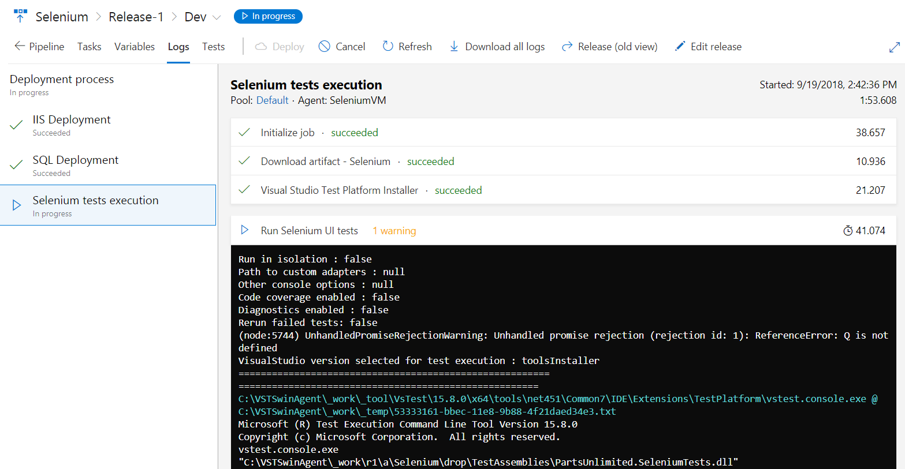

1. In this lab, we are executing **four** UI test scenarios configured to run on **Chrome** and **Firefox** browsers.

### Tests running in Chrome

   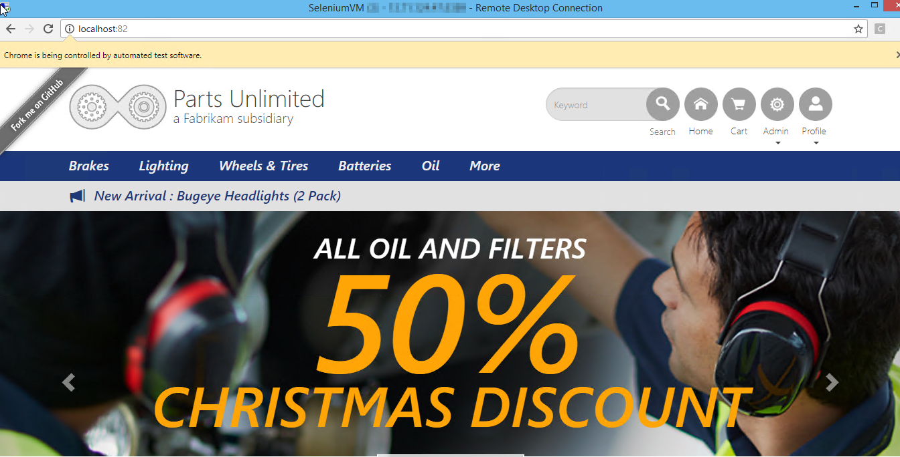

### Tests running in Firefox

   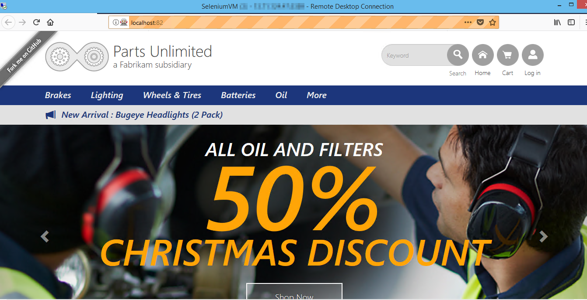

Once the release succeeds, click on the **Tests** tab to analyze the test results. Select the required filters from the dropdown in **Outcome** section to view the tests and their status.

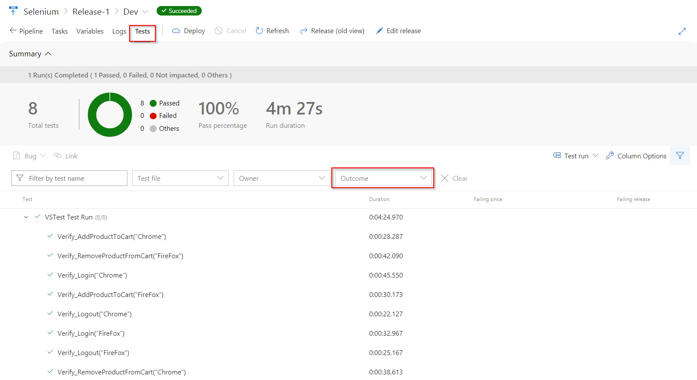

## Summary

In this lab, you have learnt how to automate and execute Selenium UI test cases on different browsers on an Azure VM with Azure Pipelines.
