<div class="rw-ui-container"></div>

## Overview

Technical debt is the set of problems in a development effort that make forward progress on customer value inefficient. Technical debt saps productivity by making code hard to understand, fragile, time-consuming to change, difficult to validate, and creates unplanned work that blocks progress. Unless they are managed, technical debt can accumulate and hurt the overall quality of the software and the productivity of the development team in the long term

[SonarQube](https://www.sonarqube.org/){:target="_blank"} an open source platform for continuous inspection of code quality to perform automatic reviews with static analysis of code to:

- Detect Bugs
- Code Smells
- Security Vulnerabilities
- Centralize Quality

### What's covered in this lab

In this lab, you will learn how to setup SonarQube on Azure and integrate with Azure DevOps project

- Provision SonarQube server from an Azure template
- Setup SonarQube project
- Provision an Azure DevOps Project and configure CI pipeline to integrate with SonarQube
- Analyze SonarQube reports

### Before you begin

1. Refer to the [Getting Started](../Setup/) page before you begin the exercises.

1. Click the **Deploy To Azure** button below to provision SonarQube Server on Azure VM.

   [](https://portal.azure.com/#create/Microsoft.Template/uri/https%3A%2F%2Fraw.githubusercontent.com%2FAzure%2Fazure-quickstart-templates%2Fmaster%2Fsonarqube-azuresql%2Fazuredeploy.json){:target="_blank"}

   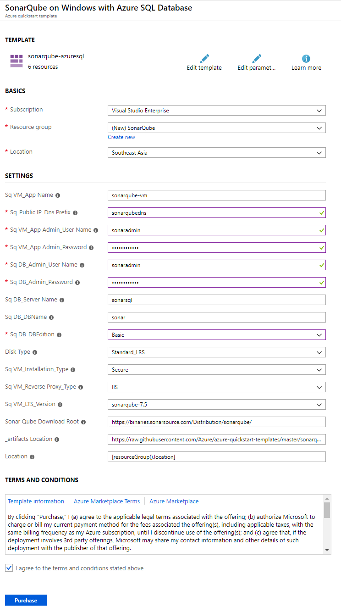

   Provide the following parameters as shown.

   |Parameter Name| Description|
   |--------------|------------|
   |**Subscription Details**|Choose the active Azure subscription, create a new resource group along with the location of creation|
   |**SQ_VM_App Name**|Name of the VM where SonarQube will be installed|
   |**SQ_Public IP_DNS Pefix**|**unique** DNS name to be provided with the following pattern:- **^[a-z][a-z0-9-]{1,61}[a-z0-9]$** or it will throw an error. For ex: sonarqubedns|
   |**SQ VM_App Admin_User Name**|Local admin account for the SonarQube VM|
   |**SQ VM_App Admin_User Password**|Password for the SonarQube VM|
   |**SQ DB_Admin_User Name**|Admin account for Azure SQL Server|
   |**SQ DB_Admin_Password**|Password for Azure SQL Server|
   |**SQ DB_DBEdition**|Choose **Standard** as the Azure SQL database edition|

1. After providing all of the required values in the above table, check the ***Terms & Conditions*** checkbox and click on the **Purchase button**.

   
   {% include important.html content= "The deployment in Azure can take up to 20 minutes. At the end of the deployment, SonarQube will be configured to run as a Windows Service on the SonarQube VM. When the SonarQube service starts for the first time, it will configure its database. This can take an additional 15 minutes  to complete during which time the Azure deployment shows as completed but you still won't be able to reach the SonarQube home page. Please give SonarQube some time to update. Click [here](https://blogs.msdn.microsoft.com/visualstudioalmrangers/2016/10/06/easily-deploy-sonarqube-server-in-azure/){:target=\"_blank\"} for more information." %}

1. Once the deployment is successful, you will see the resources in Azure Portal.

   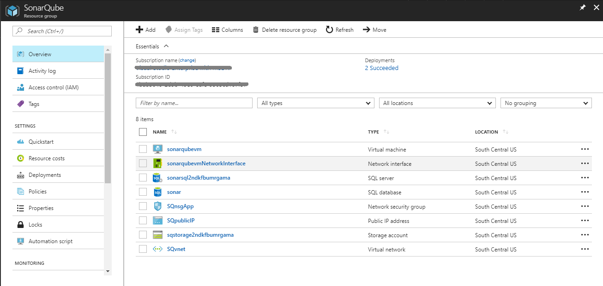


1. [RDP](https://docs.microsoft.com/en-us/azure/virtual-machines/windows/connect-logon) into the machine and download Java JDK 8 from Oracle http://www.oracle.com/technetwork/java/javase/downloads/jdk8-downloads-2133151.html.

    - To enable the file download on Internet Explorer, follow the below steps on the browser :
        - Click Tools and then Internet options.
        - Click on the security tab.
        - Select the Internet Zone
        - Click on the Custom Level Button and then scroll down to Download
        - Make sure to enable *File download*
        - Click Apply and OK
        - Restart Internet Explorer and check if that helps.


1. Install JDK by the following the wizard.

1. Start the **SonarQube** service by typing below command in command line
   ```
   net start SonarQube
   ```

1. Use the [Azure DevOps Demo Generator](https://azuredevopsdemogenerator.azurewebsites.net/?TemplateId=77364&Name=SonarQube){:target="_blank"} to provision a project on your Azure DevOps Organization.

## Exercise 1: Create a SonarQube Project and configure Quality Gate

1. Access the **SonarQube** portal providing the DNS name suffixed by the port number.

   

   

1. Open a browser and login to the SonarQube Portal using the following credentials-

   >**Username= admin, Password= admin**

1. Click **Skip this tutorial** in the pop-up window to see the home page.
 
   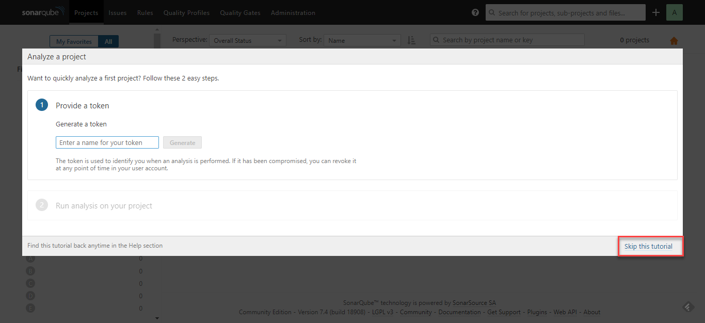

      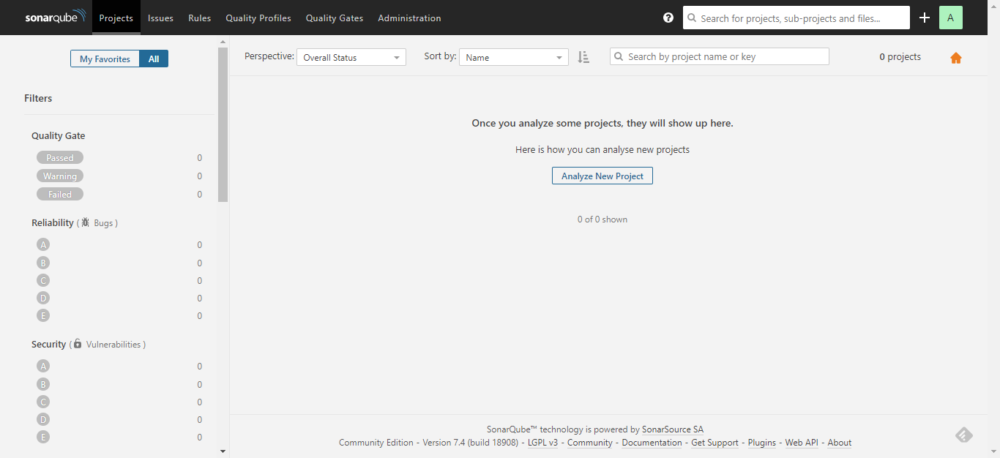

1. Choose **Administration** in the toolbar, click **Projects** tab and then **Management**.

   

1. Create a project with **Name** and **Key** as **MyShuttle**.

   - **Name**: Name of the SonarQube project that will be displayed on the web interface.

   - **Key**: The SonarQube project key that is unique for each project.

   - Leave the **Visibility** option to **Public**.

   

   Let us create a Quality Gate to enforce a policy which fails the gate if there are bugs in the code. A Quality Gate is a PASS/FAIL check on a code quality that must be enforced before releasing software.

1. Click the **Quality Gates** menu and click **Create** in the Quality Gates screen. Enter a name for the Quality Gate and click **Create**.

   

1. Let us add a condition to check for the number of bugs in the code. Click on **Add Condition** drop down, choose the value **Bugs**.

   

1. Change the **Operator** value to **is greater than** and the **ERROR** threshold value to **0** (zero) and click on the **Add** button.

   

   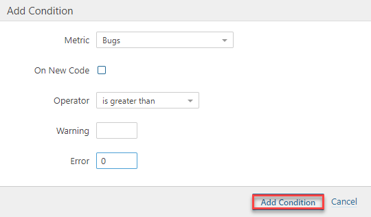

1. To enforce this quality gate for **MyShuttle** project, click on **All** under **Projects** section and select the project checkbox.

   

## Exercise 2: Modify the Build to Integrate with SonarQube

Now that the SonarQube server is running, we will modify Azure Build pipeline to integrate with SonarQube to analyze the java code provisioned by the Azure DevOps Demo Generator system.

1. Go to **Builds** under **Pipelines** tab, edit the build pipeline **SonarQube**. This is a Java application and we are using [Maven](https://docs.microsoft.com/en-us/azure/devops/pipelines/tasks/build/maven?view=azure-devops) to build the code. And we are using [SonarQube](https://marketplace.visualstudio.com/items?itemName=SonarSource.sonarqube) extension tasks to prepare  analysis on SonarQube and publish Quality Gate results.

1. **Prepare Analysis Configuration** task is to configure all the required settings before executing the build. Click **+ NEW** to add SonarQube server endpoint. 
    
    

   In the **Add SonarQube service connection** wizard enter the SonarQube server URL and SonarQube security token detials. If you don't have SonarQube security token follow [this](https://docs.sonarqube.org/latest/user-guide/user-token/) to create one. And make sure SonarQube project name and project key are same as you entered while creating SonarQube project in **Exercise 1**. 
   
    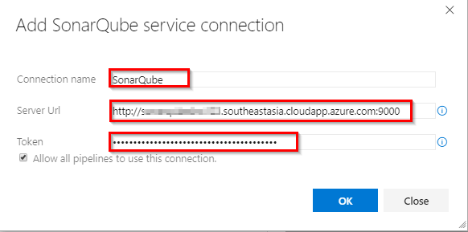

   

1. **Publish Quality Gate Result** task is to display the Quality Gate status in the build summary.
     
     

1. **Save** the changes and queue the build.

   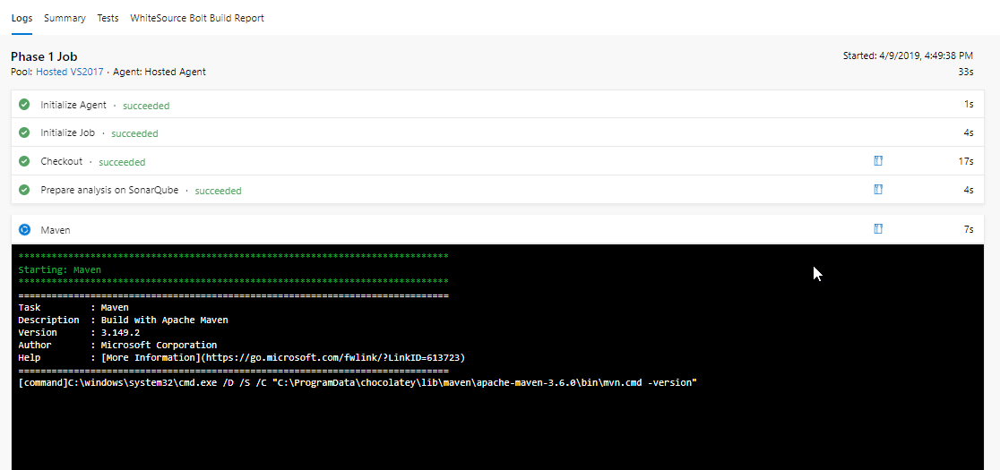

1. You will see that the build has succeeded but the associated  **SonarQube Quality Gate** has **failed**. The  count of bugs is also displayed under **SonarQube Analysis Report**.

   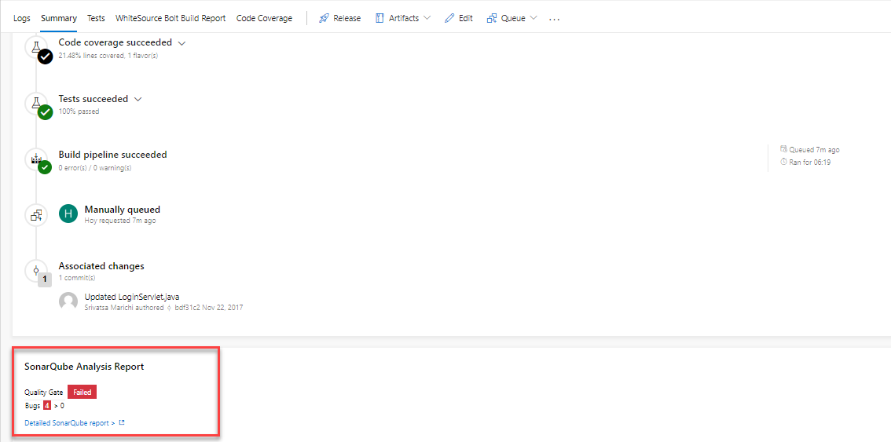

1. Click on the **Detailed SonarQube Report** link in the build summary to open the project in SonarQube.

   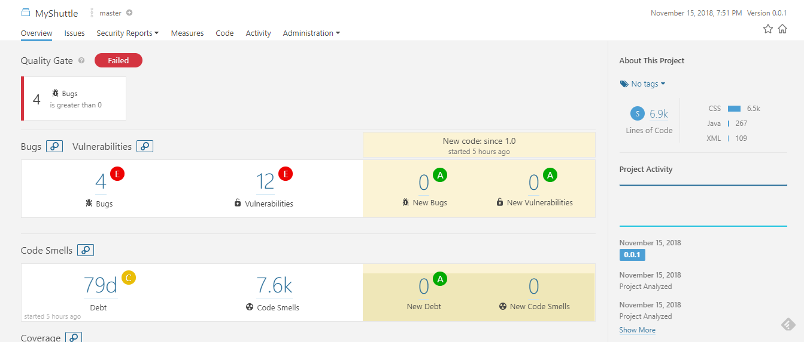

## Exercise 3: Analyze SonarQube Reports

The link will open the **MyShuttle** project in the SonarQube Dashboard.  Under ***Bugs and Vulnerabilities***, we can see that there are 4 bugs reported.

  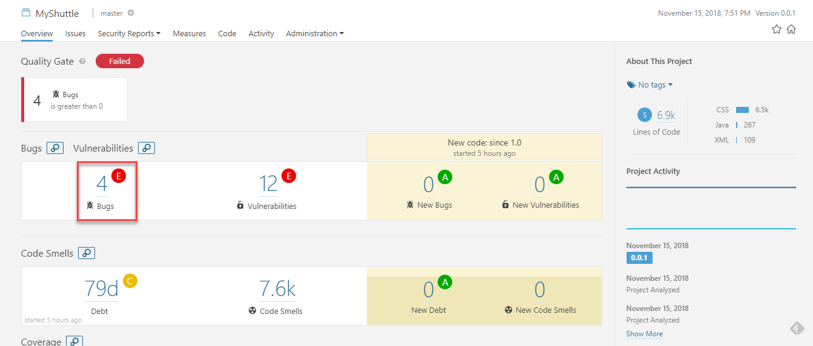

  The page has other metrics such as ***Code Smells***, ***Coverage***, ***Duplications*** and ***Size***. The following table briefly explains each of these terms.

   |Terms|Description|
   |-----|-----------|
   |**Bugs**|An issue that represents something wrong in the code. If this has not broken yet, it will, and probably at the worst possible moment. This needs to be fixed|
   |**Vulnerabilities**|A security-related issue which represents a potential backdoor for attackers|
   |**Code Smells**|A maintainability-related issue in the code. Leaving it as-is means that at best maintainers will have a harder time than they should making changes to the code. At worst, they'll be so confused by the state of the code that they'll introduce additional errors as they make changes|
   |**Coverage**|To determine what proportion of your project's code is actually being tested by tests such as unit tests, code coverage is used. To guard effectively against bugs, these tests should exercise or 'cover' a large proportion of your code|
   |**Duplications**|The duplications decoration shows which parts of the source code are duplicated|
   |**Size**|Provides the count of lines of code within the project including the number of statements, Functions, Classes, Files and Directories|

  

1. Click on the **Bugs** count to see the details of the bug.

   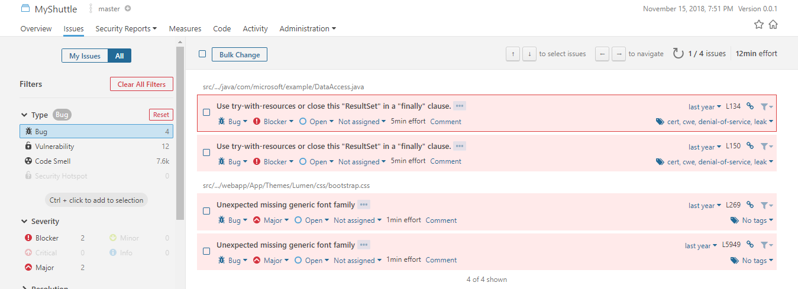

With Azure DevOps and SonarQube, the capability is to not only show the health of an application but also to highlight newer issues. With a Quality Gate in place, you can fix the leak and therefore improve code quality systematically. 

## Summary

With SonarQube direct integration with Azure Pipeline, you learnt how to have a quality management tool to ensure that your code is up to standards. You can embed automated testing in your CI/CD pipleine to automate the measurement of your technical debt including code semantics, testing coverage, vulnerabilities. etc.
