

## Overview

[Terraform](https://www.terraform.io/intro/index.html) is a tool for building, changing and versioning infrastructure safely and efficiently. Terraform can manage existing and popular cloud service providers as well as custom in-house solutions.

Configuration files describe to **Terraform** the components needed to run a single application or your entire datacenter. Terraform generates an execution plan describing what it will do to reach the desired state, and then executes it to build the described infrastructure. As the configuration changes, Terraform is able to determine what changed and create incremental execution plans which can be applied. 

Want more hands-on experience? Check out <a href="https://docs.microsoft.com/en-us/learn/modules/provision-infrastructure-azure-pipelines/"><b><u> Provision infrastructure
in Azure Pipelines</u></b></a> on Microsoft Learn.

### What’s covered in this lab

In this lab, you will see

1. How open source tools, such as Terraform can be leveraged to implement Infrastructure as Code (**IaC**)
1. How to automate your infrastructure deployments in the Cloud with Terraform and Azure Pipelines

The following image will walk you through all the steps explained in this lab

 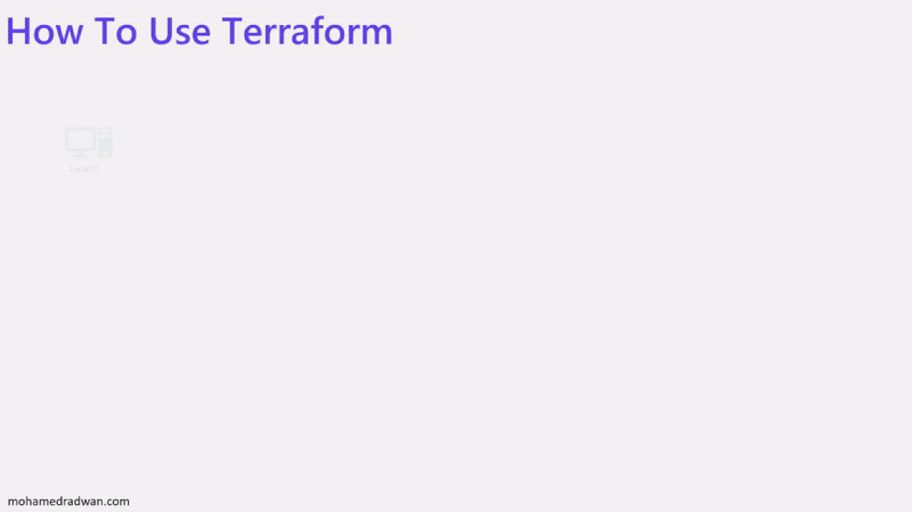

### Before you begin

1. Refer to the [Getting Started](../Setup/) page before you begin following the exercises.

1. Use the [Azure DevOps Demo Generator](https://azuredevopsdemogenerator.azurewebsites.net/?TemplateId=77382&Name=Terraform){:target="_blank"} to provision the project on your Azure DevOps organization.
   This URL will automatically select **Terraform** template in the demo generator. If you want to try other projects, use this URL instead -[azuredevops generator](https://azuredevopsdemogenerator.azurewebsites.net/)

   Follow the [simple walkthrough](https://docs.microsoft.com/en-us/azure/devops/demo-gen/use-vsts-demo-generator-v2?view=vsts){:target="_blank"} to know how to use the Azure DevOps Demo Generator.

## Exercise 1: Examine the Terraform file (IaC) in your Source code
In this lab, you will use PartsUnlimited which is an example eCommerce website developed using .Net Core. You will examine the terraform file which helps you to provision the Azure Resources required to deploy PartsUnlimited website.

1. Navigate to the project you created above using [Azure DevOps Demo Generator](https://azuredevopsdemogenerator.azurewebsites.net/?TemplateId=77382&Name=Terraform){:target="_blank"}

1. Select **Repos**. Switch to **terraform** branch.

    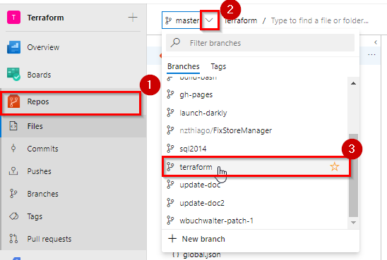

    Make sure that you are now on the **terraform** branch and **Terraform** folder is there in the repo.

    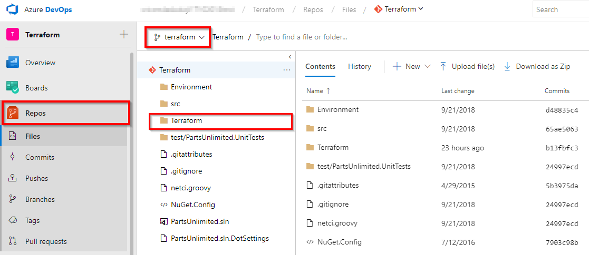

1. Select the **webapp.tf** file under the Terraform folder. Go through the code.
     
      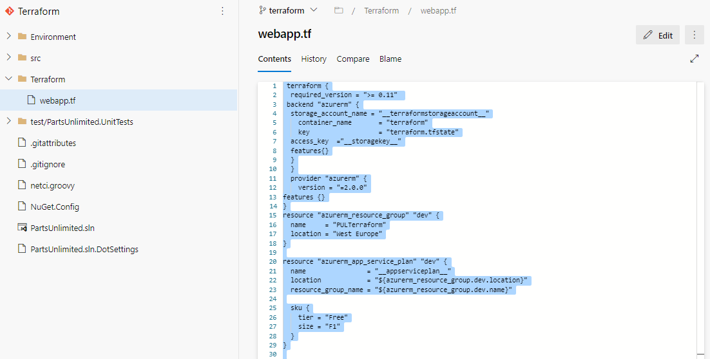

    **webapp.tf** is a terraform configuration file. Terraform uses its own file format, called HCL (Hashicorp Configuration Language). This is very similar to YAML.

    In this example, we want to deploy an Azure Resource group, App service plan and App service required to deploy the website. And we have added Terraform file (Infrastructure as Code) to source control repository in your Azure DevOps project which can deploy the required Azure resources. 
    
    If you would like to learn more about the terraform basics click [here](https://azurecitadel.com/automation/terraform/lab1/){:target="_blank"}.
  

## Exercise 2: Build your application using Azure CI Pipeline
  In this exercise, you will build your application and publish the required files to an artifact called drop.

  1. Navigate to **Pipelines --> Pipelines**. Select **Terraform-CI** and click **Edit**.

      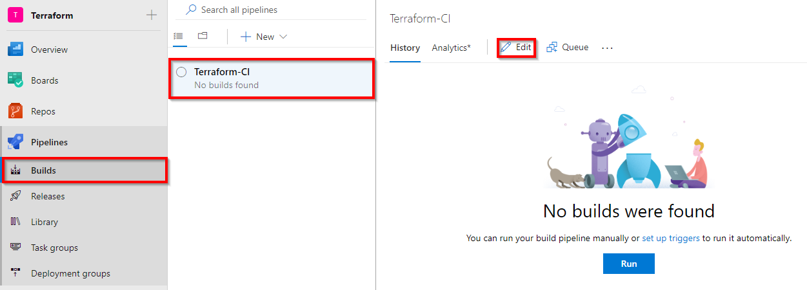

  1. Your build pipeline will look like as below. This CI pipeline has tasks to compile .Net Core project. The `dotnet` tasks in the pipeline will restore dependencies, build, test and publish the build output into a zip file (package)  which can be deployed to a web application.
    
      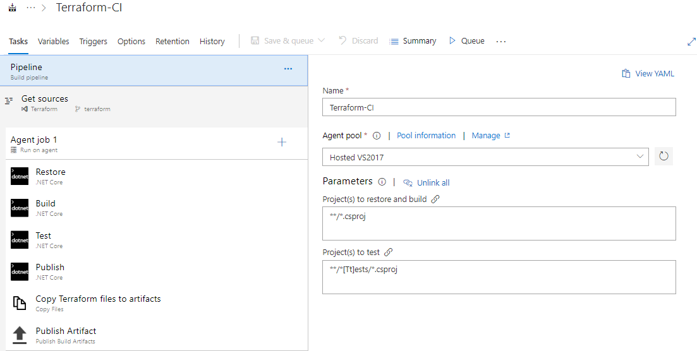

     For more guidance on how to build .Net Core projects with Azure Pipelines see [here](https://docs.microsoft.com/en-us/azure/devops/pipelines/languages/dotnet-core?view=vsts&tabs=designer#build-your-project).

 1. In addition to the application build, we need to publish terraform files to build artifacts so that it will be available in CD pipeline. So we have added **Copy files** task to copy Terraform file to Artifacts directory.

     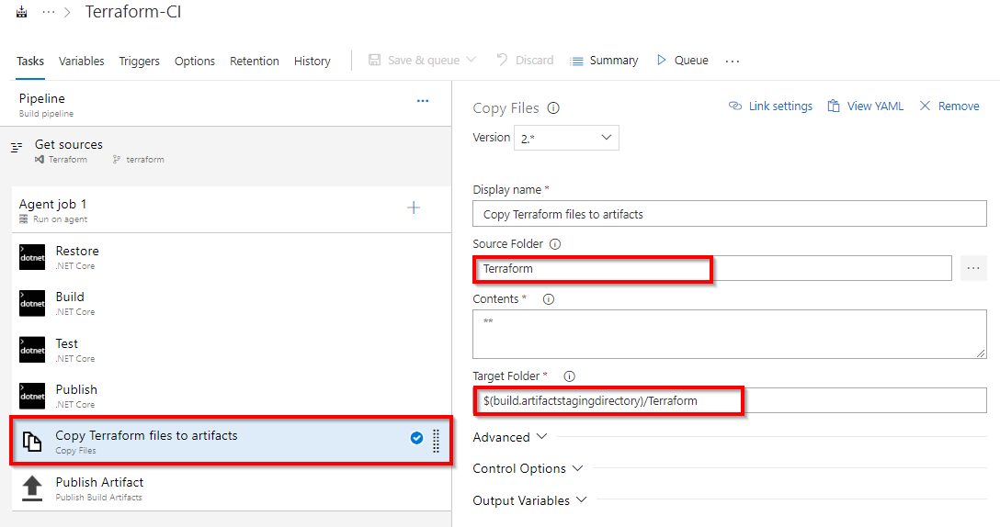

1. Now click **Queue** to trigger the build. Once the build success, verify that the artifacts have **Terraform** folder and **PartsUnlimitedwebsite.zip** file in the drop.

      

## Exercise 3: Deploy resources using Terraform (IaC) in Azure CD pipeline

In this exercise, you will create azure resources using Terraform as part of your deployment(CD) pipeline and deploy the PartsUnlimited application to the App service provisioned by Terraform.

1. Navigate to **Pipelines --> Releases**. Select **Terraform-CD** and click **Edit**.
   
    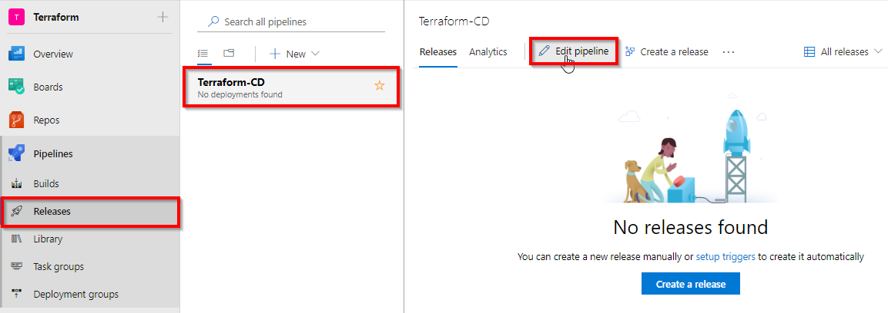

1. Select **Dev** stage and click **View stage tasks** to view the pipeline tasks.

      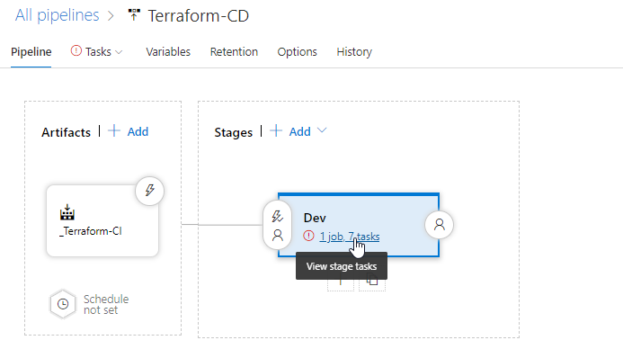

1. You will see the tasks as below.

      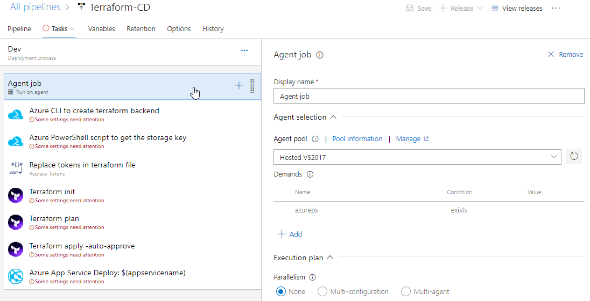

1. Select the **Azure CLI** task. Select the Azure subscription from the drop-down list and click **Authorize** to configure Azure service connection.
      
    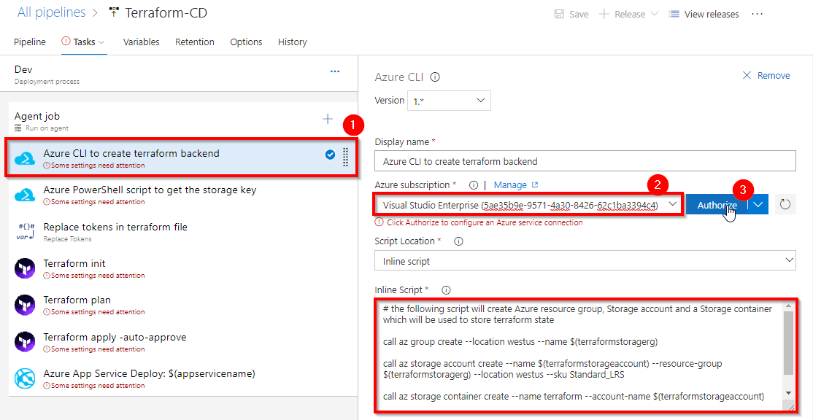

   > By default, Terraform stores state locally in a file named terraform.tfstate. When working with Terraform in a team, use of a local file makes Terraform usage complicated. With remote state, Terraform writes the state data to a remote data store. Here we are using Azure CLI task to create **Azure storage account** and **storage container** to store Terraform state. For more information on Terraform remote state click [here](https://www.terraform.io/docs/state/remote.html)

1. Select the **Azure PowerShell** task. Select Azure service connection from the drop-down.
     
     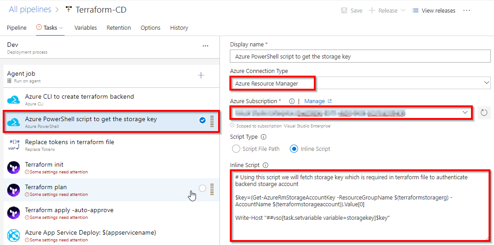

   > To configure the Terraform [backend](https://www.terraform.io/docs/backends/) we need Storage account access key. Here we are using Azure PowerShell task to get the Access key of the storage account provisioned in the previous step.

1. Select the **Replace tokens** task.
    
     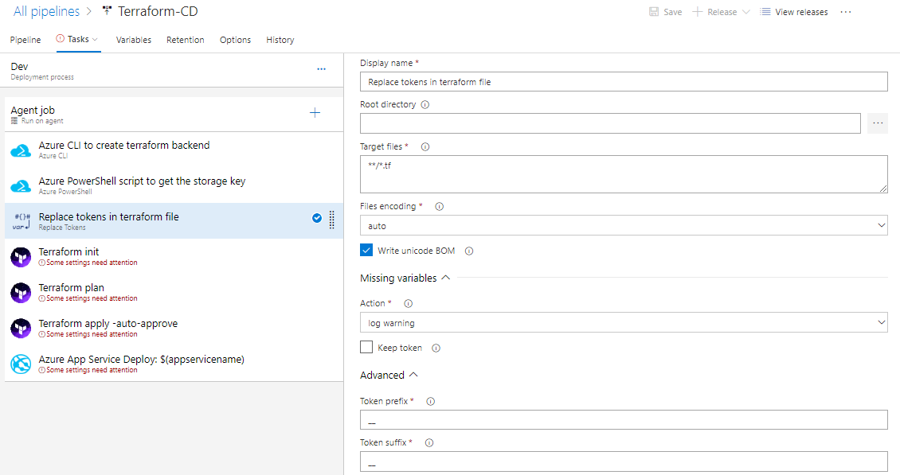

    If you observe the **webapp.tf** file in **Exercise 1, Step 3** you will see there are few values are suffixed and prefixed with **__**. For example **__terraformstorageaccount__**. Using **Replace tokens** task we will replace those values with the variable values defined in the release pipeline.
     
      

1. Terraform tool installer task is used to install  a specified version of Terraform from the Internet or the tools cache and prepends it to the PATH of the Azure Pipelines Agent (hosted or private).
      
    
1. When running Terraform in automation, the focus is usually on the core plan/apply cycle.

   The main Terraform workflow is shown below:

      

      
    i. Initialize the Terraform working directory.

   ii. Produce a plan for changing resources to match the current configuration.
   
   iii. Apply the changes described by the plan.
    
    The next Terraform tasks in your release pipeline help you to implement this workflow.
1. Select the **Terraform init** task. Select Azure service connection from the drop-down. And make sure to enter the container name  as **terraform**. For the other task parameters information see [here](https://github.com/microsoft/azure-pipelines-extensions/blob/master/Extensions/Terraform/Src/Tasks/TerraformTaskV1/README.md)
       
      

      

    > This task runs `terraform init` command. The `terraform init` command looks through all of the *.tf files in the current working directory and automatically downloads any of the providers required for them. In this example, it will download [Azure provider](https://www.terraform.io/docs/providers/azurerm/) as we are going to deploy Azure resources. For more information about `terraform init` command click [here](https://www.terraform.io/docs/commands/init.html)

1. Select the **Terraform plan** task. Select Azure service connection from the drop-down.
       
      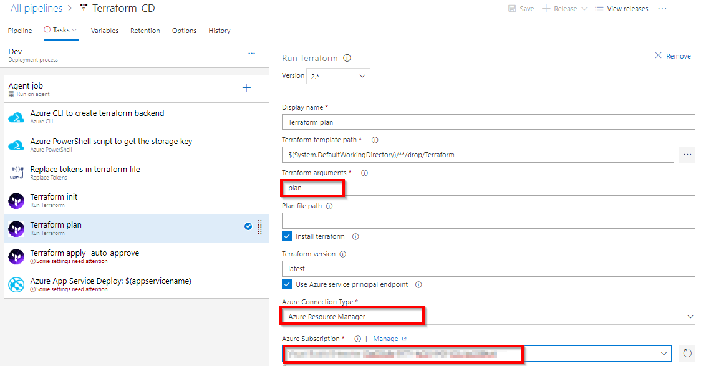
 
    > The `terraform plan` command is used to create an execution plan. Terraform determines what actions are necessary to achieve the desired state specified in the configuration files. This is a dry run and shows which actions will be made.  For more information about `terraform plan` command click [here](https://www.terraform.io/docs/commands/plan.html)

1. Select the **Terraform Apply** task. Select Azure service connection from the drop-down.
  
    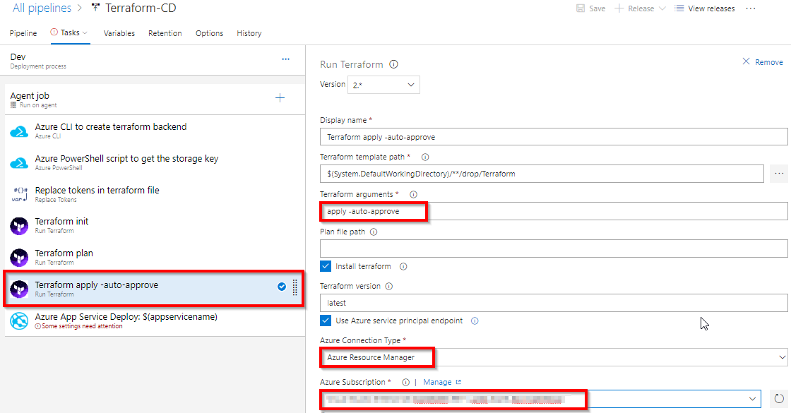

    > This task will run the `terraform apply` command to deploy the resources. By default, it will also prompt for confirmation that you want to apply those changes. Since we are automating the deployment we are adding `auto-approve` argument to not prompt for confirmation.

1. Select **Azure App Service Deploy** task. Select Azure service connection from the drop-down.

   

   > This task will deploy the PartsUnlimited package to Azure app service which is provisioned by Terraform tasks in previous steps.

1. Once you are done **Save** the changes and **Create a release**.
   
   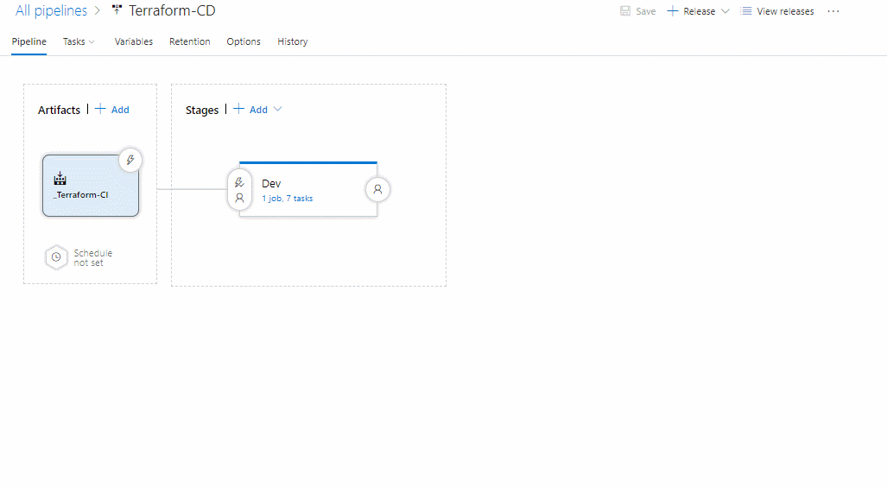

1. Once the release is success navigate to your Azure portal. Search for **pulterraformweb** in App services. Select **pulterraformweb-xxxx** and browse to view the application deployed.

   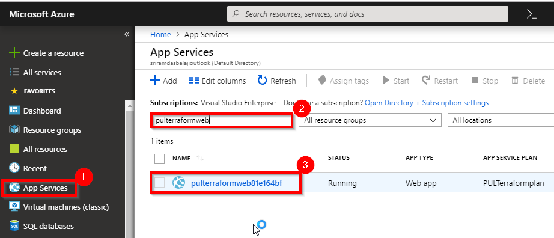

   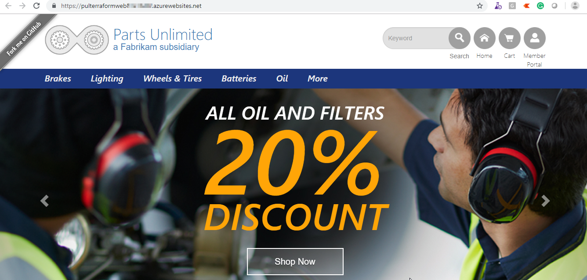

   Do you want to learn more about Terraform? If yes click [here](https://www.terraform.io/) for Terraform documentation.

## Summary

In this lab, you have learned how to automate repeatable deployments with Terraform on Azure using Azure Pipelines.

## Reference

You can watch the following video that walks you through all the steps explained in this lab

<figure class="video_container">
  <iframe width="560" height="315" src="https://www.youtube.com/embed/KiCZzJlS16A" frameborder="0" allowfullscreen="true"> </iframe>
</figure>
